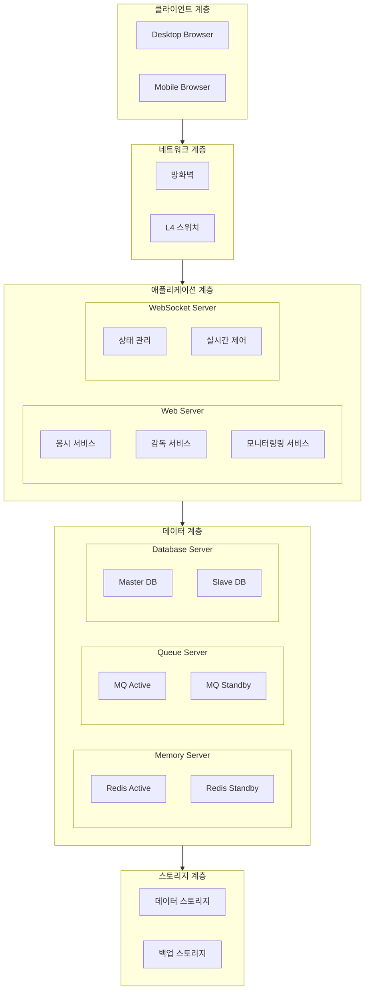
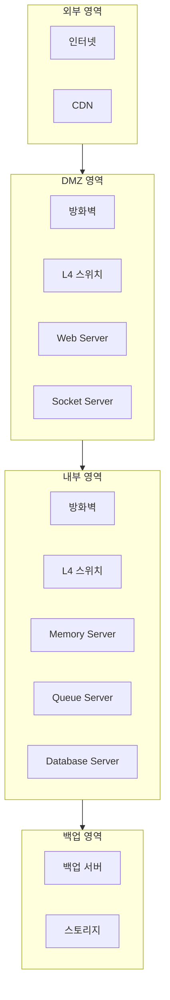

# 온라인 시험 시스템 아키텍처 구성도

## 1. 시스템 구성도



## 2. 네트워크 구성도



## 3. 주요 컴포넌트 설명

### 3.1 클라이언트 계층

-   데스크탑/모바일 브라우저
-   시험 응시 모듈
-   감독 모듈
-   관리 모듈

### 3.2 네트워크 계층

-   방화벽(보안)
-   L4 스위치(부하분산)
-   CDN(정적 리소스)

### 3.3 애플리케이션 계층

```
Web Server
- 시험 응시 처리
- 데이터 수집/전송
- 인증/인가 처리
- API 제공

Socket Server
- 상태 관리
- 실시간 제어
- 알림 전달
- 모니터링
```

### 3.4 데이터 계층

```
Memory Server
- 세션 관리
- 캐시 처리
- 실시간 데이터
- 임시 저장

Queue Server
- 메시지 큐
- 비동기 처리
- 배치 작업
- 로그 처리

Database Server
- 영구 데이터
- 트랜잭션 처리
- 데이터 복제
- 백업 관리
```

## 4. 데이터 흐름도

### 4.1 시험 데이터

```
응시자 -> Web Server -> Queue Server -> Database
캡처 이미지 -> Web Server -> Storage
상태 정보 -> Socket Server -> Memory Server
```

### 4.2 모니터링 데이터

```
Socket Server -> Memory Server -> Queue Server
Queue Server -> Database -> Storage
```

## 5. 확장 전략

### 5.1 수평적 확장

-   Web/Socket 서버 증설
-   Memory/Queue 서버 증설
-   Database 복제본 증설

### 5.2 수직적 확장

-   서버 리소스 증설
-   스토리지 용량 증설
-   네트워크 대역폭 증설
