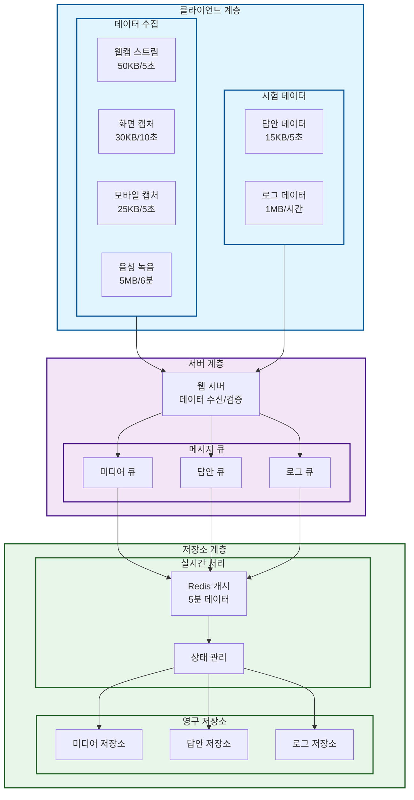
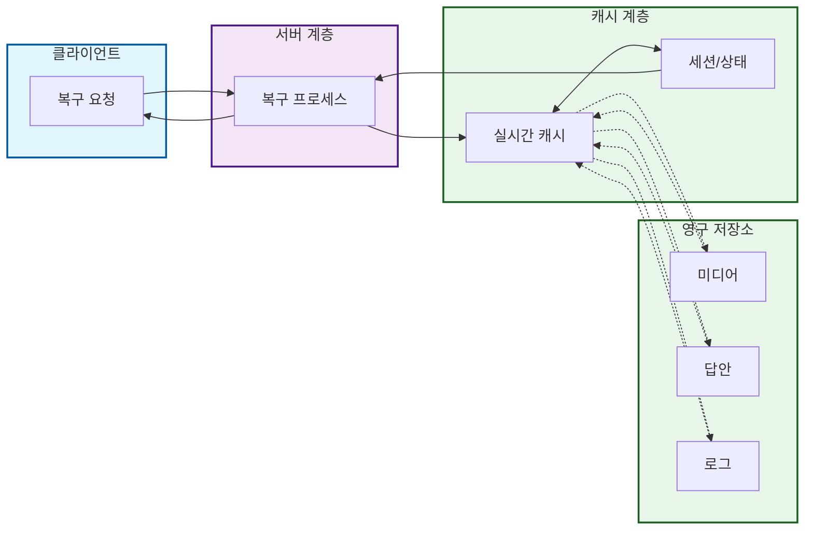
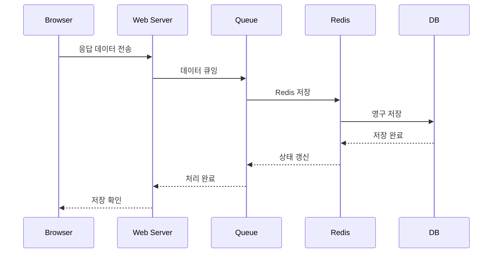
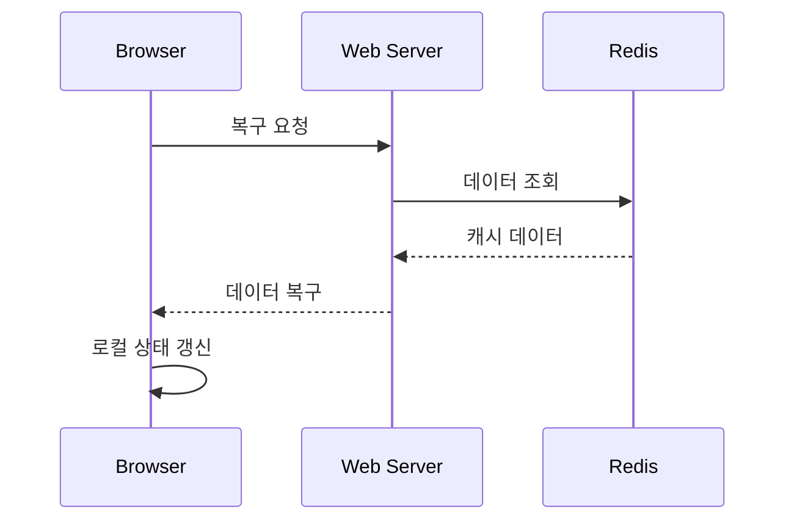

# 온라인 시험 데이터 흐름 상세

## 수집 및 저장



## 복구



## 흐름 설명

## 1. 데이터 저장 흐름(응답 데이타타)



## 2. 데이터 복구 흐름(응답 데이타)



## 3. 단계별 처리 내용

### 3.1 저장 프로세스

```
1. Browser -> Web Server
   - 변경시 전송
   - 변경분 데이터
   - 상태 정보 포함
   - 검증데이터 포함

2. Web Server -> Queue
   - 데이터 검증
   - 메타데이터 추가
   - 우선순위 할당
   - 배치 구성

3. Queue -> Redis
   - 임시 저장
   - 버전 관리
   - 상태 관리
   - 복제 처리

4. Redis -> DB
   - 트랜잭션 처리
   - 이력 관리
   - 영구 저장
   - 인덱스 갱신
```

### 3.2 복구 프로세스

```
1. Redis -> Web Server
   - 최신 데이터 조회
   - 버전 정보 확인
   - 상태 정보 확인
   - 메타데이터 포함

2. Web Server -> Browser
   - 데이터 검증
   - 버전 확인
   - 상태 전파
   - 복구 지원
```

## 4. 데이터 구조

### 4.1 전송 데이터 구조

```json
{
    "examId": "string", // 계획코드
    "testCode": "string", // 시험코드
    "userId": "string", // 사용자ID
    "timestamp": "datetime", // 전송시간
    "answers": {
        "quizCode": {
            // 문항코드
            "value": "string", // 답안내용
            "version": "number", // 버전
            "updated": "datetime" // 수정시간
        }
    },
    "metadata": {
        "device": {
            // 장치정보
            "type": "string", // PC/Mobile
            "browser": "string", // 브라우저정보
            "os": "string" // OS정보
        },
        "behavior": {
            // 행위정보
            "focusTime": "number", // 문항 포커스 시간
            "editCount": "number", // 수정 횟수
            "keystrokes": "number", // 키입력 수
            "navigation": [
                // 이동 이력
                {
                    "from": "quizCode",
                    "to": "quizCode",
                    "timestamp": "datetime"
                }
            ]
        }
    },
    "status": "string", // 상태코드
    "checksum": "string" // 무결성 체크
}
```

### 4.2 캐시 데이터 구조

```json
{
    "exam:{examId}:test:{testCode}:user:{userId}": {
        "answers": {
            "quizCode": {
                "value": "string",
                "version": "number",
                "updated": "datetime",
                "behavior": {
                    "focusTime": "number",
                    "editCount": "number",
                    "keystrokes": "number"
                }
            }
        },
        "metadata": {
            "lastSync": "datetime",
            "version": "number",
            "status": "string",
            "device": {
                "type": "string",
                "browser": "string",
                "os": "string"
            }
        },
        "navigation": [
            {
                "from": "quizCode",
                "to": "quizCode",
                "timestamp": "datetime"
            }
        ]
    }
}
```

## 5. 오류 처리

### 5.1 저장 실패 처리

```
Browser 단계
- 로컬 저장 유지
- 재전송 큐 관리
- 상태 표시
- 자동 재시도

Queue 단계
- 재처리 큐 이동
- 우선순위 상향
- 관리자 알림
- 수동 처리
```

### 5.2 복구 실패 처리

```
Redis 단계
- 복제본 조회
- 이전 버전 조회
- DB 직접 조회
- 부분 복구

Browser 단계
- 로컬 데이터 활용
- 수동 복구 지원
- 상태 동기화
- 관리자 알림
```
