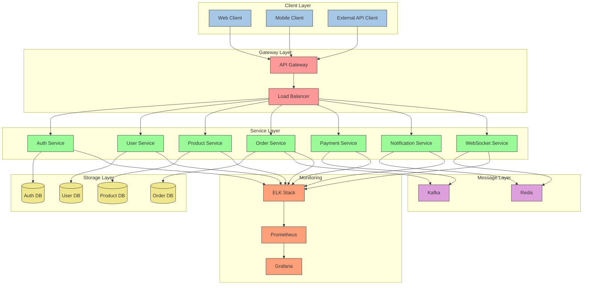

MSA 서비스 전체 구성을 다이어그램과 함께 설명하겠습니다.


    
핵심 구성:

1. API Gateway (Spring Cloud Gateway)
```yaml
spring:
  cloud:
    gateway:
      routes:
        - id: auth-service
          uri: lb://auth-service
          predicates:
            - Path=/api/auth/**
        - id: user-service
          uri: lb://user-service
          predicates:
            - Path=/api/users/**
```

2. Service Discovery (Eureka)
```yaml
eureka:
  client:
    serviceUrl:
      defaultZone: http://discovery:8761/eureka/
```

3. 서비스 간 통신 (Feign)
```java
@FeignClient(name = "user-service")
public interface UserServiceClient {
    @GetMapping("/api/users/{id}")
    UserDto getUser(@PathVariable("id") Long id);
}
```

4. 메시지 큐 (Kafka)
```java
@Service
public class OrderService {
    @Autowired
    private KafkaTemplate<String, Order> kafkaTemplate;

    public void createOrder(Order order) {
        kafkaTemplate.send("order-topic", order);
    }
}
```

5. 캐시 처리 (Redis)
```java
@Service
public class UserService {
    @Cacheable(value = "users", key = "#id")
    public User getUser(Long id) {
        return userRepository.findById(id);
    }
}
```

6. 모니터링 구성
```yaml
management:
  endpoints:
    web:
      exposure:
        include: health,metrics,prometheus
  metrics:
    export:
      prometheus:
        enabled: true
```

Docker Compose 구성:
```yaml
version: '3'
services:
  gateway:
    image: gateway-service
    ports:
      - "8080:8080"
  auth:
    image: auth-service
    depends_on:
      - redis
      - mysql
  user:
    image: user-service
  kafka:
    image: confluentinc/cp-kafka
  redis:
    image: redis
  prometheus:
    image: prom/prometheus
  grafana:
    image: grafana/grafana
```
