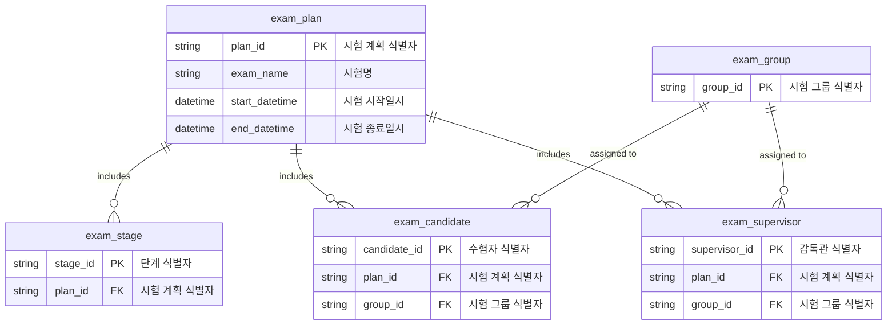

## 시험 운영 상태 관리 데이터 명세서 (Exam Operation State Management Data Specification)

---

## 목차(Table of Contents)

1. [시험 계획(Exam Plan) 테이블](#1-시험-계획exam-plan-테이블)
2. [시험 단계(Exam Stage) 테이블](#2-시험-단계exam-stage-테이블)
3. [수험자(Candidate) 테이블](#3-수험자candidate-테이블)
4. [감독관(Supervisor) 테이블](#4-감독관supervisor-테이블)
5. [시험 그룹(Exam Group) 테이블](#5-시험-그룹exam-group-테이블)
6. [데이터 관계 다이어그램(Data Relationship Diagram)](#6-데이터-관계-다이어그램data-relationship-diagram)
7. [Redis 저장 구조(Redis Storage Structure)](#7-redis-저장-구조redis-storage-structure)

---

## 1. 시험 계획(Exam Plan) 테이블

**Table: `exam_plan` (시험 계획 정보)**

| 영문명(Field English)      | 한글명(Field Korean)    | 설명(Description)            | 예시(Example)           |
| -------------------------- | ----------------------- | ---------------------------- | ----------------------- |
| plan_id (PK)               | 시험 계획 식별자        | Exam plan unique ID          | `PLAN202401`            |
| exam_name                  | 시험명                  | Name of the exam             | `2024년 한국어능력시험` |
| start_datetime             | 시험 시작일시           | Start datetime of the exam   | `2024-01-15 09:00:00`   |
| end_datetime               | 시험 종료일시           | End datetime of the exam     | `2024-01-16 18:00:00`   |
| login_method               | 로그인 방식             | Login method (웹/키 인증)    | `웹 로그인`             |
| conduct_type               | 진행 방식               | Conduct type (동시/개별시험) | `동시시험`              |
| requires_supervisor        | 감독관 필요 여부        | Requires supervisor          | `TRUE`                  |
| enables_cheating_detection | 부정행위 감지 여부      | Cheating detection enabled   | `FALSE`                 |
| requires_camera            | 카메라 필요 여부        | Requires camera              | `TRUE`                  |
| camera_capture_interval    | 카메라 캡처 간격(초)    | Camera capture interval(sec) | `10`                    |
| enables_ai_monitoring      | AI 감시 사용 여부       | AI monitoring enabled        | `TRUE`                  |
| enables_gaze_tracking      | 시선 감시 사용 여부     | Gaze tracking enabled        | `FALSE`                 |
| allows_mobile_camera       | 모바일 카메라 사용 여부 | Allows mobile camera         | `TRUE`                  |
| shuffle_questions          | 문항 섞기 여부          | Shuffle questions            | `TRUE`                  |
| shuffle_answers            | 답항 섞기 여부          | Shuffle answers              | `TRUE`                  |

---

## 2. 시험 단계(Exam Stage) 테이블

**Table: `exam_stage` (시험 단계 정보)**

| 영문명              | 한글명           | 설명(Description)              | 예시(Example) |
| ------------------- | ---------------- | ------------------------------ | ------------- |
| stage_id (PK)       | 단계 식별자      | Unique stage ID                | `STEP01`      |
| plan_id (FK)        | 시험 계획 식별자 | Exam plan ID                   | `PLAN202401`  |
| stage_name          | 단계명           | Stage name                     | `시스템 점검` |
| time_limit_seconds  | 제한 시간(초)    | Time limit in seconds          | `300`         |
| auto_move_enabled   | 자동 이동 여부   | Auto move enabled              | `TRUE`        |
| exam_code           | 시험지 코드      | Exam code (for exam stage)     | `EXAM202401`  |
| allocated_exam_time | 시험 시간(초)    | Allocated exam time in seconds | `7200`        |

---

## 3. 수험자(Candidate) 테이블

**Table: `exam_candidate` (수험자 정보)**

| 영문명                 | 한글명           | 설명(Description)      | 예시(Example)                        |
| ---------------------- | ---------------- | ---------------------- | ------------------------------------ |
| candidate_id (PK)      | 수험자 식별자    | Candidate unique ID    | `CAND202301`                         |
| plan_id (FK)           | 시험 계획 식별자 | Exam plan ID           | `PLAN202401`                         |
| candidate_name         | 수험자 이름      | Candidate name         | `홍길동`                             |
| candidate_auth_code    | 수험자 인증번호  | Candidate auth code    | `AUTH1234`                           |
| grade_level            | 학년             | Grade level            | `고3`                                |
| email_address          | 이메일           | Email address          | `hong@example.com`                   |
| additional_info        | 부가 정보        | Additional info (JSON) | `{"school":"서울고","major":"문과"}` |
| group_id (FK)          | 시험 그룹 식별자 | Exam group ID          | `GROUP01`                            |
| temp_answer_file_path  | 임시 답지 경로   | Temp answer file path  | `/temp/PLAN202401/CAND202301`        |
| final_answer_file_path | 최종 답지 경로   | Final answer file path | `/final/PLAN202401/CAND202301`       |
| capture_file_path      | 캡처 저장 경로   | Capture file path      | `/capture/PLAN202401/CAND202301`     |

---

## 4. 감독관(Supervisor) 테이블

**Table: `exam_supervisor` (감독관 정보)**

| 영문명             | 한글명           | 설명(Description)    | 예시(Example) |
| ------------------ | ---------------- | -------------------- | ------------- |
| supervisor_id (PK) | 감독관 식별자    | Supervisor unique ID | `SUP202301`   |
| plan_id (FK)       | 시험 계획 식별자 | Exam plan ID         | `PLAN202401`  |
| supervisor_name    | 감독관 이름      | Supervisor name      | `김철수`      |
| group_id (FK)      | 시험 그룹 식별자 | Exam group ID        | `GROUP01`     |

---

## 5. 시험 그룹(Exam Group) 테이블

**Table: `exam_group` (시험 그룹 정보)**

| 영문명            | 한글명             | 설명(Description)      | 예시(Example)         |
| ----------------- | ------------------ | ---------------------- | --------------------- |
| group_id (PK)     | 시험 그룹 식별자   | Exam group unique ID   | `GROUP01`             |
| group_name        | 시험 그룹명        | Exam group name        | `서울 1반`            |
| group_description | 시험 그룹 설명     | Exam group description | `서울 지역 오전 시험` |
| start_datetime    | 시험 그룹 시작일시 | Group start datetime   | `2024-01-15 09:00:00` |
| end_datetime      | 시험 그룹 종료일시 | Group end datetime     | `2024-01-15 12:00:00` |

---

## 6. 데이터 관계 다이어그램 (Data Relationship Diagram)

아래 다이어그램은 영문명, 한글명을 병기하며, 데이터 타입은 제외하였습니다. (Data types are omitted)

---

## 7. Redis 저장 구조(Redis Storage Structure)

Redis를 활용하여 실시간 상태 정보(예: 소켓 연결 상태, 진행 상태)를 관리하는 예시입니다.

| 항목(English/Korean)             | Redis 키 형식(Key Format)              | 값 형식(Value Type) | 예시 값(Example)                                                        |
| -------------------------------- | -------------------------------------- | ------------------- | ----------------------------------------------------------------------- |
| 시험 계획 정보 (Exam Plan Info)  | `exam_plan:{plan_id}`                  | Hash                | `{"exam_name":"한국어능력시험","start_datetime":"2024-01-15 09:00:00"}` |
| 시험 단계 정보 (Exam Stage Info) | `exam_plan:{plan_id}:stage:{stage_id}` | Hash                | `{"stage_name":"시스템 점검","time_limit_seconds":300}`                 |
| 수험자 상태 (Candidate Status)   | `exam_candidate:{candidate_id}:status` | Hash                | `{"status":"in_progress","current_stage":"STEP02"}`                     |
| 감독관 상태 (Supervisor Status)  | `exam_supervisor:{supervisor_id}:info` | Hash                | `{"name":"김철수","group_id":"GROUP01"}`                                |
| 시험 그룹 정보 (Exam Group Info) | `exam_group:{group_id}:info`           | Hash                | `{"group_name":"서울 1반","start_datetime":"2024-01-15 09:00:00"}`      |

---
