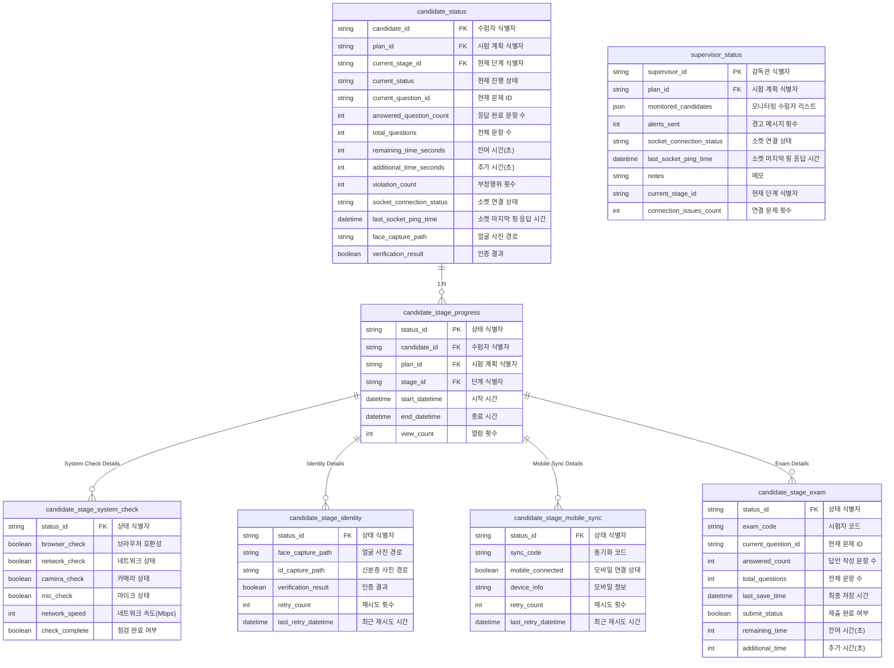

## 시험 운영 상태 관리 데이터 명세서 (Exam Operation State Management Data Specification)

---

## 개요(Overview)

본 문서는 시험 운영 과정에서 수험자(Candidate), 감독관(Supervisor), 시험 단계(Stage) 등에 대한 상태 정보를 체계적으로 관리하기 위한 데이터 구조를 정의합니다. 또한 수험자의 단계별 진행 상태와 단계별 특화 상태 정보를 포함하고 있어 시험 진행 중 발생하는 다양한 상황을 일관성 있고 유연하게 관리할 수 있습니다.

---

## 목차(Table of Contents)

1. [수험자 상태 (Candidate Status)](#수험자-상태-candidate-status)
2. [감독관 상태 (Supervisor Status)](#감독관-상태-supervisor-status)
3. [수험자 단계별 진행 상태 (Candidate Stage Progress)](#수험자-단계별-진행-상태-candidate-stage-progress)
4. [단계별 특화 상태 테이블 (Stage-Specific State Tables)](#단계별-특화-상태-테이블-stage-specific-state-tables)
    - [시스템 점검 상태 (System Check State)](#시스템-점검-상태-system-check-state)
    - [신분 인증 상태 (Identity Verification State)](#신분-인증-상태-identity-verification-state)
    - [모바일 동기화 상태 (Mobile Sync State)](#모바일-동기화-상태-mobile-sync-state)
    - [시험 상태 (Exam State)](#시험-상태-exam-state)
5. [데이터 관계 다이어그램 (Data Relationship Diagram)](#데이터-관계-다이어그램-data-relationship-diagram)
6. [활용 방안 (Usage Scenarios)](#활용-방안-usage-scenarios)

---

## 1. 수험자 상태 (Candidate Status)

**Table: candidate_status (수험자 상태)**

| 영문명(Field English Name) | 한글명(Field Korean Name) | 데이터 타입(Data Type) | 필수(Required) | 설명(Description)                                          | 예시(Example)       |
| -------------------------- | ------------------------- | ---------------------- | -------------- | ---------------------------------------------------------- | ------------------- |
| candidate_id               | 수험자 식별자             | STRING                 | Y              | 수험자 고유 식별자(PK, Candidate unique identifier)        | CAND202301          |
| plan_id                    | 시험 계획 식별자          | STRING                 | Y              | 시험 계획 식별자(FK, Exam plan ID)                         | PLAN202401          |
| current_stage_id           | 현재 단계 식별자          | STRING                 | Y              | 현재 시험 단계 ID(FK, Current stage ID)                    | STEP02              |
| current_status             | 현재 진행 상태            | ENUM                   | Y              | 현재 진행 상태(`ready`, `in_progress`, `completed`)        | in_progress         |
| current_question_id        | 현재 문제 ID              | STRING                 | N              | 현재 풀이 중인 문제 ID(Current question ID)                | Q001                |
| answered_question_count    | 답안 작성 문항 수         | INT                    | N              | 응답 완료된 문항 수(Answered question count)               | 5                   |
| total_questions            | 전체 문항 수              | INT                    | N              | 전체 문항 수(Total number of questions)                    | 30                  |
| remaining_time_seconds     | 잔여 시간(초)             | INT                    | N              | 남은 시험 시간(초)(Remaining time in seconds)              | 3600                |
| additional_time_seconds    | 추가 시간(초)             | INT                    | N              | 추가 부여된 시간(초)(Additional time in seconds)           | 300                 |
| violation_count            | 부정행위 횟수             | INT                    | N              | 부정행위 감지 횟수(Violation detection count)              | 1                   |
| socket_connection_status   | 소켓 연결 상태            | ENUM                   | N              | 소켓 연결 상태(`connected`, `disconnected`)(Socket status) | connected           |
| last_socket_ping_time      | 소켓 마지막 핑 응답 시간  | DATETIME               | N              | 소켓 마지막 ping 응답 시간(Last socket ping time)          | 2024-01-15 09:15:00 |
| face_capture_path          | 얼굴 사진 경로            | STRING                 | N              | 신분 인증 중 얼굴 사진 경로(Face capture path)             | /captures/face/001  |
| verification_result        | 인증 결과                 | BOOLEAN                | N              | 신분 인증 결과(Verification result)                        | TRUE                |

---

## 2. 감독관 상태 (Supervisor Status)

**Table: supervisor_status (감독관 상태)**

| 영문명(Field English Name) | 한글명(Field Korean Name) | 데이터 타입 | 필수 | 설명(Description)                                          | 예시(Example)               |
| -------------------------- | ------------------------- | ----------- | ---- | ---------------------------------------------------------- | --------------------------- |
| supervisor_id              | 감독관 식별자             | STRING      | Y    | 감독관 고유 식별자(PK, Supervisor unique ID)               | SUP202301                   |
| plan_id                    | 시험 계획 식별자          | STRING      | Y    | 시험 계획 식별자(FK, Exam plan ID)                         | PLAN202401                  |
| monitored_candidates       | 모니터링 수험자 리스트    | JSON        | N    | 현재 감독 중인 수험자 목록(List of monitored candidates)   | ["CAND202301","CAND202302"] |
| alerts_sent                | 경고 메시지 발송 횟수     | INT         | N    | 경고 메시지 발송 횟수(Alerts sent)                         | 2                           |
| socket_connection_status   | 소켓 연결 상태            | ENUM        | N    | 소켓 연결 상태(`connected`, `disconnected`)(Socket status) | connected                   |
| last_socket_ping_time      | 소켓 마지막 핑 응답 시간  | DATETIME    | N    | 소켓 마지막 ping 응답 시간(Last socket ping time)          | 2024-01-15 09:18:00         |
| notes                      | 메모                      | STRING      | N    | 감독관 메모(Notes)                                         | CAND202302 부정행위 의심    |
| current_stage_id           | 현재 단계 식별자          | STRING      | N    | 현재 감독 중인 시험 단계 ID(Current stage ID)              | STEP02                      |
| connection_issues_count    | 연결 문제 횟수            | INT         | N    | 감독관 연결 문제 발생 횟수(Connection issues count)        | 1                           |

---

## 3. 수험자 단계별 진행 상태 (Candidate Stage Progress)

**Table: candidate_stage_progress (수험자 단계별 진행 상태)**

| 영문명(Field English Name) | 한글명(Field Korean Name) | 데이터 타입 | 필수 | 설명(Description)                            | 예시(Example)       |
| -------------------------- | ------------------------- | ----------- | ---- | -------------------------------------------- | ------------------- |
| status_id                  | 상태 식별자               | STRING      | Y    | 상태 식별자(PK, Status ID)                   | STATUS202401150001  |
| candidate_id               | 수험자 식별자             | STRING      | Y    | 수험자 식별자(FK, Candidate ID)              | CAND202301          |
| plan_id                    | 시험 계획 식별자          | STRING      | Y    | 시험 계획 식별자(FK, Exam plan ID)           | PLAN202401          |
| stage_id                   | 단계 식별자               | STRING      | Y    | 단계 식별자(FK, Stage ID)                    | STEP01              |
| start_datetime             | 시작 시간                 | DATETIME    | Y    | 해당 단계 시작 시간(Start time of stage)     | 2024-01-15 09:00:00 |
| end_datetime               | 종료 시간                 | DATETIME    | N    | 해당 단계 종료 시간(End time of stage)       | 2024-01-15 09:05:00 |
| view_count                 | 열람 횟수                 | INT         | Y    | 해당 단계 열람 횟수(View count of the stage) | 1                   |

> `candidate_stage_progress`는 한 명의 수험자에 대해 여러 단계별 진행 이력을 가질 수 있으므로 `candidate_status`와 1:N 관계를 가질 수 있습니다.

---

## 4. 단계별 특화 상태 테이블 (Stage-Specific State Tables)

각 단계 유형별로 필요한 상세 정보를 별도 테이블로 관리합니다. 모두 `status_id`를 외래 키로 사용하여 `candidate_stage_progress`와 연결됩니다.

### 4.1 시스템 점검 상태 (System Check State)

**Table: candidate_stage_system_check (시스템 점검 상태)**

| 영문명         | 한글명          | 데이터 타입 | 필수 | 설명(Description)     | 예시(Example)      |
| -------------- | --------------- | ----------- | ---- | --------------------- | ------------------ |
| status_id      | 상태 식별자     | STRING      | Y    | 상태 식별자(FK)       | STATUS202401150001 |
| browser_check  | 브라우저 호환성 | BOOLEAN     | Y    | Browser compatibility | TRUE               |
| network_check  | 네트워크 상태   | BOOLEAN     | Y    | Network status        | TRUE               |
| camera_check   | 카메라 상태     | BOOLEAN     | Y    | Camera status         | TRUE               |
| mic_check      | 마이크 상태     | BOOLEAN     | Y    | Mic status            | TRUE               |
| network_speed  | 네트워크 속도   | INT         | Y    | Network speed(Mbps)   | 100                |
| check_complete | 점검 완료 여부  | BOOLEAN     | Y    | Check complete        | TRUE               |

### 4.2 신분 인증 상태 (Identity Verification State)

**Table: candidate_stage_identity (신분 인증 상태)**

| 영문명              | 한글명           | 데이터 타입 | 필수 | 설명(Description)   | 예시(Example)       |
| ------------------- | ---------------- | ----------- | ---- | ------------------- | ------------------- |
| status_id           | 상태 식별자      | STRING      | Y    | 상태 식별자(FK)     | STATUS202401150001  |
| face_capture_path   | 얼굴 사진 경로   | STRING      | Y    | Face capture path   | /captures/face/001  |
| id_capture_path     | 신분증 사진 경로 | STRING      | Y    | ID capture path     | /captures/id/001    |
| verification_result | 인증 결과        | BOOLEAN     | Y    | Verification result | TRUE                |
| retry_count         | 재시도 횟수      | INT         | Y    | Retry count         | 2                   |
| last_retry_datetime | 최근 재시도 시간 | DATETIME    | N    | Last retry datetime | 2024-01-15 09:03:00 |

### 4.3 모바일 동기화 상태 (Mobile Sync State)

**Table: candidate_stage_mobile_sync (모바일 동기화 상태)**

| 영문명              | 한글명           | 데이터 타입 | 필수 | 설명(Description)   | 예시(Example)       |
| ------------------- | ---------------- | ----------- | ---- | ------------------- | ------------------- |
| status_id           | 상태 식별자      | STRING      | Y    | 상태 식별자(FK)     | STATUS202401150001  |
| sync_code           | 동기화 코드      | STRING      | Y    | Sync code           | SYNC12345           |
| mobile_connected    | 연결 상태        | BOOLEAN     | Y    | Mobile connected    | TRUE                |
| device_info         | 모바일 정보      | STRING      | Y    | Device info         | Galaxy S21          |
| retry_count         | 재시도 횟수      | INT         | Y    | Retry count         | 3                   |
| last_retry_datetime | 최근 재시도 시간 | DATETIME    | N    | Last retry datetime | 2024-01-15 09:02:00 |

### 4.4 시험 상태 (Exam State)

**Table: candidate_stage_exam (시험 상태)**

| 영문명              | 한글명            | 데이터 타입 | 필수 | 설명(Description)        | 예시(Example)       |
| ------------------- | ----------------- | ----------- | ---- | ------------------------ | ------------------- |
| status_id           | 상태 식별자       | STRING      | Y    | 상태 식별자(FK)          | STATUS202401150001  |
| exam_code           | 시험지 코드       | STRING      | Y    | Exam code                | EXAM202401          |
| current_question_id | 현재 문제 ID      | STRING      | Y    | Current question ID      | Q001                |
| answered_count      | 답안 작성 문항 수 | INT         | Y    | Answered count           | 15                  |
| total_questions     | 전체 문항 수      | INT         | Y    | Total questions          | 30                  |
| last_save_time      | 최종 저장 시간    | DATETIME    | N    | Last save time           | 2024-01-15 10:30:00 |
| submit_status       | 제출 완료 여부    | BOOLEAN     | Y    | Submit status            | TRUE                |
| remaining_time      | 잔여 시간(초)     | INT         | Y    | Remaining time(seconds)  | 3600                |
| additional_time     | 추가 시간(초)     | INT         | Y    | Additional time(seconds) | 600                 |

---

## 데이터 관계 다이어그램 (Data Relationship Diagram)

---
