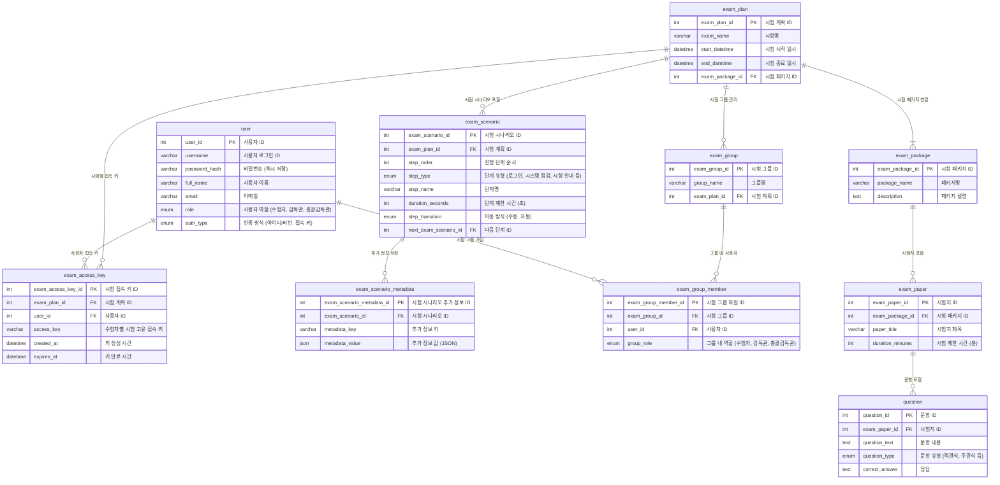

### **📌 Mermaid ERD 코드**

---

### **📌 ERD 설명**

1. **사용자(`user`)**
   - `exam_access_key`와 연결 (시험별 접속 키 제공)
   - `exam_group_member`와 연결 (시험 그룹 내 사용자 관리)

2. **시험 계획(`exam_plan`)**
   - `exam_access_key`와 연결 (시험별 고유 접속 키)
   - `exam_scenario`와 연결 (시험 진행 단계)
   - `exam_group`과 연결 (시험 그룹 포함)
   - `exam_package`와 연결 (시험 패키지 사용)

3. **시험 진행(`exam_scenario`)**
   - `exam_scenario_metadata`와 연결 (추가 메타데이터 저장)

4. **시험 그룹(`exam_group`)**
   - `exam_group_member`와 연결 (시험 그룹 내 사용자)

5. **시험 패키지(`exam_package`)**
   - `exam_paper`와 연결 (시험지 포함)
   - `question`과 연결 (문항 포함)
