```mermaid
erDiagram

    %% ------------------------
    %% exam_participant_status
    %% ------------------------
    exam_participant_status {
        int participant_status_id PK
        int exam_plan_id FK
        int user_id FK
        int current_scenario_id FK
        datetime start_time
        datetime end_time
        enum status
    }

    %% --------------------------------
    %% exam_participant_scenario_log
    %% --------------------------------
    exam_participant_scenario_log {
        int participant_scenario_log_id PK
        int participant_status_id FK
        int scenario_id FK
        datetime entered_at
        datetime exited_at
        int elapsed_time_seconds
        boolean auto_transition
        boolean forced_exit
    }

    %% -------------------------------
    %% exam_participant_time_log
    %% -------------------------------
    exam_participant_time_log {
        int participant_time_log_id PK
        int participant_status_id FK
        int proctor_time_log_id FK
        int scenario_id FK
        datetime previous_end_time
        datetime new_end_time
        int extra_time_minutes
        datetime updated_at
    }

    %% -------------------------------
    %% exam_participant_response
    %% -------------------------------
    exam_participant_response {
        int response_id PK
        int participant_status_id FK
        int question_id FK
        text response_text
        boolean is_correct
        decimal score
        datetime submitted_at
    }

    %% ----------------------
    %% exam_proctor_status
    %% ----------------------
    exam_proctor_status {
        int proctor_status_id PK
        int proctor_id FK
        int exam_group_id FK
        enum status
        datetime start_time
        datetime end_time
    }

    %% --------------------------
    %% exam_proctor_time_log
    %% --------------------------
    exam_proctor_time_log {
        int proctor_time_log_id PK
        int exam_plan_id FK
        int exam_scenario_id FK
        int exam_group_id FK
        int participant_status_id FK
        int proctor_id FK
        int extra_time_minutes
        text adjustment_reason
        datetime applied_at
    }

    %% --------------------------------------
    %% exam_proctor_misconduct_action_log
    %% --------------------------------------
    exam_proctor_misconduct_action_log {
        int misconduct_action_log_id PK
        int misconduct_log_id FK
        int proctor_id FK
        enum action_type
        text action_description
        datetime action_timestamp
    }

    %% -------------
    %% exam_session
    %% -------------
    exam_session {
        int session_id PK
        int user_id FK
        enum user_type
        int status_id FK
        enum auth_status
        varchar auth_token
        varchar socket_session_id
        varchar ip_address
        text user_agent
        datetime last_activity
    }

    %% -----------------
    %% exam_event_log
    %% -----------------
    exam_event_log {
        int event_log_id PK
        int participant_status_id FK
        enum event_type
        text event_description
        datetime event_timestamp
    }

    %% ------------------
    %% exam_access_log
    %% ------------------
    exam_access_log {
        int access_log_id PK
        int user_id FK
        enum user_type
        varchar ip_address
        text user_agent
        datetime login_time
        datetime logout_time
        int session_id FK
    }

    %% ----------------------
    %% exam_progress_status
    %% ----------------------
    exam_progress_status {
        int progress_status_id PK
        int exam_plan_id FK
        enum status
        datetime updated_at
    }

    %% ----------------------
    %% exam_misconduct_log
    %% ----------------------
    exam_misconduct_log {
        int misconduct_log_id PK
        int participant_status_id FK
        enum detected_type
        decimal confidence_score
        datetime log_timestamp
        int reviewed_by_proctor_id FK
    }

    %% ------------------------------------
    %% RELATIONSHIPS (FK -> PK references)
    %% ------------------------------------
    %% participant_status relations
    exam_participant_status ||--o{ exam_participant_scenario_log : "has scenario logs"
    exam_participant_status ||--o{ exam_participant_time_log : "time logs"
    exam_participant_status ||--o{ exam_participant_response : "answers"
    exam_participant_status ||--o{ exam_event_log : "events"
    exam_participant_status ||--o{ exam_misconduct_log : "misconduct logs"
    exam_participant_status ||--o{ exam_proctor_time_log : "can be targeted"

    %% proctor_status relations
    exam_proctor_status ||--o{ exam_session : "status_id (if user_type=proctor)"

    %% participant_status <-> session
    exam_participant_status ||--o{ exam_session : "status_id (if user_type=participant)"

    %% misconduct <-> proctor action
    exam_misconduct_log ||--o{ exam_proctor_misconduct_action_log : "action logs"

    %% proctor_time_log <-> participant_time_log
    exam_proctor_time_log ||--o{ exam_participant_time_log : "applies to"

    %% exam_session <-> exam_access_log
    exam_session ||--o{ exam_access_log : "session usage"

```

---

## **주요 관계 요약**

- **`exam_participant_status`** ↔ **`exam_participant_scenario_log`**: 1:N, 수험자가 여러 단계 이력을 가질 수 있음  
- **`exam_participant_status`** ↔ **`exam_participant_time_log`**: 1:N, 여러 차례 시간 조정 가능  
- **`exam_participant_status`** ↔ **`exam_participant_response`**: 1:N, 한 시험 상태에서 여러 답안 제출 가능  
- **`exam_misconduct_log`** ↔ **`exam_proctor_misconduct_action_log`**: 1:N, 하나의 부정행위 건에 대해 여러 조치 발생 가능  

---
