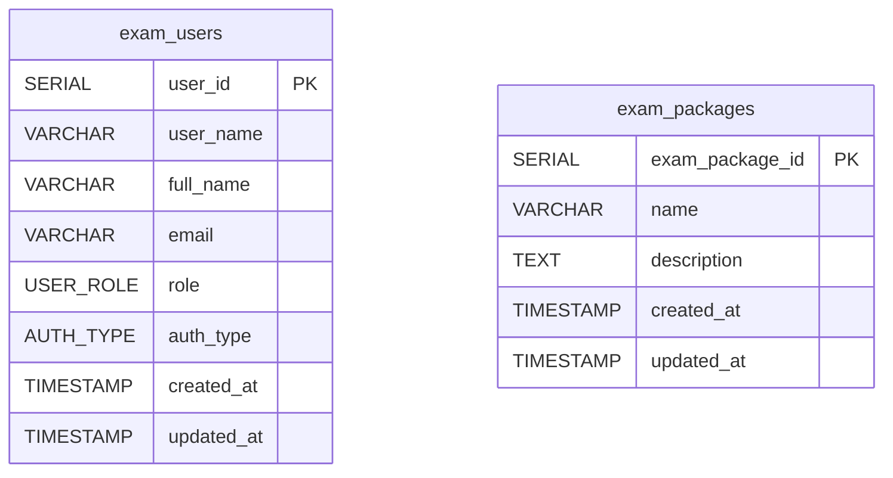
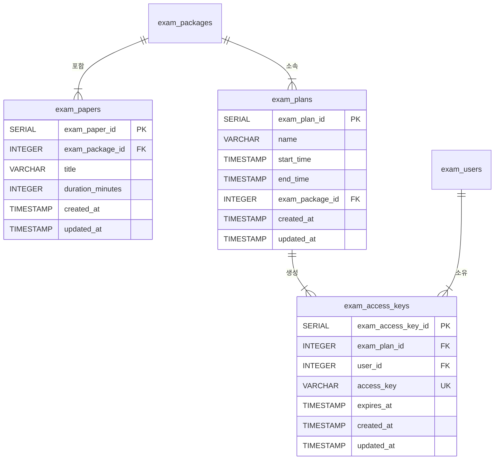
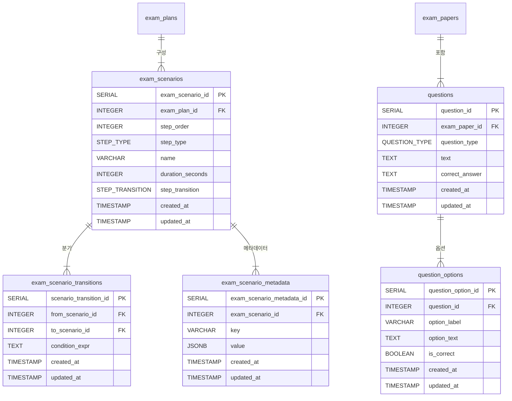
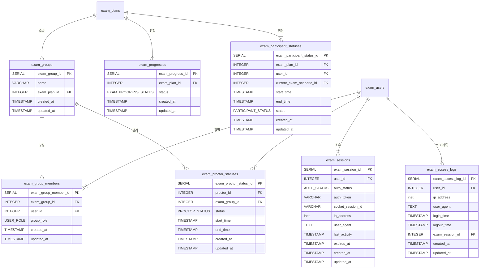
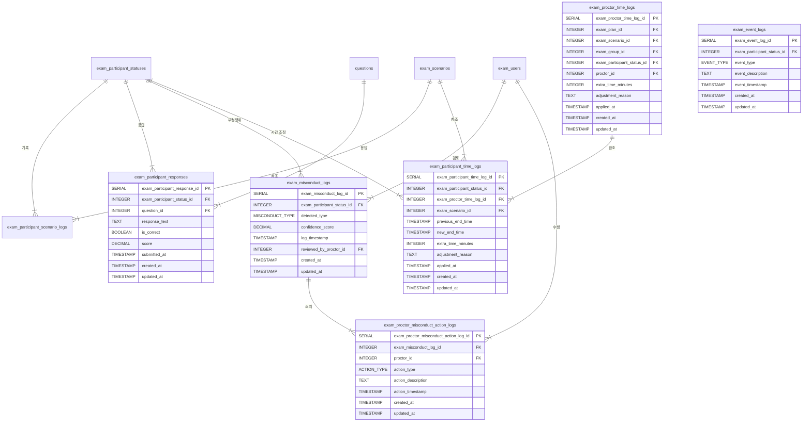

## Step 1. 기본 엔터티 (의존성 없는 테이블)

> **설명:**  
>
> - **exam_users**와 **exam_packages**는 다른 테이블에 의존하지 않는 기본 엔터티입니다.

---

## Step 2. 1차 종속 엔터티  

(예: 시험지, 시험 계획, 시험 접근 키 등)

> **설명:**  
>
> - **exam_papers**와 **exam_plans**는 **exam_packages**에 의존하며,  
> - **exam_access_keys**는 **exam_plans**와 **exam_users**를 참조합니다.

---

## Step 3. 시험 시나리오 및 문제 관련 엔터티

> **설명:**  
>
> - **exam_scenarios**는 **exam_plans**에 속하며,  
>   - 분기 정보는 **exam_scenario_transitions**로 관리하고,  
>   - 추가 정보는 **exam_scenario_metadata**에 저장합니다.  
> - **questions**는 **exam_papers**의 하위 항목이며,  
>   - 객관식 보기는 **question_options**로 관리됩니다.

---

## Step 4. 그룹, 진행 상태, 세션 및 로그 관련 엔터티

> **설명:**  
>
> - **exam_groups**와 **exam_group_members**는 시험 그룹 관련 정보를 관리하며,  
> - **exam_progresses**와 **exam_participant_statuses**는 시험 진행 및 수험자 상태를 나타냅니다.  
> - **exam_proctor_statuses**는 감독관의 상태를 기록합니다.  
> - **exam_sessions**와 **exam_access_logs**는 사용자 세션 및 접근 로그를 관리합니다.

---

## Step 5. 로그 및 응답, 부정행위 관련 엔터티

> **설명:**  
>
> - **exam_participant_scenario_logs**는 수험자의 시나리오 이동을 기록합니다.  
> - **exam_participant_responses**는 수험자의 문제 응답을 저장합니다.  
> - **exam_misconduct_logs**와 **exam_proctor_misconduct_action_logs**는 부정행위 기록과 이에 대한 조치를 관리합니다.  
> - **exam_proctor_time_logs**와 **exam_participant_time_logs**는 감독관에 의한 시간 조정 내역을 기록합니다.  
> - **exam_event_logs** (코드에 포함되지 않은 경우 별도로 추가 가능)도 이벤트 발생 시각을 기록합니다.

---

