### **기타 시험 운영 상태 관리 데이터 명세서 (Additional Exam Operation State Management Data Specification)**

---

## **목차 (Table of Contents)**

1. [이벤트 로그 (Action Log)](#1-이벤트-로그-action-log)
2. [부정행위 로그 (Violation Log)](#2-부정행위-로그-violation-log)
3. [부정행위 세부 정보 테이블 (Violation Details Tables)](#3-부정행위-세부-정보-테이블-violation-details-tables)
    - 3.1 [화면 캡처 (Screen Capture)](#31-화면-캡처-screen-capture)
    - 3.2 [카메라 (Camera)](#32-카메라-camera)
    - 3.3 [음성 (Audio)](#33-음성-audio)
    - 3.4 [시선 (Gaze)](#34-시선-gaze)
    - 3.5 [입력 (Input)](#35-입력-input)
    - 3.6 [화면전환 (Screen Switch)](#36-화면전환-screen-switch)
    - 3.7 [불법 프로그램 (Illegal Program)](#37-불법-프로그램-illegal-program)
4. [수험자 부정행위 상태 (Candidate Violation State)](#4-수험자-부정행위-상태-candidate-violation-state)
5. [데이터 관계 다이어그램 (Data Relationship Diagram)](#5-데이터-관계-다이어그램-data-relationship-diagram)
6. [활용 방안 (Usage Scenarios)](#6-활용-방안-usage-scenarios)

---

## **1. 이벤트 로그 (Action Log)**

액션 로그는 시험 운영 중 발생하는 모든 행동과 시스템 이벤트를 기록합니다. 부정행위와는 독립적으로 관리되며, 수험자, 감독관, 시스템에서 발생한 모든 활동을 추적합니다.

| **한글명**        | **영문명**         | **설명**                                            | **예시 값**                             |
| ----------------- | ------------------ | --------------------------------------------------- | --------------------------------------- |
| 액션 로그 ID      | action_log_id      | 액션 로그 고유 식별자                               | ACTION202401150001                      |
| 이벤트 발생자 ID  | actor_id           | 이벤트를 발생시킨 사용자 ID                         | CAND202301 (수험자), SUP202302 (감독관) |
| 사용자 유형       | actor_type         | 이벤트 발생자의 유형 (`수험자`, `감독관`, `시스템`) | CANDIDATE, SUPERVISOR, SYSTEM           |
| 시험 계획 ID (FK) | plan_id            | 이벤트가 발생한 시험 계획 ID                        | PLAN202401                              |
| 단계 ID (FK)      | stage_id           | 이벤트가 발생한 시험 단계 ID                        | STEP02                                  |
| 액션 유형         | action_type        | 액션의 유형 (브라우저 열기, 소켓 연결 등)           | BROWSER_OPENED, SOCKET_CONNECTED        |
| 액션 세부 유형    | action_subtype     | 액션의 세부 유형                                    | KEYBOARD_INPUT, SCREEN_SWITCHED         |
| 발생 시각         | action_timestamp   | 액션 발생 시간                                      | 2024-01-15 09:05:00                     |
| 액션 설명         | action_description | 액션에 대한 상세 설명                               | "브라우저 닫기 후 다시 열기"            |

---

## **2. 부정행위 로그 (Violation Log)**

부정행위 로그는 특정 이벤트가 부정행위로 판단된 경우 관련 정보를 기록합니다.

| **한글명**        | **영문명**          | **설명**                          | **예시 값**          |
| ----------------- | ------------------- | --------------------------------- | -------------------- |
| 부정행위 ID (PK)  | violation_id        | 부정행위 고유 식별자              | VIO202401150001      |
| 수험자 ID (FK)    | candidate_id        | 부정행위를 발생시킨 수험자 ID     | CAND202301           |
| 시험 계획 ID (FK) | plan_id             | 부정행위가 발생한 시험 계획 ID    | PLAN202401           |
| 단계 ID (FK)      | stage_id            | 부정행위가 발생한 시험 단계 ID    | STEP02               |
| 부정행위 유형     | violation_type      | 부정행위 유형 (입력, 화면전환 등) | INPUT, CAMERA        |
| 심각도            | severity_level      | 부정행위 심각도 (1~5)             | 3                    |
| 발생 시각         | violation_timestamp | 부정행위 발생 시간                | 2024-01-15 09:05:30  |
| 감독관 조치       | supervisor_action   | 부정행위에 대한 감독관의 조치     | "경고 발송"          |
| 해결 상태         | resolution_status   | 부정행위 해결 여부                | RESOLVED, UNRESOLVED |

---

## **3. 부정행위 세부 정보 테이블 (Violation Details Tables)**

### **3.1 화면 캡처 (Screen Capture)**

| **한글명**       | **영문명**        | **설명**                                    | **예시 값**              |
| ---------------- | ----------------- | ------------------------------------------- | ------------------------ |
| 부정행위 ID (FK) | violation_id      | 부정행위 이벤트 식별자(FK to violation_log) | VIO202401150001          |
| 캡처 경로        | capture_path      | 화면 캡처 저장 경로                         | /captures/screen/001.png |
| 감지 내용        | detected_content  | 화면 캡처에서 감지된 내용 설명              | "다른 시험 문서 감지"    |
| 캡처 시각        | capture_timestamp | 화면 캡처 시각                              | 2024-01-15 09:03:00      |

---

### **3.2 카메라 (Camera)**

| **한글명**           | **영문명**                 | **설명**                                                | **예시 값**                  |
| -------------------- | -------------------------- | ------------------------------------------------------- | ---------------------------- |
| 부정행위 ID (FK)     | violation_id               | 부정행위 이벤트 식별자(FK to violation_log)             | VIO202401150002              |
| 카메라 부정행위 유형 | camera_violation_type      | 카메라 기반 부정행위 유형 (자리비움, 여러 사람 감지 등) | "ABSENT", "MULTIPLE_PERSONS" |
| 감지된 사람 수       | detected_person_count      | 해당 시점에 감지된 사람 수 (유형에 따라 선택적)         | 2                            |
| 감지 지속시간 (초)   | detection_duration_seconds | 감지된 상황이 지속된 시간 (초 단위)                     | 10                           |
| 상황 설명            | scenario_description       | 이벤트 상황 설명                                        | "자리비움 10초"              |

---

### **3.3 음성 (Audio)**

| **한글명**         | **영문명**                    | **설명**                                    | **예시 값**           |
| ------------------ | ----------------------------- | ------------------------------------------- | --------------------- |
| 부정행위 ID (FK)   | violation_id                  | 부정행위 이벤트 식별자(FK to violation_log) | VIO202401150003       |
| 화자 수            | speaker_count                 | 감지된 화자의 수                            | 2                     |
| 비인가 화자 여부   | unauthorized_speaker_detected | 비인가 화자 감지 여부                       | TRUE/FALSE            |
| 감지된 음성 내용   | detected_audio_content        | 감지된 음성 내용 (예: 비정상 발언 등)       | "정답 공유 의심 발언" |
| 감지 지속시간 (초) | detection_duration_seconds    | 감지된 상황이 지속된 시간 (초 단위)         | 15                    |

---

### **3.4 시선 (Gaze)**

| **한글명**              | **영문명**                  | **설명**                                       | **예시 값**               |
| ----------------------- | --------------------------- | ---------------------------------------------- | ------------------------- |
| 부정행위 ID (FK)        | violation_id                | 부정행위 이벤트 식별자(FK to violation_log)    | VIO202401150004           |
| 시선 감지 유형          | gaze_violation_type         | 시선 부정행위 유형 (시선 이탈, 장시간 고정 등) | "OFF_SCREEN", "FIXED"     |
| 시선 이탈 지속시간 (초) | gaze_off_duration_seconds   | 시선이 화면을 벗어난 시간 (초 단위)            | 5                         |
| 고정 시선 지속시간 (초) | gaze_fixed_duration_seconds | 화면에 장시간 고정된 시간 (초 단위)            | 20                        |
| 상황 설명               | scenario_description        | 이벤트 상황 설명                               | "시선이 화면 밖으로 이동" |

---

### **3.5 입력 (Input)**

| **한글명**         | **영문명**           | **설명**                                       | **예시 값**                  |
| ------------------ | -------------------- | ---------------------------------------------- | ---------------------------- |
| 부정행위 ID (FK)   | violation_id         | 부정행위 이벤트 식별자(FK to violation_log)    | VIO202401150005              |
| 입력 부정행위 유형 | input_violation_type | 입력 부정행위 유형 (입력 없음, 비정상 입력 등) | "NO_INPUT", "ABNORMAL_INPUT" |
| 정량적 정보        | quantitative_value   | 유형별 정량적 정보 (예: 무입력 지속 시간)      | 30 (초)                      |
| 상황 설명          | scenario_description | 이벤트 상황 설명                               | "30초 동안 입력 없음"        |

---

### **3.6 화면전환 (Screen Switch)**

| **한글명**           | **영문명**                   | **설명**                                    | **예시 값**         |
| -------------------- | ---------------------------- | ------------------------------------------- | ------------------- |
| 부정행위 ID (FK)     | violation_id                 | 부정행위 이벤트 식별자(FK to violation_log) | VIO202401150006     |
| 화면전환 발생 횟수   | screen_switch_count          | 화면전환 발생 횟수                          | 2                   |
| 화면전환 설명        | screen_switch_description    | 화면전환 이벤트에 대한 설명                 | "다른 앱 실행"      |
| 마지막 화면전환 시간 | last_screen_switch_timestamp | 가장 최근 화면전환 발생 시간                | 2024-01-15 09:08:00 |

---

### **3.7 불법 프로그램 (Illegal Program)**

| **한글명**       | **영문명**          | **설명**                                    | **예시 값**           |
| ---------------- | ------------------- | ------------------------------------------- | --------------------- |
| 부정행위 ID (FK) | violation_id        | 부정행위 이벤트 식별자(FK to violation_log) | VIO202401150007       |
| 프로그램 이름    | program_name        | 감지된 프로그램 이름                        | "TeamViewer"          |
| 실행 경로        | execution_path      | 감지된 프로그램의 실행 경로                 | "/usr/bin/teamviewer" |
| 감지 시간        | detection_timestamp | 프로그램 감지 시간                          | 2024-01-15 09:10:00   |

---

## **4. 수험자 부정행위 상태 (Candidate Violation State)**

수험자 부정행위 상태는 수험자가 시험 중 발생시킨 모든 부정행위를 집계하여 총합 및 유형별로 제공하며, 최종 부정행위 수준을 계산합니다.

| **한글명**                  | **영문명**                      | **설명**                                                                            | **예시 값**         |
| --------------------------- | ------------------------------- | ----------------------------------------------------------------------------------- | ------------------- |
| 수험자 ID (PK)              | candidate_id                    | 수험자 고유 식별자                                                                  | CAND202301          |
| 시험 계획 ID (FK)           | plan_id                         | 부정행위 상태가 발생한 시험 계획 ID                                                 | PLAN202401          |
| 부정행위 총 횟수            | total_violation_count           | 수험자가 발생시킨 전체 부정행위 이벤트 수                                           | 5                   |
| 심각도 평균                 | average_severity_level          | 모든 부정행위 이벤트의 심각도 평균                                                  | 3.4                 |
| 최종 부정행위 수준          | final_violation_level           | 전체 부정행위 데이터를 분석하여 계산된 최종 부정행위 수준 (`Low`, `Medium`, `High`) | Medium              |
| 입력 부정행위 횟수          | input_violation_count           | 입력(키보드/마우스) 기반 부정행위 횟수                                              | 2                   |
| 카메라 부정행위 횟수        | camera_violation_count          | 카메라 기반 부정행위 횟수                                                           | 1                   |
| 음성 부정행위 횟수          | audio_violation_count           | 음성 기반 부정행위 횟수                                                             | 1                   |
| 시선 부정행위 횟수          | gaze_violation_count            | 시선 기반 부정행위 횟수                                                             | 1                   |
| 화면전환 부정행위 횟수      | screen_switch_violation_count   | 화면전환 부정행위 횟수                                                              | 0                   |
| 불법 프로그램 부정행위 횟수 | illegal_program_violation_count | 불법 프로그램 사용 부정행위 횟수                                                    | 0                   |
| 마지막 부정행위 시각        | last_violation_timestamp        | 가장 최근에 발생한 부정행위 이벤트의 시간                                           | 2024-01-15 10:35:00 |

---

## **5. 데이터 관계 다이어그램 (Data Relationship Diagram)**

```mermaid
erDiagram
    action_log {
        string action_log_id PK "액션 로그 ID"
        string actor_id FK "이벤트 발생자 ID"
        string actor_type "이벤트 발생자 유형"
        string plan_id FK "시험 계획 ID"
        string stage_id FK "단계 ID"
        string action_type "액션 유형"
        string action_subtype "액션 세부 유형"
        datetime action_timestamp "액션 발생 시각"
        string action_description "액션 설명"
    }
    violation_log {
        string violation_id PK "부정행위 ID"
        string candidate_id FK "수험자 ID"
        string plan_id FK "시험 계획 ID"
        string stage_id FK "단계 ID"
        string violation_type "부정행위 유형"
        string severity_level "심각도"
        datetime violation_timestamp "발생 시각"
        string supervisor_action "감독관 조치"
        string resolution_status "해결 상태"
    }
    violation_details_screen_capture {
        string violation_id FK "부정행위 ID"
        string capture_path "캡처 경로"
        string detected_content "감지 내용"
        datetime capture_timestamp "캡처 시각"
    }
    violation_details_camera {
        string violation_id FK "부정행위 ID"
        string camera_violation_type "카메라 부정행위 유형"
        int detected_person_count "감지된 사람 수"
        int detection_duration_seconds "감지 지속시간"
        string scenario_description "상황 설명"
    }
    violation_details_audio {
        string violation_id FK "부정행위 ID"
        int speaker_count "화자 수"
        boolean unauthorized_speaker_detected "비인가 화자 여부"
        string detected_audio_content "감지된 음성 내용"
        int detection_duration_seconds "감지 지속시간"
    }
    violation_details_gaze {
        string violation_id FK "부정행위 ID"
        string gaze_violation_type "시선 부정행위 유형"
        int gaze_off_duration_seconds "시선 이탈 지속시간"
        int gaze_fixed_duration_seconds "고정 시선 지속시간"
        string scenario_description "상황 설명"
    }
    violation_details_input {
        string violation_id FK "부정행위 ID"
        string input_violation_type "입력 부정행위 유형"
        int quantitative_value "정량적 정보"
        string scenario_description "상황 설명"
    }
    violation_details_screen_switch {
        string violation_id FK "부정행위 ID"
        int screen_switch_count "화면전환 발생 횟수"
        string screen_switch_description "화면전환 설명"
        datetime last_screen_switch_timestamp "마지막 화면전환 시간"
    }
    violation_details_illegal_program {
        string violation_id FK "부정행위 ID"
        string program_name "프로그램 이름"
        string execution_path "실행 경로"
        datetime detection_timestamp "감지 시간"
    }
    candidate_violation_state {
        string candidate_id PK "수험자 ID"
        string plan_id FK "시험 계획 ID"
        int total_violation_count "부정행위 총 횟수"
        float average_severity_level "심각도 평균"
        string final_violation_level "최종 부정행위 수준"
        int input_violation_count "입력 부정행위 횟수"
        int camera_violation_count "카메라 부정행위 횟수"
        int audio_violation_count "음성 부정행위 횟수"
        int gaze_violation_count "시선 부정행위 횟수"
        int screen_switch_violation_count "화면전환 부정행위 횟수"
        int illegal_program_violation_count "불법 프로그램 부정행위 횟수"
        datetime last_violation_timestamp "마지막 부정행위 시각"
    }

    action_log ||--o{ violation_log : "captures potential violations"
    violation_log ||--o{ violation_details_screen_capture : has
    violation_log ||--o{ violation_details_camera : has
    violation_log ||--o{ violation_details_audio : has
    violation_log ||--o{ violation_details_gaze : has
    violation_log ||--o{ violation_details_input : has
    violation_log ||--o{ violation_details_screen_switch : has
    violation_log ||--o{ violation_details_illegal_program : has
    candidate_violation_state ||--o{ violation_log : "summarizes violations"

```

