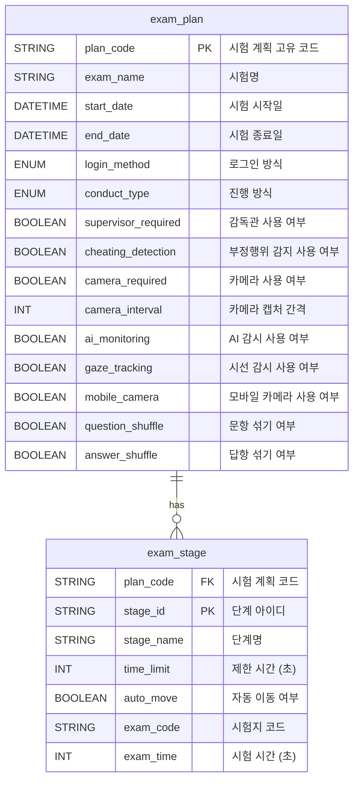

### **시험 계획 정보 데이터 명세서 (업데이트)**

`exam_scenario`와 `exam_stage_details`를 통합하여 하나의 테이블로 설계했습니다. 단계별 세부 정보를 통합적으로 관리하여 데이터의 일관성과 관리 효율성을 높였습니다.

---

### **1. 시험 계획 테이블**

#### **1.1 `exam_plan` (시험 계획 정보)**

| **필드명**          | **데이터 타입** | **설명**                | **예시**                |
| ------------------- | --------------- | ----------------------- | ----------------------- |
| plan_code           | STRING          | 시험 계획 고유 코드     | `PLAN202401`            |
| exam_name           | STRING          | 시험명                  | `2024년 한국어능력시험` |
| start_date          | DATETIME        | 시험 시작일             | `2024-01-15 09:00:00`   |
| end_date            | DATETIME        | 시험 종료일             | `2024-01-16 18:00:00`   |
| login_method        | ENUM            | 로그인 방식             | `웹 로그인`, `키 인증`  |
| conduct_type        | ENUM            | 진행 방식               | `동시시험`, `개별시험`  |
| supervisor_required | BOOLEAN         | 감독관 사용 여부        | `TRUE`                  |
| cheating_detection  | BOOLEAN         | 부정행위 감지 사용 여부 | `FALSE`                 |
| camera_required     | BOOLEAN         | 카메라 사용 여부        | `TRUE`                  |
| camera_interval     | INT             | 카메라 캡처 간격 (초)   | `10`                    |
| ai_monitoring       | BOOLEAN         | AI 감시 사용 여부       | `TRUE`                  |
| gaze_tracking       | BOOLEAN         | 시선 감시 사용 여부     | `FALSE`                 |
| mobile_camera       | BOOLEAN         | 모바일 카메라 사용 여부 | `TRUE`                  |
| question_shuffle    | BOOLEAN         | 문항 섞기 여부          | `TRUE`                  |
| answer_shuffle      | BOOLEAN         | 답항 섞기 여부          | `TRUE`                  |

---

### **2. 시험 단계 테이블**

#### **2.1 `exam_stage` (시험 단계 정보)**

| **필드명** | **데이터 타입** | **설명**                             | **예시**      |
| ---------- | --------------- | ------------------------------------ | ------------- |
| plan_code  | STRING          | 시험 계획 코드 (외래 키)             | `PLAN202401`  |
| stage_id   | STRING          | 단계 아이디                          | `STEP01`      |
| stage_name | STRING          | 단계명                               | `시스템 점검` |
| time_limit | INT             | 제한 시간 (초)                       | `300`         |
| auto_move  | BOOLEAN         | 자동 이동 여부                       | `TRUE`        |
| exam_code  | STRING          | 시험지 코드 (해당 단계에서만 사용)   | `EXAM202401`  |
| exam_time  | INT             | 시험 시간 (초, 시험 단계에서만 사용) | `7200`        |

---

### **3. 데이터 관계**

#### **3.1 관계 다이어그램 (Mermaid)**

---

### **4. 데이터 명세 예시**

#### **4.1 `exam_plan` 데이터 예시**

| **plan_code** | **exam_name**         | **start_date**      | **end_date**        | **login_method** | **conduct_type** | **supervisor_required** | **cheating_detection** | **camera_required** | **camera_interval** | **ai_monitoring** | **gaze_tracking** | **mobile_camera** | **question_shuffle** | **answer_shuffle** |
| ------------- | --------------------- | ------------------- | ------------------- | ---------------- | ---------------- | ----------------------- | ---------------------- | ------------------- | ------------------- | ----------------- | ----------------- | ----------------- | -------------------- | ------------------ |
| PLAN202401    | 2024년 한국어능력시험 | 2024-01-15 09:00:00 | 2024-01-16 18:00:00 | 웹 로그인        | 동시시험         | TRUE                    | FALSE                  | TRUE                | 10                  | TRUE              | FALSE             | TRUE              | TRUE                 | TRUE               |

---

#### **4.2 `exam_stage` 데이터 예시**

| **plan_code** | **stage_id** | **stage_name** | **time_limit** | **auto_move** | **exam_code** | **exam_time** |
| ------------- | ------------ | -------------- | -------------- | ------------- | ------------- | ------------- |
| PLAN202401    | STEP01       | 시스템 점검    | 300            | TRUE          | NULL          | NULL          |
| PLAN202401    | STEP02       | 안내 1         | 600            | TRUE          | NULL          | NULL          |
| PLAN202401    | STEP03       | 안내 2         | 600            | TRUE          | NULL          | NULL          |
| PLAN202401    | STEP04       | 수험자 인증    | 900            | FALSE         | NULL          | NULL          |
| PLAN202401    | STEP05       | 시험 진행      | 7200           | FALSE         | EXAM202401    | 7200          |
| PLAN202401    | STEP06       | 시험 종료      | 300            | TRUE          | NULL          | NULL          |

---

### **5. 저장 구조 설계**

#### **Redis 저장 구조**

| **항목**       | **키 형식**                              | **값 형식** | **예시 값**                            |
| -------------- | ---------------------------------------- | ----------- | -------------------------------------- |
| 시험 계획 정보 | `exam_plan:{plan_code}`                  | Hash        | 시험명, 시작일, 종료일, 감독관 여부 등 |
| 시험 단계 정보 | `exam_plan:{plan_code}:stage:{stage_id}` | Hash        | 단계명, 제한 시간, 자동 이동 여부      |

---
