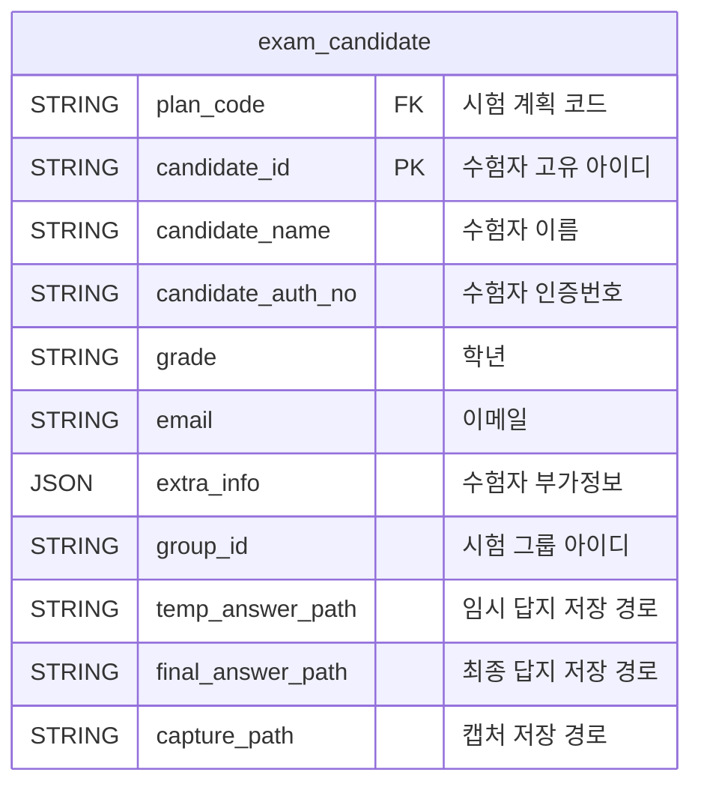

### **수험자 정보 데이터 명세서**

수험자 정보를 통합 관리하고 효율적인 데이터 구조를 제공하기 위해 문서를 업데이트했습니다. 모든 데이터를 단일 테이블로 통합하며, Redis와 데이터베이스 저장 구조를 표준화했습니다.

---

### **1. 수험자 정보 테이블**

#### **1.1 `exam_candidate` (통합 수험자 정보)**

| **필드명**        | **데이터 타입** | **설명**                   | **예시**                              |
| ----------------- | --------------- | -------------------------- | ------------------------------------- |
| plan_code         | STRING          | 시험 계획 코드 (외래 키)   | `PLAN202401`                          |
| candidate_id      | STRING          | 수험자 고유 아이디         | `CAND202301`                          |
| candidate_name    | STRING          | 수험자 이름                | `홍길동`                              |
| candidate_auth_no | STRING          | 수험자 인증번호            | `AUTH1234`                            |
| grade             | STRING          | 학년                       | `고3`                                 |
| email             | STRING          | 이메일                     | `hong@example.com`                    |
| extra_info        | JSON            | 부가 정보 (동적 확장 가능) | `{"school":"서울고", "major":"문과"}` |
| group_id          | STRING          | 시험 그룹 아이디           | `GROUP01`                             |
| temp_answer_path  | STRING          | 임시 답지 저장 경로        | `/temp/PLAN202401/CAND202301`         |
| final_answer_path | STRING          | 최종 답지 저장 경로        | `/final/PLAN202401/CAND202301`        |
| capture_path      | STRING          | 캡처 저장 경로             | `/capture/PLAN202401/CAND202301`      |

---

### **2. 데이터 관계**

#### **2.1 관계 다이어그램**

---

### **3. 데이터 명세 예시**

#### **3.1 `exam_candidate` 데이터 예시**

| **plan_code** | **candidate_id** | **candidate_name** | **candidate_auth_no** | **grade** | **email**        | **extra_info**                        | **group_id** | **temp_answer_path**        | **final_answer_path**        | **capture_path**               |
| ------------- | ---------------- | ------------------ | --------------------- | --------- | ---------------- | ------------------------------------- | ------------ | --------------------------- | ---------------------------- | ------------------------------ |
| PLAN202401    | CAND202301       | 홍길동             | AUTH1234              | 고3       | hong@example.com | {"school": "서울고", "major": "문과"} | GROUP01      | /temp/PLAN202401/CAND202301 | /final/PLAN202401/CAND202301 | /capture/PLAN202401/CAND202301 |

---

### **4. Redis 저장 구조**

| **항목**    | **키 형식**                     | **값 형식** | **예시 값**                                                                                            |
| ----------- | ------------------------------- | ----------- | ------------------------------------------------------------------------------------------------------ |
| 수험자 정보 | `candidate:{candidate_id}:info` | Hash        | `{"name":"홍길동", "auth_no":"AUTH1234", "group":"GROUP01", "temp":"/temp/...", "final":"/final/..."}` |

---
