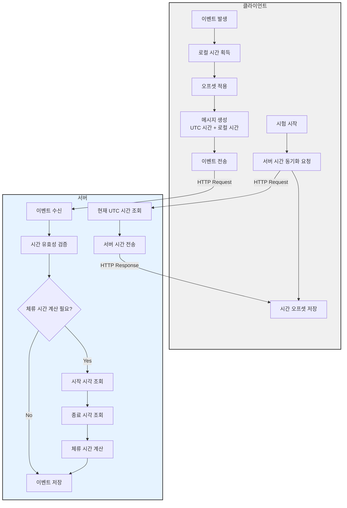

# **온라인 시험 메타정보 수집 설계**

## **1. 용어 정의**

### **1.1 문항 유형**

-   **독립 문항**

    -   지문 없이 단독으로 표시되는 문항
    -   한 화면에 하나의 문항만 표시

-   **그룹 문항**
    -   하나의 지문에 연계된 여러 문항이 함께 표시
    -   지문 영역과 문항 영역으로 구성
    -   동일 그룹 ID로 연결된 복수의 문항

### **1.2 상태 정의**

-   **문항 상태**

    -   활성: 현재 화면에 표시된 상태
    -   비활성: 다른 문항으로 이동하여 화면에서 벗어난 상태

-   **체류 시간**
    -   독립 문항: 문항 진입부터 다른 문항으로 이동까지의 시간
    -   그룹 문항: 그룹 진입부터 다른 문항/그룹으로 이동까지의 시간

### **1.3 시간 정의**

-   **표준 시간**

    -   UTC(협정 세계시) 기준으로 모든 시간 정보 처리
    -   서버와 클라이언트 간 시간 동기화 기준
    -   이벤트 발생 순서 및 체류 시간 계산의 기준

-   **시간 구성 요소**
    -   서버 시간: 시스템 표준시간(UTC)
    -   클라이언트 시간: 응시자 로컬 시간
    -   타임존 정보: IANA 타임존 ID
    -   시간 오프셋: UTC 기준 차이값

## **2. 메타정보 항목**

### **2.1 시간 동기화 메타정보**

| 항목          | 수집 주체  | 처리 주체  | 메시지 이름 및 내용                                                                                                 | 수집 시기                     | 수집 방법                 |
| ------------- | ---------- | ---------- | ------------------------------------------------------------------------------------------------------------------- | ----------------------------- | ------------------------- |
| `시간 동기화` | 서버       | 클라이언트 | `server-time-sync`<br>`{ "serverTime": "2024-01-01T00:00:00Z", "serverTimeMs": 1704067200000 }`                     | - 시험 시작 시<br>- 재접속 시 | 서버 시간 전송            |
| `동기화 응답` | 클라이언트 | 서버       | `client-time-sync`<br>`{ "clientTime": "2024-01-01T09:00:00+09:00", "timezone": "Asia/Seoul", "offset": 32400000 }` | - 시간 동기화 요청 수신 시    | 클라이언트 시간 정보 전송 |

### **2.2 독립 문항 메타정보**

#### **시간 정보**

| 항목             | 수집 주체  | 처리 주체 | 메시지 이름 및 내용                                                                                                                                                                  | 수집 시기                                                       | 수집 방법                 |
| ---------------- | ---------- | --------- | ------------------------------------------------------------------------------------------------------------------------------------------------------------------------------------ | --------------------------------------------------------------- | ------------------------- |
| `문항 진입 시각` | 클라이언트 | 서버      | `client-single-enter`<br>`{ "questionId": "q1", "timestamp": "2024-01-01T00:00:00Z", "localTimestamp": "2024-01-01T09:00:00+09:00", "timezone": "Asia/Seoul", "elapsedTime": 0 }`    | - 네비게이션으로 문항 진입 시<br>- 시험 시작 시 첫 문항 진입 시 | 진입 시각 타임스탬프 전송 |
| `문항 이탈 시각` | 클라이언트 | 서버      | `client-single-exit`<br>`{ "questionId": "q1", "timestamp": "2024-01-01T00:01:00Z", "localTimestamp": "2024-01-01T09:01:00+09:00", "timezone": "Asia/Seoul", "elapsedTime": 60000 }` | - 네비게이션으로 다른 문항 이동 시<br>- 시험 종료 시            | 이탈 시각 타임스탬프 전송 |

#### **답안 응답**

| 항목          | 수집 주체  | 처리 주체 | 메시지 이름 및 내용                                                                                                                                                                           | 수집 시기                                                      | 수집 방법                |
| ------------- | ---------- | --------- | --------------------------------------------------------------------------------------------------------------------------------------------------------------------------------------------- | -------------------------------------------------------------- | ------------------------ |
| `객관식 선택` | 클라이언트 | 서버      | `client-choice-select`<br>`{ "questionId": "q1", "choiceValue": "2", "timestamp": "2024-01-01T00:00:30Z", "localTimestamp": "2024-01-01T09:00:30+09:00", "elapsedTime": 30000 }`              | - 보기 클릭 시<br>- 보기 키보드 선택 시                        | 선택값, 선택시각 전송    |
| `주관식 입력` | 클라이언트 | 서버      | `client-text-input`<br>`{ "questionId": "q1", "inputAction": "focus/typing/blur", "timestamp": "2024-01-01T00:00:30Z", "localTimestamp": "2024-01-01T09:00:30+09:00", "elapsedTime": 30000 }` | - 입력영역 포커스 시<br>- 텍스트 입력 시<br>- 입력영역 이탈 시 | 입력 행위, 발생시각 전송 |

#### **사용자 행동**

| 항목          | 수집 주체  | 처리 주체 | 메시지 이름 및 내용                                                                                                                                                                            | 수집 시기              | 수집 방법                  |
| ------------- | ---------- | --------- | ---------------------------------------------------------------------------------------------------------------------------------------------------------------------------------------------- | ---------------------- | -------------------------- |
| `마우스 클릭` | 클라이언트 | 서버      | `client-mouse-click`<br>`{ "questionId": "q1", "elementType": "choice/text/image", "timestamp": "2024-01-01T00:00:15Z", "localTimestamp": "2024-01-01T09:00:15+09:00", "elapsedTime": 15000 }` | - 문항 영역 내 클릭 시 | 클릭 요소, 발생시각 전송   |
| `스크롤 이동` | 클라이언트 | 서버      | `client-scroll`<br>`{ "questionId": "q1", "direction": "up/down", "timestamp": "2024-01-01T00:00:20Z", "localTimestamp": "2024-01-01T09:00:20+09:00", "elapsedTime": 20000 }`                  | - 문항 영역 스크롤 시  | 스크롤 방향, 발생시각 전송 |

### **2.3 그룹 문항 메타정보**

#### **그룹 시간 정보**

| 항목             | 수집 주체  | 처리 주체 | 메시지 이름 및 내용                                                                                                                                                                                | 수집 시기                                                       | 수집 방법                |
| ---------------- | ---------- | --------- | -------------------------------------------------------------------------------------------------------------------------------------------------------------------------------------------------- | --------------------------------------------------------------- | ------------------------ |
| `그룹 진입 시각` | 클라이언트 | 서버      | `client-group-enter`<br>`{ "groupId": "g1", "passageId": "p1", "questionIds": ["q1","q2"], "timestamp": "2024-01-01T00:00:00Z", "localTimestamp": "2024-01-01T09:00:00+09:00", "elapsedTime": 0 }` | - 네비게이션으로 그룹 진입 시<br>- 시험 시작 시 첫 그룹 진입 시 | 진입 시각, 문항목록 전송 |
| `그룹 이탈 시각` | 클라이언트 | 서버      | `client-group-exit`<br>`{ "groupId": "g1", "timestamp": "2024-01-01T00:02:00Z", "localTimestamp": "2024-01-01T09:02:00+09:00", "elapsedTime": 120000 }`                                            | - 다른 문항/그룹으로 이동 시<br>- 시험 종료 시                  | 이탈 시각 전송           |

#### **지문 행동**

| 항목          | 수집 주체  | 처리 주체 | 메시지 이름 및 내용                                                                                                                                                                           | 수집 시기              | 수집 방법                  |
| ------------- | ---------- | --------- | --------------------------------------------------------------------------------------------------------------------------------------------------------------------------------------------- | ---------------------- | -------------------------- |
| `지문 클릭`   | 클라이언트 | 서버      | `client-passage-click`<br>`{ "passageId": "p1", "position": {"x": 100, "y": 200}, "timestamp": "2024-01-01T00:00:30Z", "localTimestamp": "2024-01-01T09:00:30+09:00", "elapsedTime": 30000 }` | - 지문 영역 내 클릭 시 | 클릭 위치, 발생시각 전송   |
| `지문 스크롤` | 클라이언트 | 서버      | `client-passage-scroll`<br>`{ "passageId": "p1", "direction": "up/down", "timestamp": "2024-01-01T00:00:40Z", "localTimestamp": "2024-01-01T09:00:40+09:00", "elapsedTime": 40000 }`          | - 지문 영역 스크롤 시  | 스크롤 방향, 발생시각 전송 |

#### **그룹 내 문항 응답**

| 항목          | 수집 주체  | 처리 주체 | 메시지 이름 및 내용                                                                                                                                                                                            | 수집 시기                                                      | 수집 방법                     |
| ------------- | ---------- | --------- | -------------------------------------------------------------------------------------------------------------------------------------------------------------------------------------------------------------- | -------------------------------------------------------------- | ----------------------------- |
| `객관식 선택` | 클라이언트 | 서버      | `client-group-choice`<br>`{ "groupId": "g1", "questionId": "q1", "choiceValue": "2", "timestamp": "2024-01-01T00:01:00Z", "localTimestamp": "2024-01-01T09:01:00+09:00", "elapsedTime": 60000 }`               | - 보기 클릭 시<br>- 보기 키보드 선택 시                        | 그룹ID, 문항ID, 선택값 전송   |
| `주관식 입력` | 클라이언트 | 서버      | `client-group-text`<br>`{ "groupId": "g1", "questionId": "q1", "inputAction": "focus/typing/blur", "timestamp": "2024-01-01T00:01:30Z", "localTimestamp": "2024-01-01T09:01:30+09:00", "elapsedTime": 90000 }` | - 입력영역 포커스 시<br>- 텍스트 입력 시<br>- 입력영역 이탈 시 | 그룹ID, 문항ID, 입력행위 전송 |

#### **그룹 내 문항 이동**

| 항목           | 수집 주체  | 처리 주체 | 메시지 이름 및 내용                                                                                                                                                                                    | 수집 시기                  | 수집 방법                   |
| -------------- | ---------- | --------- | ------------------------------------------------------------------------------------------------------------------------------------------------------------------------------------------------------ | -------------------------- | --------------------------- |
| `문항 간 이동` | 클라이언트 | 서버      | `client-group-navigation`<br>`{ "groupId": "g1", "fromQuestion": "q1", "toQuestion": "q2", "timestamp": "2024-01-01T00:01:15Z", "localTimestamp": "2024-01-01T09:01:15+09:00", "elapsedTime": 75000 }` | - 그룹 내 문항 간 이동 시  | 이동 전후 문항ID, 시각 전송 |
| `문항 포커스`  | 클라이언트 | 서버      | `client-group-focus`<br>`{ "groupId": "g1", "questionId": "q1", "focusState": "in/out", "timestamp": "2024-01-01T00:01:20Z", "localTimestamp": "2024-01-01T09:01:20+09:00", "elapsedTime": 80000 }`    | - 문항 영역 포커스 변경 시 | 포커스 상태, 발생시각 전송  |

## **3. 처리 규칙**

### **3.1 시간 처리 규칙**

#### **1. 시간 동기화 처리**

1. 초기 동기화

    - 시험 시작 시 서버-클라이언트 시간 동기화
    - 클라이언트 타임존 및 오프셋 정보 저장
    - 시간 차이(보정값) 계산

2. 지속적 검증

    - 주기적 시간 차이 검증 (5분 간격)
    - 클라이언트 시간 조작 감지
    - 비정상 시간 차이 발생 시 재동기화

3. 이벤트 시간 처리
    - 모든 이벤트 시간을 UTC로 변환하여 처리
    - 로컬 시간 정보는 참조용으로 저장
    - 시험 시작 후 경과 시간 기록

#### **2. 체류 시간 계산**

1. UTC 기준 계산

    - 진입 시각: UTC 타임스탬프
    - 이탈 시각: UTC 타임스탬프
    - 체류 시간 = 이탈 시각 - 진입 시각

2. 시간 보정

    - 서버-클라이언트 시간 차이 보정
    - 네트워크 지연 보정
    - 시간대 변경 발생 시 재계산

3. 예외 상황 처리
    - 세션 종료: 마지막 유효 시간 기준 처리
    - 비정상 종료: 서버 시간 기준으로 보정
    - 시간대 변경: UTC 기준으로 재계산
    - 브라우저 전환/비활성: 체류 시간 별도 표시

### **3.2 독립 문항 처리**

1. 시간 처리

    - 진입 시각: 문항 표시 시점(UTC)
    - 이탈 시각: 다른 문항으로 이동 시점(UTC)
    - 체류 시간: 이탈 시각 - 진입 시각
    - 유효 체류 시간: 브라우저 활성 상태의 체류 시간

2. 방문 처리

    - 최초 방문: 시험 중 첫 진입
    - 재방문: 다른 문항에서 재진입
    - 방문 횟수: 진입 이벤트 카운트
    - 방문 이력: 시간순 방문 기록

3. 응답 처리
    - 선택/입력 시각 기록(UTC)
    - 변경 횟수 카운트
    - 최종 응답 시각 기록
    - 응답 이력 시간순 저장

### **3.3 그룹 문항 처리**

1. 그룹 단위 처리

    - 그룹 진입 시각: 지문과 문항들이 표시된 시점(UTC)
    - 그룹 체류 시간: 그룹 내 전체 문항의 총 체류 시간
    - 그룹 이탈 시각: 다른 독립 문항/그룹으로 이동 시점(UTC)
    - 유효 체류 시간: 브라우저 활성 상태의 체류 시간

2. 지문 행동 처리

    - 지문 참조: 스크롤/클릭 이벤트 발생 시점(UTC)
    - 연계 기록: 지문 참조 시 연계된 모든 문항에 기록
    - 참조 횟수: 지문 영역 활동 카운트
    - 참조 패턴: 시간순 지문 활동 기록

3. 개별 문항 처리

    - 문항별 응답 시각 기록(UTC)
    - 문항 간 이동 순서 기록
    - 응답 변경 이력 관리
    - 문항별 체류 시간 계산

4. 그룹 내 이동
    - 동일 그룹 내 문항 간 이동 기록
    - 문항별 포커스 변경 시각 기록(UTC)
    - 지문-문항 간 시선 이동 패턴 분석
    - 이동 순서 및 시간 간격 분석

## **4. 데이터 저장 구조**

### **4.1 시간 정보 저장**

```sql
CREATE TABLE event_times (
    event_id VARCHAR(36) PRIMARY KEY,
    utc_timestamp TIMESTAMP,      -- UTC 기준
    local_timestamp TIMESTAMP,    -- 로컬 시간
    timezone VARCHAR(50),         -- IANA 타임존
    timezone_offset INT,          -- UTC 오프셋(초)
    elapsed_time BIGINT,         -- 경과 시간(ms)
    is_valid BOOLEAN,            -- 시간 유효성
    correction_value INT         -- 보정값(ms)
);
```

### **4.2 이벤트 저장**

```sql
CREATE TABLE events (
    event_id VARCHAR(36) PRIMARY KEY,
    session_id VARCHAR(36),      -- 시험 세션
    event_type VARCHAR(50),      -- 이벤트 유형
    question_id VARCHAR(36),     -- 문항 ID
    group_id VARCHAR(36),        -- 그룹 문항의 경우
    passage_id VARCHAR(36),      -- 지문 ID
    event_data JSON,             -- 이벤트 상세 데이터
    time_info_id VARCHAR(36),    -- event_times 참조
    created_at TIMESTAMP        -- 서버 저장 시각
);
```

### **4.3 체류 시간 저장**

```sql
CREATE TABLE duration_logs (
    duration_id VARCHAR(36) PRIMARY KEY,
    question_id VARCHAR(36),     -- 문항 ID
    group_id VARCHAR(36),        -- 그룹 ID
    start_time_id VARCHAR(36),   -- 시작 event_times 참조
    end_time_id VARCHAR(36),     -- 종료 event_times 참조
    total_duration BIGINT,       -- 총 체류 시간(ms)
    active_duration BIGINT,      -- 유효 체류 시간(ms)
    is_valid BOOLEAN            -- 유효성 여부
);
```

## **5. 데이터 정합성 검증**

### **5.1 시간 정합성**

1. 이벤트 순서 검증

    - 시간 역전 현상 검사
    - 논리적 순서 검증
    - 체류 시간 유효성 검증
    - 시간 간격 비정상 검사

2. 시간 보정
    - 클라이언트 시간 조작 감지 시 보정
    - 네트워크 지연 보정
    - 비정상 체류 시간 보정
    - 시간대 변경 시 재계산

### **5.2 데이터 정합성**

1. 공통 검증

    - 이벤트 연속성 검증
    - 필수 필드 존재 확인
    - 참조 ID 유효성 검증
    - 데이터 형식 검증

2. 독립 문항 검증

    - 단일 문항 진입/이탈 순서 검증
    - 응답 시각의 체류 시간 내 포함 여부
    - 중복 이벤트 필터링
    - 이벤트 간격 유효성 검증

3. 그룹 문항 검증
    - 그룹 ID와 소속 문항 ID 일치 여부
    - 지문 참조와 문항 응답의 시간 순서
    - 그룹 내 문항 이동 순서
    - 연계 문항 응답 순서 검증

## **6. 특이사항**

### **6.1 시간 관련 특이사항**

1. 글로벌 서비스 고려사항

    - 다양한 시간대 지원
    - DST(일광절약시간) 처리
    - 국제 표준시 기준 처리
    - 지역별 시간 표시 지원

2. 보안 고려사항
    - 시간 조작 방지
    - 시간 동기화 신뢰성 확보
    - 이상 징후 감지 및 대응
    - 시간 관련 로그 보관

### **6.2 일반 특이사항**

1. 무상태 클라이언트

    - 이벤트 발생 시점에만 데이터 전송
    - 모든 상태 관리는 서버에서 수행
    - 네트워크 단절 대비 임시 저장
    - 재접속 시 데이터 동기화

2. 자유 네비게이션

    - 문항 유형 간 자유로운 이동 지원
    - 재방문 시나리오 처리
    - 이동 패턴 분석 지원
    - 네비게이션 로그 기록

3. 데이터 신뢰성
    - 명확한 이벤트 발생 시점 정의
    - 문항 유형별 독립적 처리 보장
    - 데이터 정합성 검증
    - 감사 로그 유지

## **7. 각 구성 요소의 역할**

### 클라이언트-서버 시간 처리 플로우 다이어그램



#### 1. 클라이언트 역할

-   시험 시작 시 서버와 시간 동기화
-   로컬 시간 기록 및 UTC 변환
-   이벤트 발생 시 시간 정보 포함하여 전송
-   타임존 정보 관리

#### 2. 서버 역할

-   UTC 기준 시간 제공
-   수신된 이벤트의 시간 유효성 검증
-   체류 시간 계산
-   모든 시간 데이터의 UTC 기준 저장

#### 3. 데이터 흐름

1. 시간 동기화

    - 클라이언트: 시간 동기화 요청
    - 서버: UTC 시간 전송
    - 클라이언트: 오프셋 계산 및 저장

2. 이벤트 처리
    - 클라이언트: 이벤트 시간 기록 및 전송
    - 서버: 시간 검증 및 처리
    - 서버: 데이터베이스 저장
