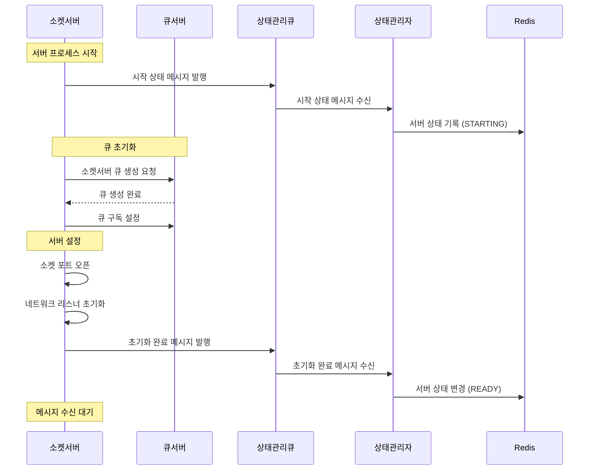
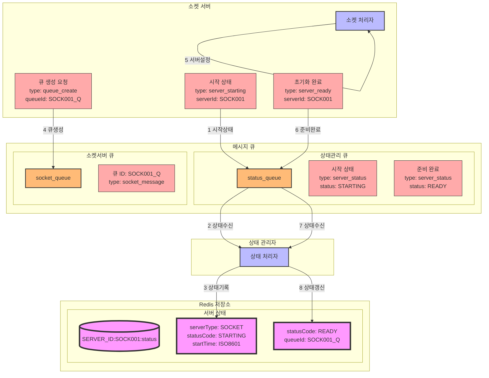

### **소켓서버 초기화 시나리오**

#### **1 시나리오 개요**

-   목적: 소켓서버의 초기화 및 준비상태 설정
-   처리 항목: 서버 시작, 서버 설정, 초기화 완료 처리
-   트리거: 소켓서버 프로세스 시작
-   결과: 소켓서버 준비 완료 및 메시지 수신 대기

#### **2 시퀀스 다이어그램**



#### **3 데이터 흐름**



### **9.4 메시지 구조**

3. 큐 생성 요청 메시지

```json
{
    "type": "queue_create",
    "data": {
        "serverId": "SOCK001",
        "queueId": "SOCK001_Q",
        "queueType": "socket_message",
        "config": {
            "maxSize": 10000,
            "expireTime": 3600,
            "priority": "high"
        }
    }
}
```

### **9.5 처리 절차**

1. 서버 상태 관리

```redis
# 서버 상태 정보
SERVER_ID:{serverId}:status
{
    "serverType": "SOCKET",
    "statusCode": "READY",
    "startTime": "2024-01-01T08:50:00Z",
    "queueId": "SOCK001_Q",
    "cpuUsage": 0.0,
    "memoryUsage": 0.0,
    "networkStatus": "GOOD"
}
```

2. 큐 생성 및 설정

    - 소켓서버 전용 큐 생성
    - 큐 구독 설정
    - 메시지 핸들러 등록

3. 에러 처리 (추가)
    - 큐 생성 실패
    - 구독 설정 실패
    - 메시지 핸들러 등록 실패
