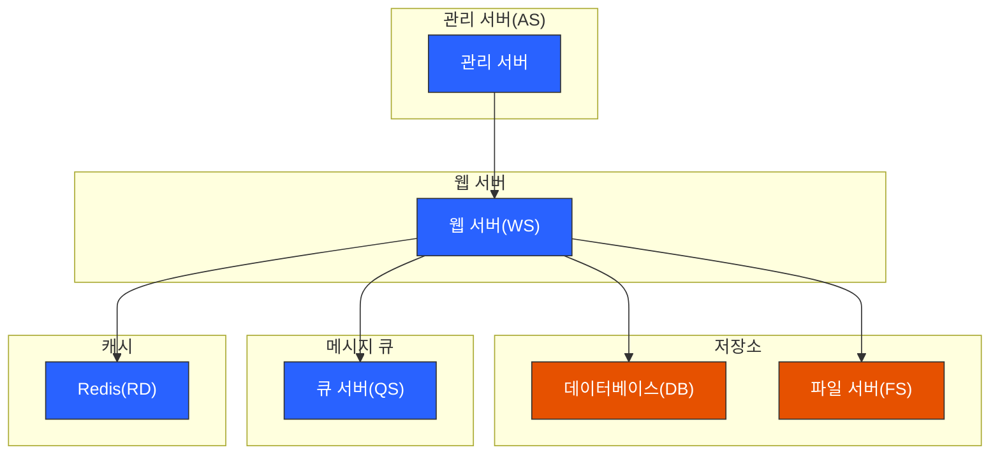
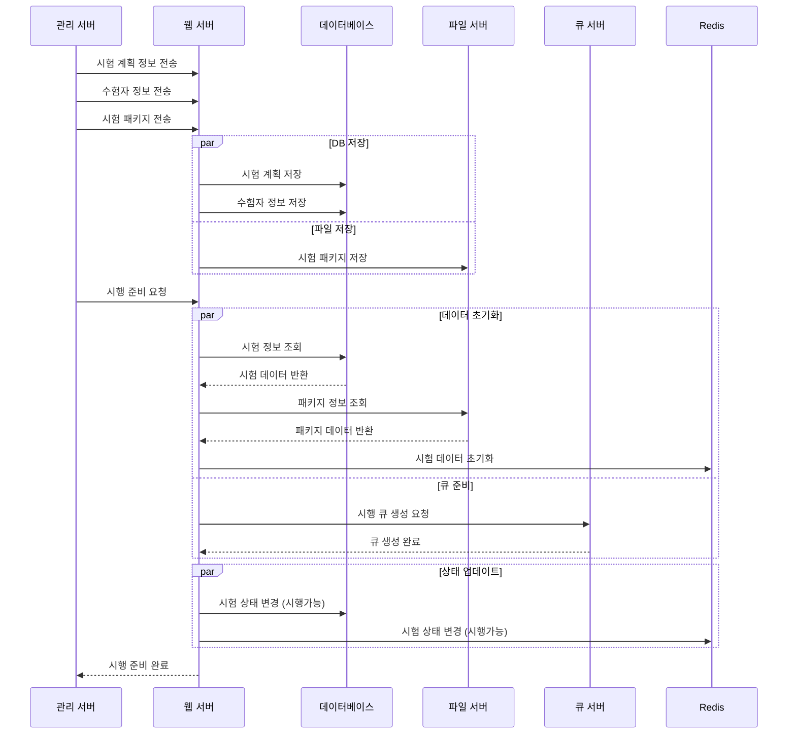

# 시험 준비 프로세스

## 1. 시험 데이터 전송 및 저장

-   시험 계획 정보 전송 및 저장
-   수험자 정보 전송 및 저장
-   시험 패키지 전송 및 저장

## 2. 시험 환경 초기화

-   Redis 데이터 초기화
-   큐 서버 준비
-   시스템 상태 설정

## 3. 상태 변경

-   시험 상태를 시행 가능 상태로 변경
-   DB와 Redis 상태 동기화

