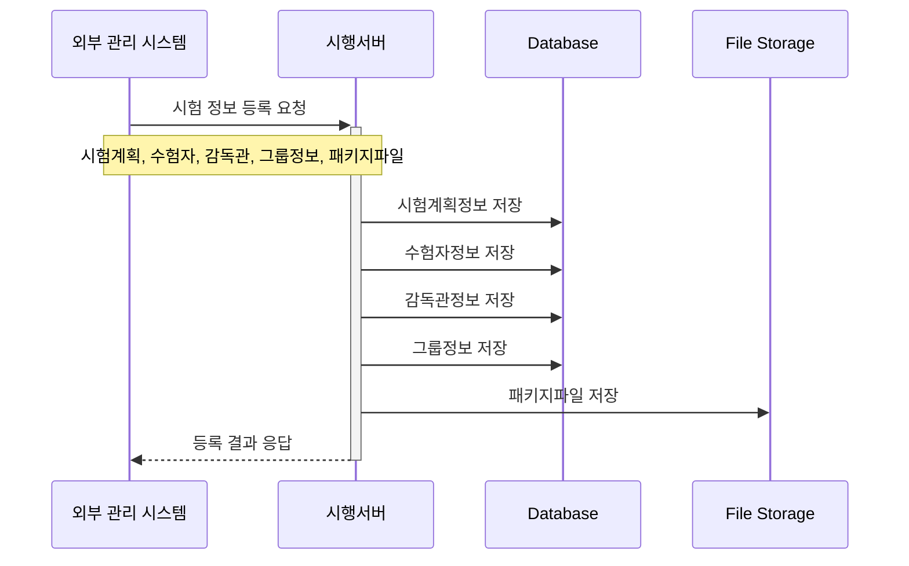
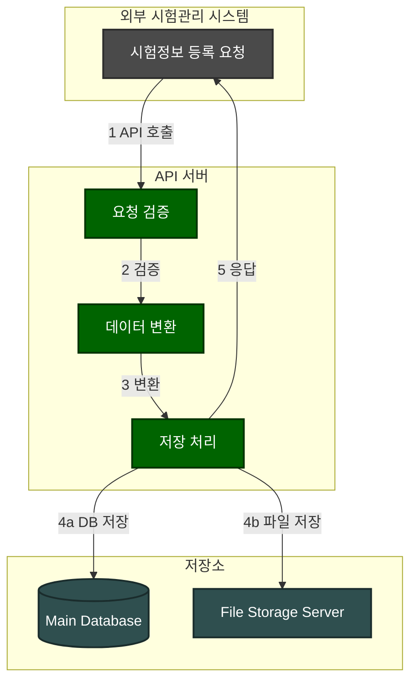

### **1. 시험 초기화 시나리오**

#### **1.1 시나리오 개요**

-   목적: 외부 시험관리 시스템으로부터 시험 정보를 등록
-   처리 항목: 시험계획정보, 수험자정보, 감독관정보, 그룹정보, 패키지파일
-   트리거: 외부 시험관리 시스템의 API 호출
-   결과: 시험 정보 등록 및 확인 응답

#### **1.2 시퀀스 다이어그램**



#### **1.3 데이터 흐름**



#### **1.4 메시지 구조**

1. 시험 정보 등록 요청 메시지

```json
{
    "type": "exam_registration",
    "planInfo": {
        "planId": "P001",
        "planName": "2024년 1회차 시험",
        "startDatetime": "2024-01-01T09:00:00Z",
        "endDatetime": "2024-01-01T12:00:00Z"
    },
    "groups": [
        {
            "groupId": "G001",
            "groupName": "A그룹",
            "groupDesc": "이공계열"
        }
    ],
    "examinees": [
        {
            "examineeId": "E001",
            "groupId": "G001",
            "examineeName": "김수험"
        }
    ],
    "supervisors": [
        {
            "supervisorId": "S001",
            "groupId": "G001",
            "supervisorName": "홍길동"
        }
    ],
    "packageFile": {
        "fileName": "exam_package.zip",
        "fileSize": 1024000,
        "fileHash": "abc123..."
    }
}
```

_데이타구조는 구조 설계를 단순화하기 위해 요약된 형식으로 작성된 것이며, 실제 구현에 따라 변경될 수 있습니다._

```json
{
    "type": "exam_registration_response",
    "status": "success",
    "data": {
        "planId": "P001",
        "registeredAt": "2024-01-01T00:00:00Z",
        "details": {
            "groupCount": 1,
            "examineeCount": 1,
            "supervisorCount": 1,
            "packageStatus": "stored"
        }
    }
}
```

#### **1.5 처리 절차**

1. 요청 검증

    - API 인증/인가 확인
    - 필수 데이터 존재 여부 확인
    - 데이터 형식 검증
    - 패키지 파일 무결성 검증

2. 데이터 저장

    - 시험계획정보 저장
    - 그룹정보 저장
    - 수험자정보 저장
    - 감독관정보 저장
    - 패키지파일 저장

3. 결과 응답
    - 처리 결과 생성
    - 응답 메시지 전송
