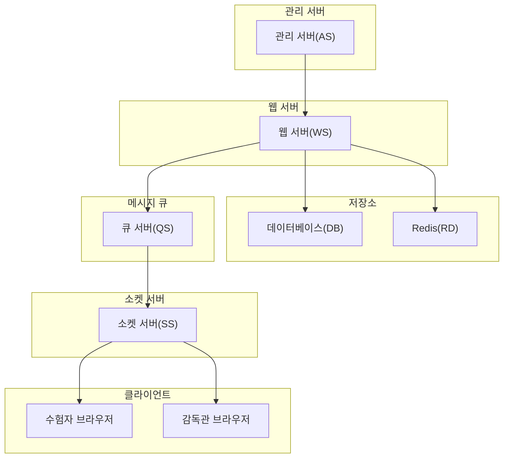
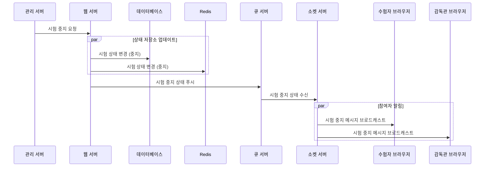

# 시험 완료 프로세스

## 1. 시험 중지 요청

-   관리 서버로부터 시험 중지 요청 수신
-   상태 저장소 업데이트 (Redis, DB)

## 2. 상태 전파

-   큐 서버를 통한 상태 변경 전파
-   소켓 서버의 브로드캐스팅
-   모든 참여자에게 알림

## 3. 처리 결과

-   수험자/감독관에게 시험 중지 알림
-   시스템 상태 최종 업데이트

