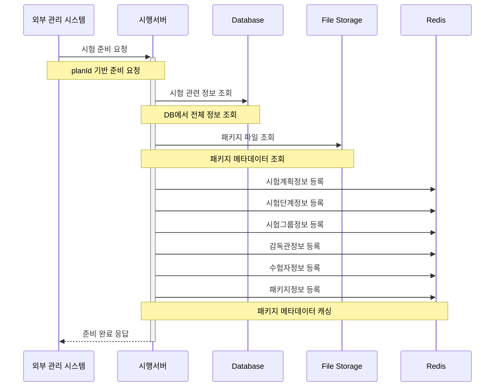
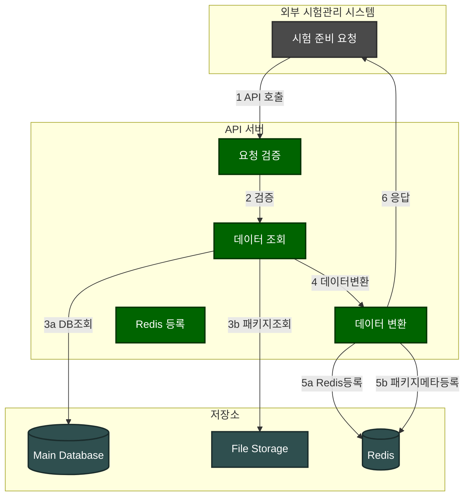

### **2. 시험 준비 시나리오**

#### **2.1 시나리오 개요**

-   목적: 시험 초기화 이후 Redis에 시험 운영을 위한 데이터 등록
-   처리 항목: 시험계획정보, 시험단계정보, 시험그룹정보, 감독관정보, 수험자정보, 패키지정보
-   트리거: 외부 시험관리 시스템의 API 호출
-   결과: Redis 데이터 등록 및 확인 응답

#### **2.2 시퀀스 다이어그램**



#### **2.3 데이터 흐름**



#### **2.4 메시지 구조**

1. 시험 준비 요청 메시지

```json
{
    "type": "exam_preparation",
    "planId": "P001"
}
```

2. 시험 준비 응답 메시지

```json
{
    "type": "exam_preparation_response",
    "status": "success",
    "data": {
        "planId": "P001",
        "preparedAt": "2024-01-01T00:00:00Z",
        "details": {
            "planInfo": "stored",
            "stageInfo": "stored",
            "groupInfo": "stored",
            "supervisorInfo": "stored",
            "examineeInfo": "stored"
        }
    }
}
```

#### **2.5 처리 절차**

1. 요청 검증

    - API 인증/인가 확인
    - planId 유효성 검증
    - 시험 상태 검증 (초기화 완료 상태 확인)

2. 데이터 준비

    - Database에서 관련 정보 조회
    - Redis 데이터 구조에 맞게 데이터 변환

3. Redis 데이터 등록

    ```redis
    # 시험 계획 정보
    plan:{planId}:info
    plan:{planId}:stages

    # 시험 그룹 정보
    plan:{planId}:groups
    plan:{planId}:group:{groupId}:info

    # 감독관 정보
    plan:{planId}:group:{groupId}:supervisors
    plan:{planId}:supervisor:{supervisorId}:info

    # 수험자 정보
    plan:{planId}:group:{groupId}:examinees
    plan:{planId}:examinee:{examineeId}:info

    # 패키지 파일 메타데이터

    plan:{planId}:package:info -> Hash
    {
    "fileName": "exam_package.zip",
    "fileSize": 1024000,
    "fileHash": "abc123...",
    "storagePath": "/storage/exam/P001/",
    "lastModified": "2024-01-01T00:00:00Z",
    "status": "READY"
    }

    # 패키지 구성 파일 목록

    plan:{planId}:package:files -> Set
    [
    "questions.json",
    "resources/images/",
    "resources/audio/"
    ]

    # 패키지 무결성 정보

    plan:{planId}:package:integrity -> Hash
    {
    "totalFiles": 100,
    "totalSize": 1024000,
    "checksumMap": "{\"questions.json\":\"hash1\", ...}",
    "verifiedAt": "2024-01-01T00:00:00Z"
    }
    ```

4. 진행상태 갱신

    - 시험 상태 'READY' 확인
    - 그룹별 상태 초기화
    - 수험자/감독관 상태 초기화
    - 패키지 상태 확인 및 초기화

5. 결과 응답

    ```json
    {
        "type": "exam_preparation_response",
        "status": "success",
        "data": {
            "planId": "P001",
            "preparedAt": "2024-01-01T00:00:00Z",
            "details": {
                "planInfo": "stored",
                "stageInfo": "stored",
                "groupInfo": "stored",
                "supervisorInfo": "stored",
                "examineeInfo": "stored",
                "packageInfo": {
                    "status": "stored",
                    "fileCount": 100,
                    "totalSize": 1024000
                }
            }
        }
    }
    ```
