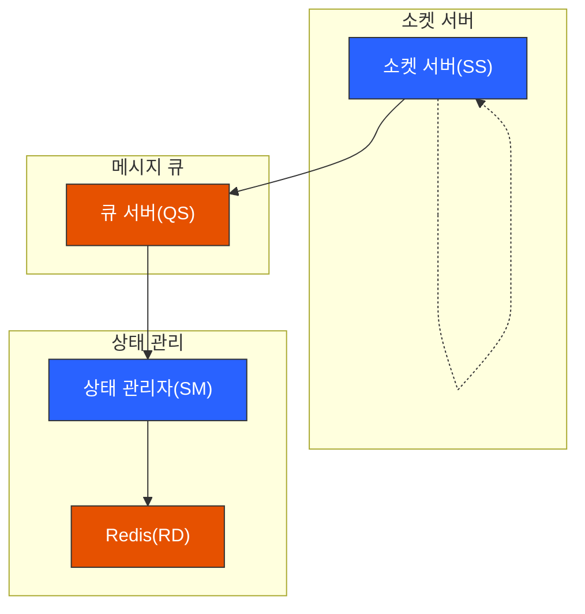
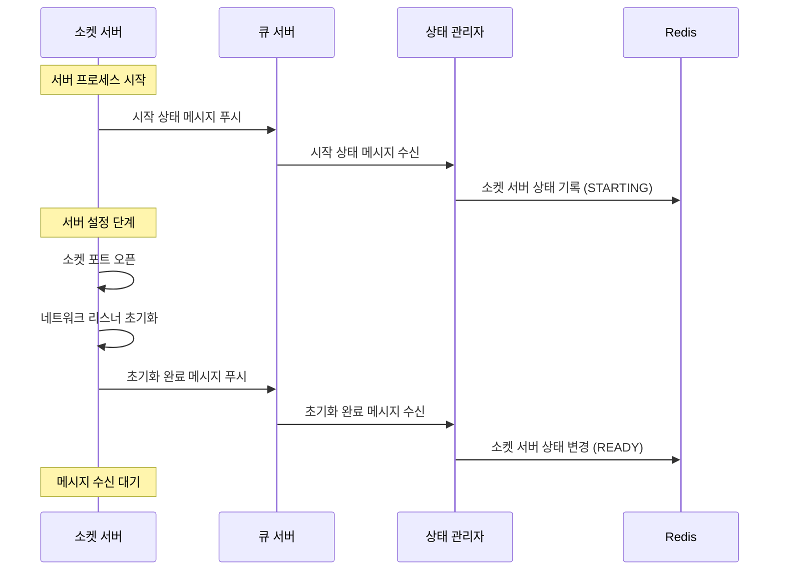

# 소켓 서버 초기화 프로세스

## 1. 초기화 단계

### 1.1 시작 상태 알림

-   소켓 서버 → 큐 서버: 시작 상태 전송
-   상태 관리자: 시작 상태 처리
-   Redis: 소켓 서버 상태 기록

### 1.2 서버 설정

-   소켓 서버: 포트 오픈
-   네트워크 리스너 초기화

### 1.3 초기화 완료

-   소켓 서버 → 큐 서버: 초기화 완료 알림
-   상태 관리자: 준비 상태로 변경
-   메시지 수신 대기 상태 진입

