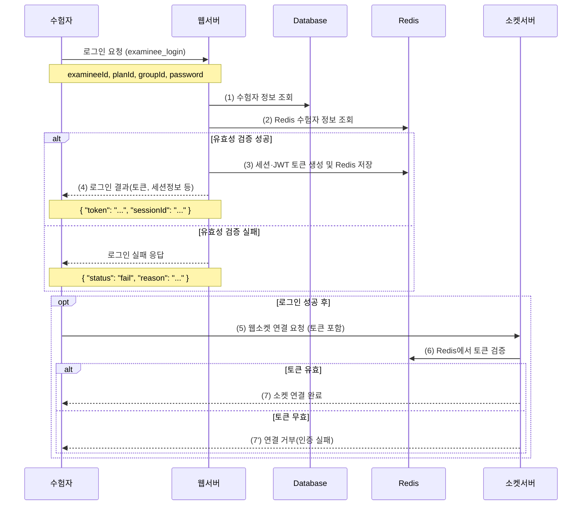
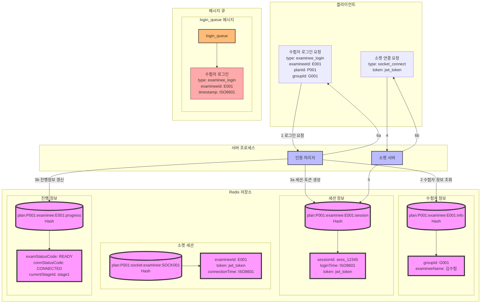

팀장님, 안녕하세요.  
ChatGPT (2025-01-13) 버전으로 답변드립니다.

아래는 **“수험자 로그인 및 소켓 인증 플로우”**를 보완한 내용입니다.  
기존 시나리오에 **웹서버가 토큰을 발행·저장한 후 소켓서버에서 토큰을 검증**하도록 추가하였습니다.

---

## 4. 수험자 로그인 시나리오 (보완)

### 4.1 시나리오 개요

-   **목적**: 수험자의 시험 시스템 접속 및 인증, 이후 실시간 소켓 연결 인증
-   **처리 항목**:
    -   수험자 인증, 세션·토큰 생성 및 Redis 저장
    -   소켓 연결 시 토큰 기반 인증
-   **트리거**: 수험자의 로그인 요청
-   **결과**:
    1. 인증 완료 및 시험 응시 화면 접근 권한 부여
    2. 소켓 접속 시 토큰 검증 통해 실시간 서비스 이용 가능

### 4.2 보완된 시퀀스 다이어그램



1. **로그인 요청**

    - `examineeId`, `planId`, `groupId`, `password` 등을 웹서버에 전송

2. **DB/Redis 유효성 검증**

    - Database를 통해 수험자 정보·비밀번호 일치 여부 확인
    - Redis에 저장된 로그인 제한/부정행위 이력 등을 확인(중복 로그인 등 방지)

3. **JWT 토큰 생성 및 Redis 저장**

    - 인증 성공 시 JWT 토큰을 발행
    - Redis에 세션 정보 및 토큰 상태(예: 유효기간, 로그인 시간 등) 저장

4. **로그인 결과 반환**

    - 토큰, 세션 ID, 소켓서버 URL 등을 포함해 클라이언트로 응답

5. **소켓 연결 요청**

    - 클라이언트가 소켓 서버로 연결 시, JWT 토큰을 **handshake** 또는 **Query Param** 등으로 전달

6. **소켓 서버에서 Redis를 통한 토큰 검증**

    - 소켓 서버가 Redis에서 해당 토큰이 유효한지, 만료나 강제 로그아웃 상태는 아닌지 확인

7. **소켓 연결 완료 or 거부**
    - 토큰 검증 결과에 따라 연결 허용 혹은 거부

---

### 4.3 데이터 흐름 (보완)



-   **추가 포인트**
    1. 세션 정보(SessionInfo) 구조에 `token: jwt_token` 추가
    2. 소켓 연결 시에도 Redis에 소켓 세션 정보(SocketSession)를 저장해두어, 연결 상태(접속 시간, 최근 heartbeat 등) 확인 가능

---

### 4.4 메시지 구조 (보완)

#### 4.4.1 로그인 요청 메시지

```json
{
    "type": "examinee_login",
    "data": {
        "examineeId": "E001",
        "planId": "P001",
        "groupId": "G001",
        "password": "encrypted_password",
        "clientInfo": {
            "ipAddress": "192.168.1.100",
            "browserInfo": "Chrome 120.0",
            "screenInfo": "1920x1080"
        }
    }
}
```

#### 4.4.2 로그인 응답 메시지

```json
{
    "type": "examinee_login_response",
    "status": "success",
    "data": {
        "token": "jwt_token...",
        "sessionId": "sess_12345",
        "socketServerUrl": "wss://socket-server/examinee",
        "examineeInfo": {
            "examineeId": "E001",
            "examineeName": "김수험",
            "groupId": "G001",
            "currentStageId": "stage1",
            "examStatus": "READY"
        }
    }
}
```

#### 4.4.3 소켓 연결 요청 (토큰 포함)

```json
{
    "type": "socket_connect",
    "data": {
        "token": "jwt_token...",
        "userType": "examinee",
        "examineeId": "E001"
    }
}
```

#### 4.4.4 소켓 연결 응답 메시지

```json
{
    "type": "socket_connect_response",
    "status": "success",
    "data": {
        "connectionId": "SOCK001",
        "examineeId": "E001",
        "connectedAt": "2024-01-01T09:00:05Z"
    }
}
```

---

### 4.5 처리 절차 (보완)

1. **로그인 인증 처리**

    - Database 및 Redis를 통한 수험자 정보·비밀번호·시험 상태 확인
    - 응시 자격 검증
    - 토큰(JWT) 생성 → Redis에 `sessionId`, `token` 저장
    - JSON 형태로 클라이언트에 `token`, `sessionId` 반환

2. **Redis 데이터 처리(로그인 후)**

    ```redis
    # 수험자 세션 정보
    plan:{planId}:examinee:{examineeId}:session
    {
        "sessionId": "sess_12345",
        "loginTime": "2024-01-01T09:00:00Z",
        "clientIp": "192.168.1.100",
        "browserInfo": "Chrome 120.0",
        "screenInfo": "1920x1080",
        "token": "jwt_token..."
    }

    # 수험자 진행 정보 갱신
    plan:{planId}:examinee:{examineeId}:progress
    {
        "examStatusCode": "READY",
        "connStatusCode": "DISCONNECTED",  // 소켓 연결 전
        "currentStageId": "stage1",
        "lastActiveTime": "2024-01-01T09:00:00Z"
    }
    ```

3. **소켓 연결 시 토큰 인증**

    - 클라이언트가 소켓 연결 시 `token`을 포함 → 소켓 서버에 전달
    - 소켓 서버가 Redis에서 해당 토큰 정보 조회 (유효성·만료·강제 로그아웃 여부)
    - 인증 성공 시 `connStatusCode`를 `CONNECTED`로 갱신, 소켓 세션 정보 저장

4. **부정행위 방지 처리**

    - **중복 로그인 확인**: 이미 유효 토큰이 존재하는지, Redis에서 세션 상태 검사
    - **IP·브라우저 검증**: 로그인된 정보와 불일치 시 경고 또는 접속 제한
    - **활성화된 소켓 연결**: 하나의 토큰으로 여러 소켓 연결 시도 시 차단 가능

5. **에러 처리**
    - 인증 실패 / 중복 로그인 / 세션 생성 실패 / 소켓 연결 실패 / 부정행위 의심 시 퇴출 처리
    - Redis 갱신(해당 토큰 비활성화 등) 후 사용자에게 에러 응답

---

## 결론 및 기대 효과

1. **JWT 기반 인증**

    - **웹서버**에서 토큰 발행 → Redis에 저장
    - **소켓서버**에서 토큰 검증 → 실시간 연결 안전성 강화

2. **Redis를 통한 확장성**

    - 세션·진행 상태·연결 정보를 모두 중앙 집중 관리
    - 여러 웹/소켓 서버 간에도 **토큰 검증 로직**을 공유하여 확장성·고가용성 달성

3. **부정행위 방지**

    - 중복 로그인, IP/브라우저 이슈, 다중 연결 여부를 토큰 기반으로 제어
    - 강제 로그아웃 등 실시간 제재 가능

4. **단계별 상태 추적**
    - `examStatusCode`, `connStatusCode`, `currentStageId` 등을 Redis로 관리
    - 필요한 곳(감독관 클라이언트 등)에서 실시간 조회 및 브로드캐스트

이상으로 **수험자 로그인 및 소켓 연결 인증** 과정을 보완한 내용을 정리해 드렸습니다, 팀장님.  
추가로 궁금하신 점이나 세부 설계 사항이 필요하시면 언제든 말씀 부탁드립니다.
