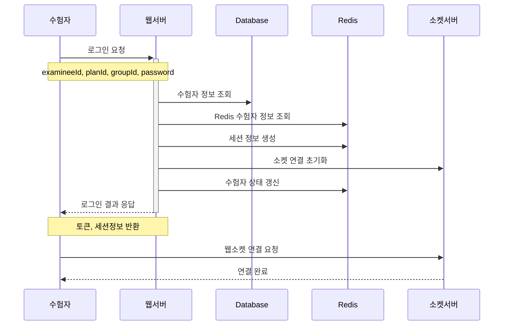
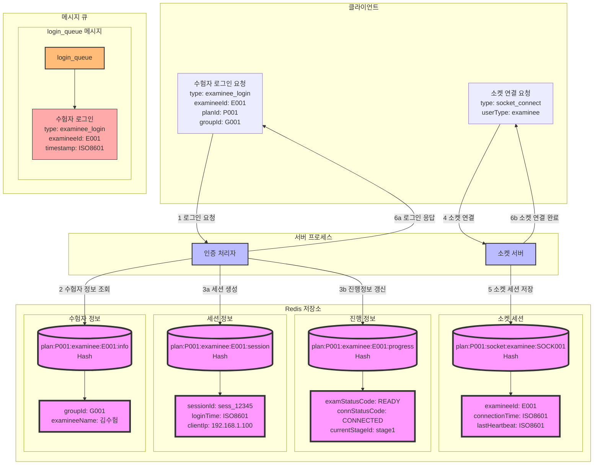

### **4. 수험자 로그인 시나리오**

#### **4.1 시나리오 개요**

-   목적: 수험자의 시험 시스템 접속 및 인증
-   처리 항목: 수험자 인증, 세션 생성, 소켓 연결, 상태 정보 갱신
-   트리거: 수험자의 로그인 요청
-   결과: 인증 완료 및 시험 응시 화면 접근 권한 부여

#### **4.2 시퀀스 다이어그램**



#### **4.3 데이터 흐름**



#### **4.4 메시지 구조**

1. 로그인 요청 메시지

```json
{
    "type": "examinee_login",
    "data": {
        "examineeId": "E001",
        "planId": "P001",
        "groupId": "G001",
        "password": "encrypted_password",
        "clientInfo": {
            "ipAddress": "192.168.1.100",
            "browserInfo": "Chrome 120.0",
            "screenInfo": "1920x1080"
        }
    }
}
```

2. 로그인 응답 메시지

```json
{
    "type": "examinee_login_response",
    "status": "success",
    "data": {
        "token": "jwt_token...",
        "sessionId": "sess_12345",
        "socketServerUrl": "wss://socket-server/examinee",
        "examineeInfo": {
            "examineeId": "E001",
            "examineeName": "김수험",
            "groupId": "G001",
            "currentStageId": "stage1",
            "examStatus": "READY"
        }
    }
}
```

#### **4.5 처리 절차**

1. 인증 처리

    - 수험자 정보 유효성 검증
    - 시험 계획 상태 확인
    - 그룹 할당 여부 확인
    - 응시 자격 검증
    - 비밀번호 검증

2. Redis 데이터 처리

```redis
# 수험자 세션 정보
plan:{planId}:examinee:{examineeId}:session
{
    "sessionId": "sess_12345",
    "loginTime": "2024-01-01T09:00:00Z",
    "clientIp": "192.168.1.100",
    "browserInfo": "Chrome 120.0",
    "screenInfo": "1920x1080"
}

# 수험자 진행 정보 갱신
plan:{planId}:examinee:{examineeId}:progress
{
    "examStatusCode": "READY",
    "connStatusCode": "CONNECTED",
    "currentStageId": "stage1",
    "lastActiveTime": "2024-01-01T09:00:00Z"
}

# 그룹별 접속 수험자 관리
plan:{planId}:group:{groupId}:examinee:active -> Set
```

3. 부정행위 방지 처리

    - 중복 로그인 확인
    - IP 주소 검증
    - 브라우저 환경 검증

4. 에러 처리
    - 인증 실패 처리
    - 중복 로그인 처리
    - 세션 생성 실패 처리
    - 소켓 연결 실패 처리
    - 부정행위 의심 처리
