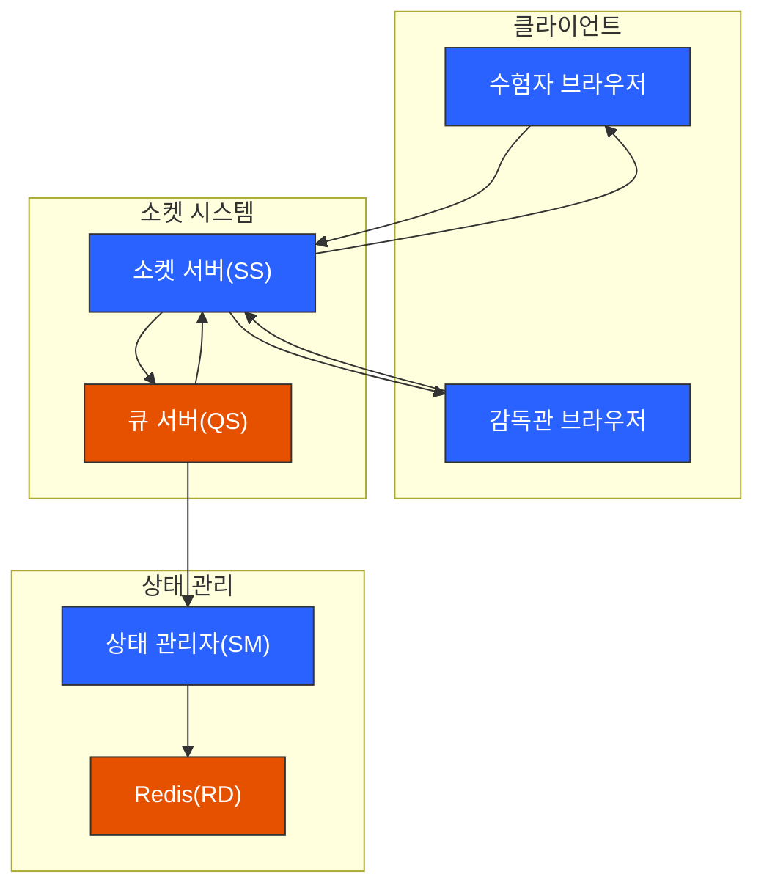
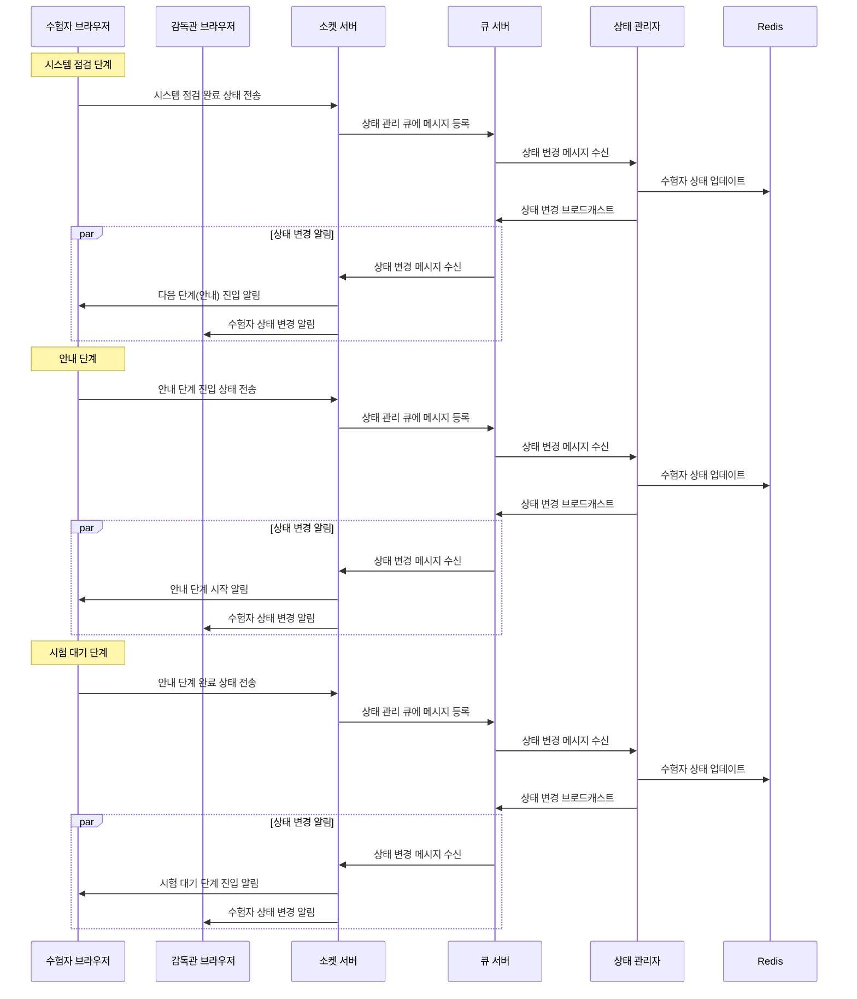

# 시험 단계 진행 프로세스

## 1. 참여 구성요소

-   클라이언트: 수험자 브라우저, 감독관 브라우저
-   서버: 소켓 서버, 큐 서버
-   처리기: 상태 관리자(State Manager)
-   저장소: Redis

## 2. 단계 전환 프로세스

각 단계(시스템 점검 → 안내 → 시험 대기)는 다음 패턴으로 진행:

1. 현재 단계 완료 처리

    - 수험자 → 소켓 서버: 단계 완료 상태 전송
    - 소켓 서버 → 큐 서버: 상태 관리 큐에 메시지 등록
    - 상태 관리자: 수험자 상태 정보 업데이트

2. 다음 단계 진입 처리

    - 상태 관리자 → 큐 서버: 상태 변경 브로드캐스트
    - 소켓 서버: 상태 변경 알림 전파
    - 수험자: 다음 단계 화면 표시

3. 다음 단계 시작 처리
    - 수험자 → 소켓 서버: 단계 진입 상태 전송
    - 위 과정 반복

