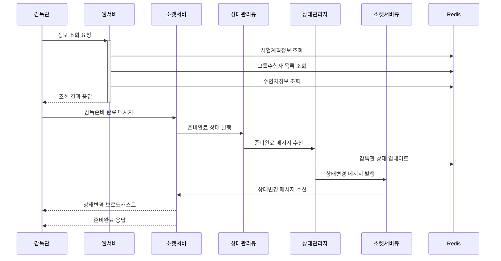
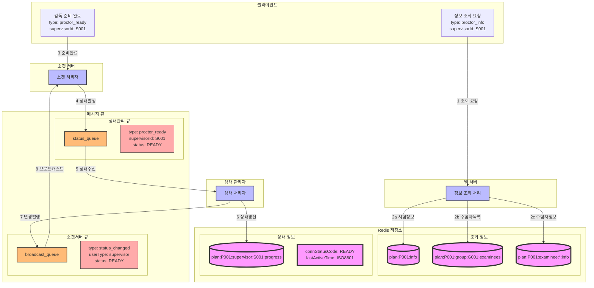

### **5. 감독관 감독준비 시나리오**

#### **5.1 시나리오 개요**

-   목적: 감독관의 시험 감독 준비 및 상태 설정
-   처리 항목: 시험계획 정보 조회, 담당 그룹 수험자 정보 조회, 감독관 상태 갱신
-   트리거: 감독관의 감독 준비 요청
-   결과: 감독 준비 완료 및 수험자 모니터링 가능 상태 전환

#### **5.2 시퀀스 다이어그램**



#### **5.3 데이터 흐름**



#### **5.4 메시지 구조**

1. 정보 조회 응답

```json
{
    "type": "proctor_info_response",
    "data": {
        "planInfo": {
            "planId": "P001",
            "planName": "2024년 1회차 시험",
            "startDatetime": "2024-01-01T09:00:00Z"
        },
        "examinees": [
            {
                "examineeId": "E001",
                "examineeName": "김수험",
                "status": "READY"
            }
        ]
    }
}
```

2. 준비 완료 메시지 (소켓)

```json
{
    "type": "proctor_ready",
    "data": {
        "supervisorId": "S001",
        "planId": "P001",
        "groupId": "G001",
        "timestamp": "2024-01-01T08:50:00Z"
    }
}
```

3. 상태 관리 큐 메시지

```json
{
    "type": "status_update",
    "data": {
        "userType": "supervisor",
        "supervisorId": "S001",
        "status": "READY",
        "timestamp": "2024-01-01T08:50:00Z"
    }
}
```

4. 소켓서버 큐 브로드캐스트 메시지

```json
{
    "type": "status_broadcast",
    "data": {
        "userType": "supervisor",
        "supervisorId": "S001",
        "status": "READY",
        "groupId": "G001",
        "timestamp": "2024-01-01T08:50:00Z"
    }
}
```

#### **5.4 처리 절차**

1. 정보 조회 단계

    - 시험계획정보 검증
    - 그룹 수험자 목록 확인
    - 수험자별 상태 확인

2. 상태 관리 단계

    - 준비완료 메시지 검증
    - Redis 상태 정보 갱신
    - 상태 변경 이벤트 발행

3. 브로드캐스트 단계

    - 상태 변경 메시지 전파
    - 관련 사용자 통지

4. 에러 처리
    - 메시지 큐 장애 대응
    - Redis 갱신 실패 처리
    - 브로드캐스트 실패 처리
