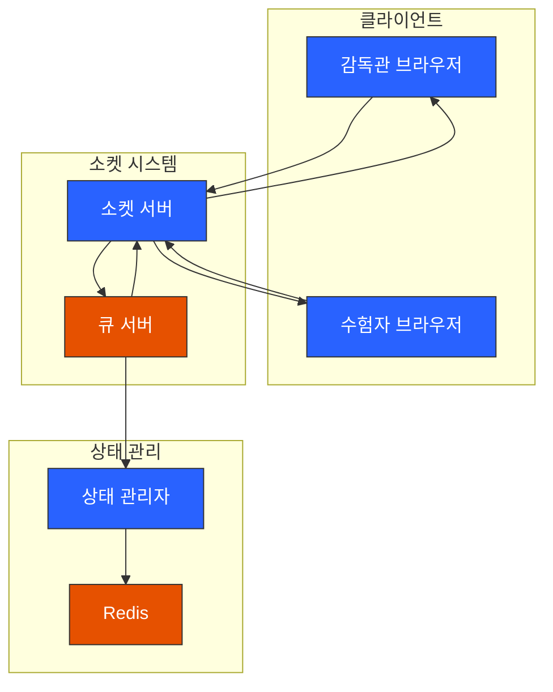
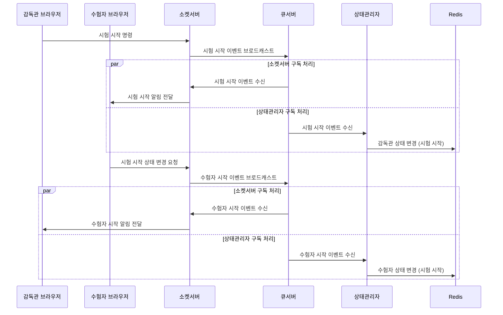

# 시험 시작 프로세스 시나리오

## 1. 감독관 시험 시작 명령 프로세스

1. 감독관 → 소켓서버

    - 시험 시작 명령 전송 (SUP_EXAM_START_CMD)

2. 소켓서버 → 큐서버

    - 시험 시작 이벤트 브로드캐스트

3. 큐서버 구독자 처리
    - 소켓서버: 수험자들에게 시험 시작 알림 전달
    - 상태관리자: 감독관 상태를 시험 시작으로 변경

## 2. 수험자 시험 시작 확인 프로세스

1. 수험자 브라우저

    - 시험 시작 알림 수신
    - 시험 시작 상태 변경 요청 전송 (CAND_EXAM_STARTED)

2. 소켓서버 → 큐서버

    - 수험자 시험 시작 이벤트 브로드캐스트

3. 큐서버 구독자 처리
    - 소켓서버: 해당 감독관에게 수험자 시작 알림
    - 상태관리자: 수험자 상태를 시험 시작으로 변경

