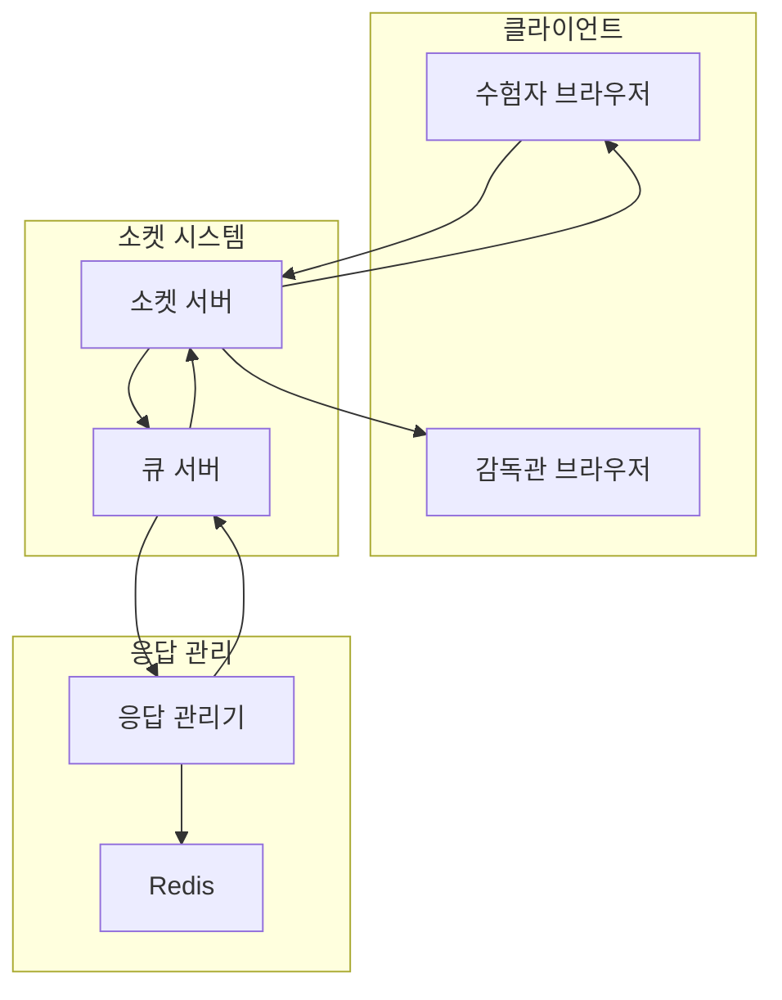
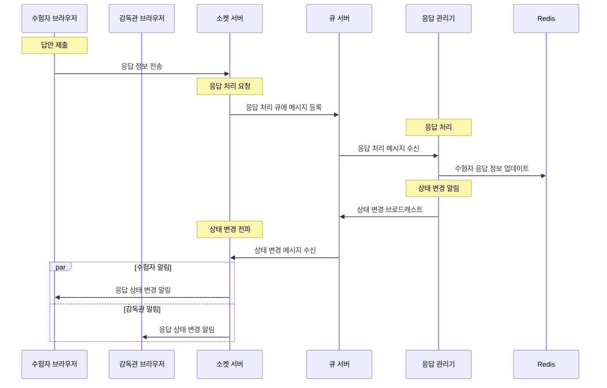

# 답안 제출 프로세스 시나리오

## 1. 참여 구성요소

-   클라이언트: 수험자 브라우저, 감독관 브라우저
-   서버: 소켓 서버, 큐 서버
-   처리기: 응답 관리기(Response Manager)
-   저장소: Redis

## 2. 프로세스 흐름

1. 답안 전송

    - 수험자 → 소켓 서버: 응답 정보 전송

2. 응답 처리 큐잉

    - 소켓 서버 → 큐 서버: 응답 처리 큐에 메시지 등록

3. 응답 정보 처리

    - 응답 관리기: 응답 처리 큐 구독
    - 응답 관리기 → Redis: 수험자 응답 정보 업데이트

4. 상태 변경 알림
    - 응답 관리기 → 큐 서버: 상태 변경 브로드캐스트
    - 소켓 서버: 상태 변경 구독
    - 소켓 서버 → 클라이언트: 상태 변경 알림 전송

