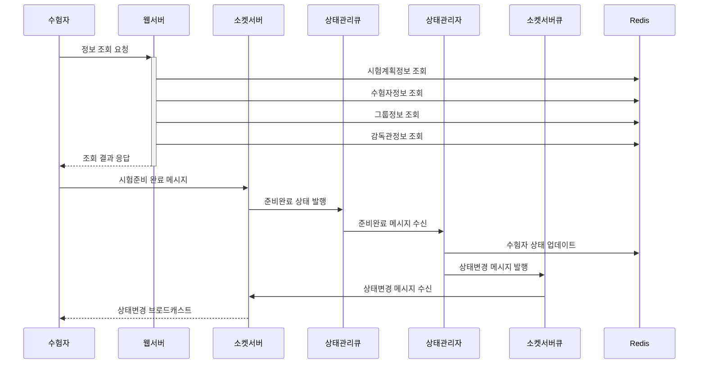
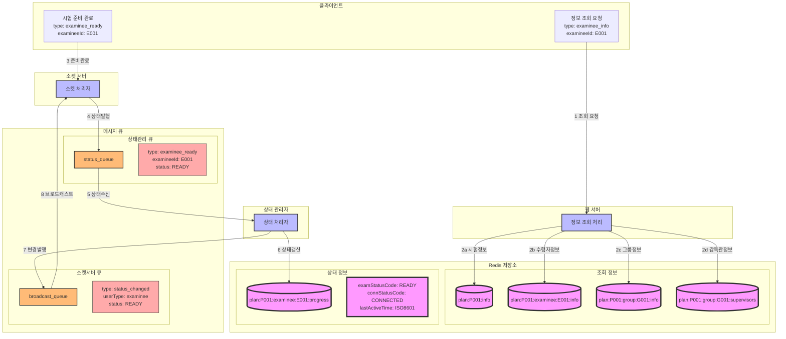

### **6. 수험자 시험준비 시나리오**

#### **6.1 시나리오 개요**

-   목적: 수험자의 시험 응시를 위한 준비 상태 설정
-   처리 항목: 계획/수험자/그룹/감독관 정보 조회 및 준비상태 설정
-   트리거: 수험자의 시험준비 요청
-   결과: 시험 준비 완료 및 시험 대기 상태 전환

#### **6.2 시퀀스 다이어그램**



#### **6.3 데이터 흐름**



#### **6.4 메시지 구조**

1. 정보 조회 응답

```json
{
    "type": "examinee_info_response",
    "data": {
        "planInfo": {
            "planId": "P001",
            "planName": "2024년 1회차 시험",
            "startDatetime": "2024-01-01T09:00:00Z"
        },
        "examineeInfo": {
            "examineeId": "E001",
            "examineeName": "김수험",
            "groupId": "G001"
        },
        "groupInfo": {
            "groupId": "G001",
            "groupName": "A그룹"
        },
        "supervisors": [
            {
                "supervisorId": "S001",
                "supervisorName": "홍감독",
                "status": "READY"
            }
        ]
    }
}
```

2. 준비 완료 메시지 (소켓)

```json
{
    "type": "examinee_ready",
    "data": {
        "examineeId": "E001",
        "planId": "P001",
        "groupId": "G001",
        "timestamp": "2024-01-01T08:50:00Z"
    }
}
```

3. 상태 관리 큐 메시지

```json
{
    "type": "status_update",
    "data": {
        "userType": "examinee",
        "examineeId": "E001",
        "status": "READY",
        "timestamp": "2024-01-01T08:50:00Z"
    }
}
```

#### **6.5 처리 절차**

1. 정보 조회 단계

    - 시험계획정보 조회 및 검증
    - 수험자정보 확인
    - 그룹정보 확인
    - 감독관정보 확인

2. 상태 관리 단계
    - Redis 상태 정보 갱신

```redis
# 수험자 진행 정보
plan:{planId}:examinee:{examineeId}:progress
{
    "examStatusCode": "READY",
    "connStatusCode": "CONNECTED",
    "currentStageId": "stage1",
    "lastActiveTime": "2024-01-01T08:50:00Z"
}

# 그룹 진행 정보 업데이트
plan:{planId}:group:{groupId}:progress
{
    "connectedExamineeCnt": <증가>,
    "readyExamineeCnt": <증가>
}
```

3. 에러 처리
    - 정보 조회 실패 처리
    - 메시지 큐 장애 대응
    - Redis 갱신 실패 처리
    - 브로드캐스트 실패 처리
