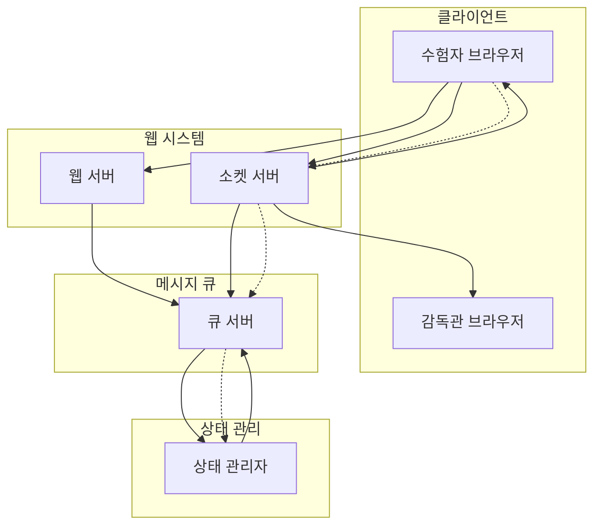
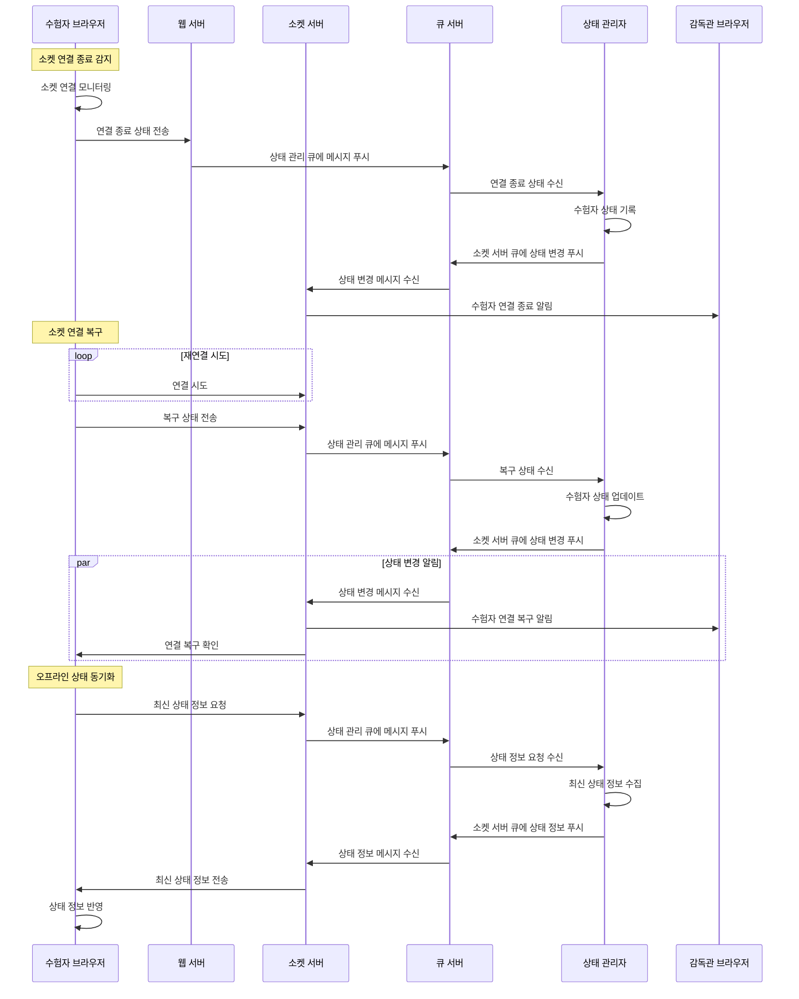

# 소켓 연결 복구 프로세스

## 1. 연결 종료 감지 및 처리

-   수험자 클라이언트의 소켓 연결 상태 모니터링
-   연결 종료 상태 전파
-   상태 관리자의 상태 기록
-   감독관 알림

## 2. 연결 복구 처리

-   주기적 재연결 시도
-   연결 복구 상태 전파
-   상태 관리자의 상태 업데이트
-   관련자 알림

## 3. 오프라인 상태 동기화

-   최신 상태 요청
-   상태 정보 수집
-   상태 정보 전달
-   클라이언트 상태 갱신

