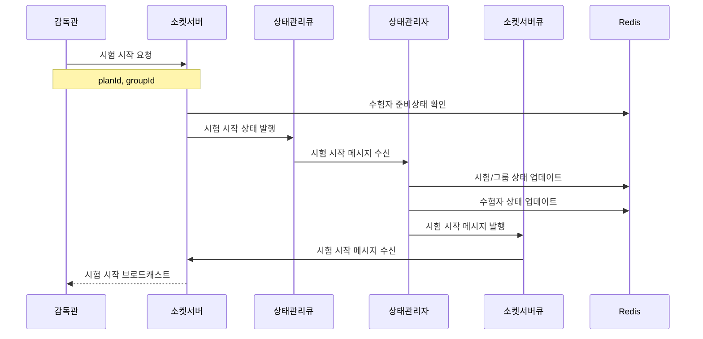
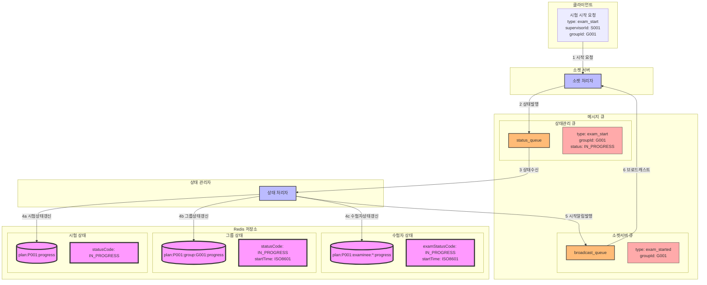

### **7. 감독관 시험 시작 시나리오**

#### **7.1 시나리오 개요**

-   목적: 감독관의 시험 시작 처리
-   처리 항목: 그룹 수험자 준비상태 확인, 시험 시작 처리, 상태 변경 전파
-   트리거: 감독관의 시험 시작 요청
-   결과: 시험 시작 및 관련 사용자 통보

#### **7.2 시퀀스 다이어그램**



#### **7.3 데이터 흐름**



#### **7.4 메시지 구조**

1. 시험 시작 요청 메시지

```json
{
    "type": "exam_start",
    "data": {
        "supervisorId": "S001",
        "planId": "P001",
        "groupId": "G001",
        "timestamp": "2024-01-01T09:00:00Z"
    }
}
```

2. 상태 관리 큐 메시지

```json
{
    "type": "exam_status_change",
    "data": {
        "planId": "P001",
        "groupId": "G001",
        "status": "IN_PROGRESS",
        "timestamp": "2024-01-01T09:00:00Z",
        "initiator": {
            "type": "supervisor",
            "id": "S001"
        }
    }
}
```

3. 소켓서버 큐 브로드캐스트 메시지

```json
{
    "type": "exam_started",
    "data": {
        "planId": "P001",
        "groupId": "G001",
        "startTime": "2024-01-01T09:00:00Z",
        "currentStageId": "stage1",
        "stageTimeLimit": 3600
    }
}
```

#### **7.5 처리 절차**

1. 시작 전 검증

```redis
# 그룹 수험자 상태 확인
plan:{planId}:group:{groupId}:progress
{
    "assignedExamineeCnt": 30,
    "connectedExamineeCnt": 30,
    "readyExamineeCnt": 30
}
```

2. 상태 갱신

```redis
# 시험 진행 상태
plan:{planId}:progress
{
    "statusCode": "IN_PROGRESS"
}

# 그룹 진행 상태
plan:{planId}:group:{groupId}:progress
{
    "statusCode": "IN_PROGRESS",
    "startDatetime": "2024-01-01T09:00:00Z"
}

# 수험자 진행 상태
plan:{planId}:examinee:{examineeId}:progress
{
    "examStatusCode": "IN_PROGRESS",
    "currentStageId": "stage1",
    "startTime": "2024-01-01T09:00:00Z"
}
```

3. 에러 처리
    - 수험자 미준비 상태 처리
    - 시간 제약 확인
    - 상태 변경 실패 처리
    - 브로드캐스트 실패 처리
