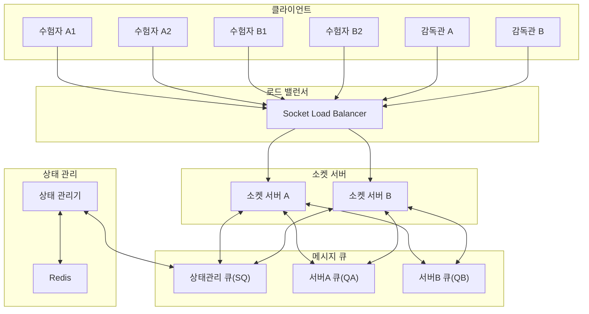
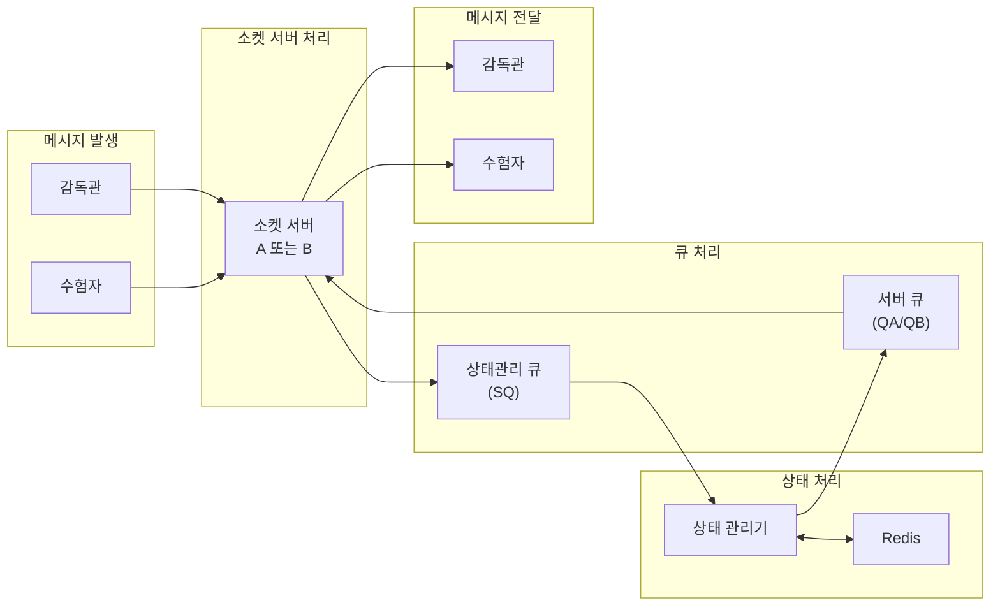
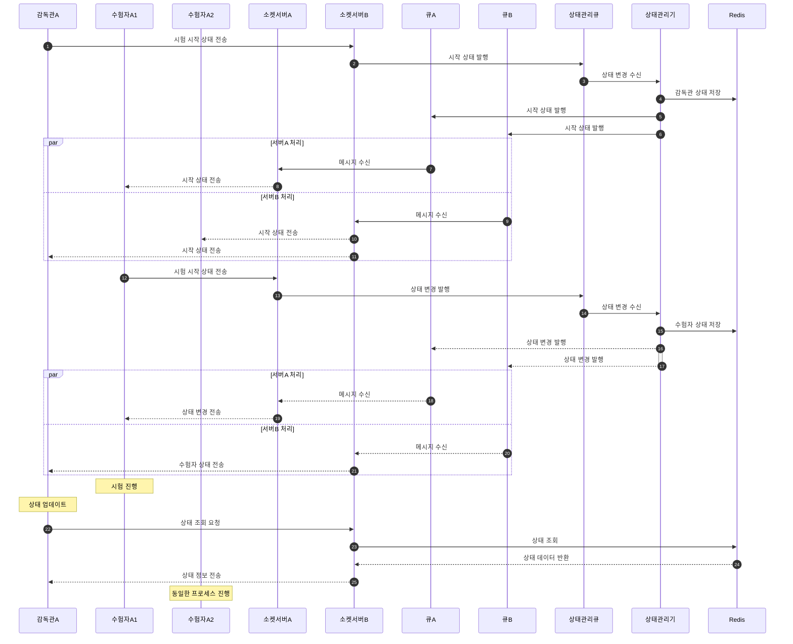

# 분산 소켓 서버 환경 시나리오

## 1. 초기 구성

-   소켓 서버: 서버A, 서버B (로드밸런싱)
-   큐: SQ(상태관리), QA(서버A), QB(서버B)
-   참여자
    -   감독관A: 수험자A1, A2 담당
    -   감독관B: 수험자B1, B2 담당

## 2. 접속 현황

-   소켓 서버A: 수험자A1
-   소켓 서버B: 수험자A2, 수험자B1, 수험자B2, 감독관A, 감독관B

## 3. 구성도

## 4. 메시지 처리 흐름

-   감독관 → 소켓 서버 → 큐 → 상태관리 → 큐 → 소켓 서버 → 수험자
-   수험자 → 소켓 서버 → 큐 → 상태관리 → 큐 → 소켓 서버 → 감독관

