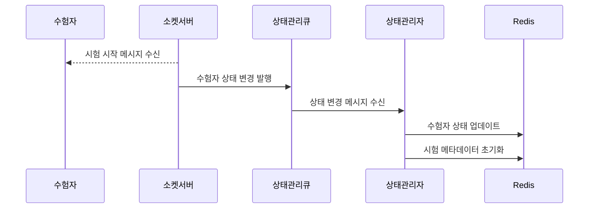
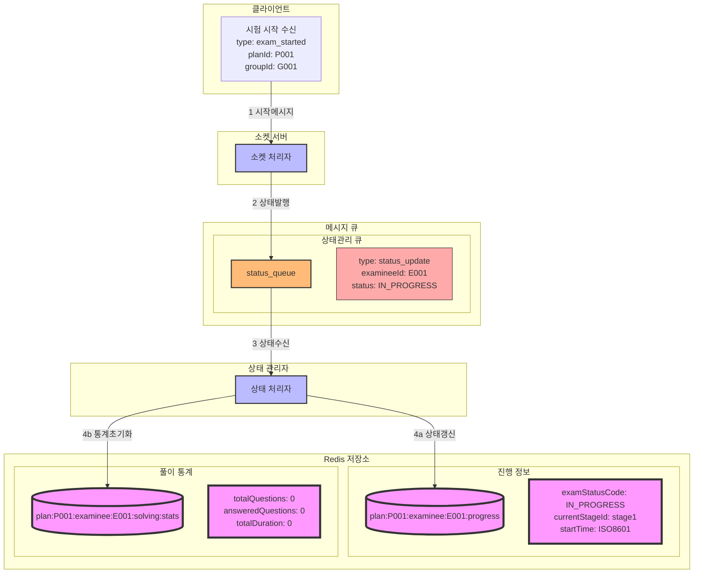

### **8. 수험자 시험시작 시나리오**

#### **8.1 시나리오 개요**

-   목적: 감독관의 시험 시작 메시지 수신 후 수험자의 시험 시작 상태 전환
-   처리 항목: 시험 시작 메시지 수신, 상태 변경, 시험 환경 초기화
-   트리거: 감독관의 시험 시작 메시지 수신
-   결과: 시험 시작 상태 전환 및 시험 환경 초기화

#### **8.2 시퀀스 다이어그램**



#### **8.3 데이터 흐름**



#### **8.4 메시지 구조**

1. 시험 시작 수신 메시지

```json
{
    "type": "exam_started",
    "data": {
        "planId": "P001",
        "groupId": "G001",
        "startTime": "2024-01-01T09:00:00Z",
        "currentStageId": "stage1",
        "stageTimeLimit": 3600
    }
}
```

#### **8.5 처리 절차**

1. 상태 정보 갱신

```redis
# 수험자 진행 정보
plan:{planId}:examinee:{examineeId}:progress
{
    "examStatusCode": "IN_PROGRESS",
    "currentStageId": "stage1",
    "startTime": "2024-01-01T09:00:00Z"
}

# 풀이 통계 초기화
plan:{planId}:examinee:{examineeId}:solving:stats
{
    "totalQuestions": 0,
    "answeredQuestions": 0,
    "totalDuration": 0,
    "effectiveDuration": 0,
    "focusLostCount": 0,
    "pageScrolls": 0,
    "totalClicks": 0
}
```

2. 에러 처리
    - 시험 시작 메시지 누락 대응
    - 상태 변경 실패 처리
    - 통계 초기화 실패 처리
