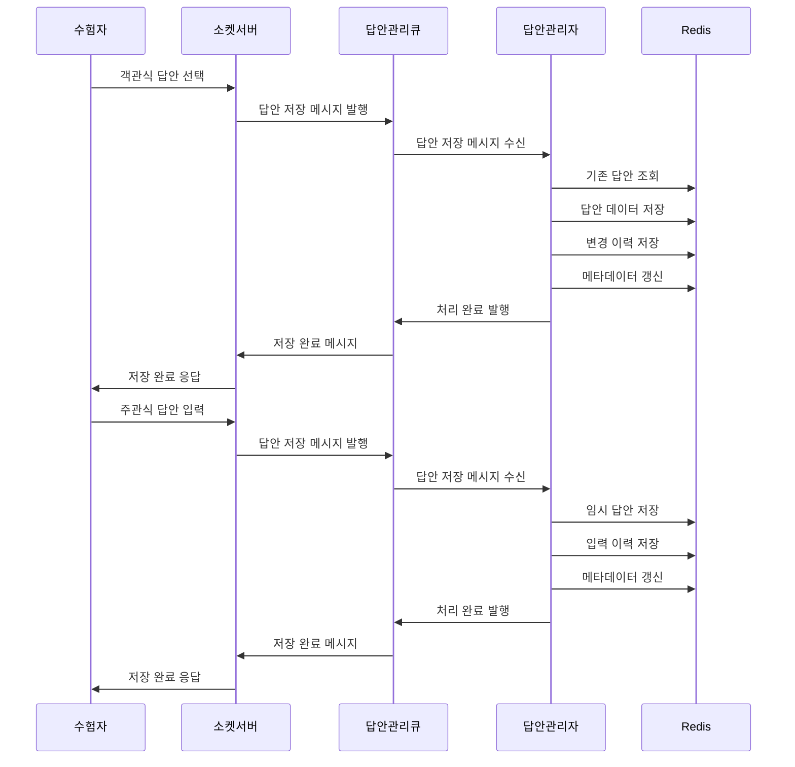
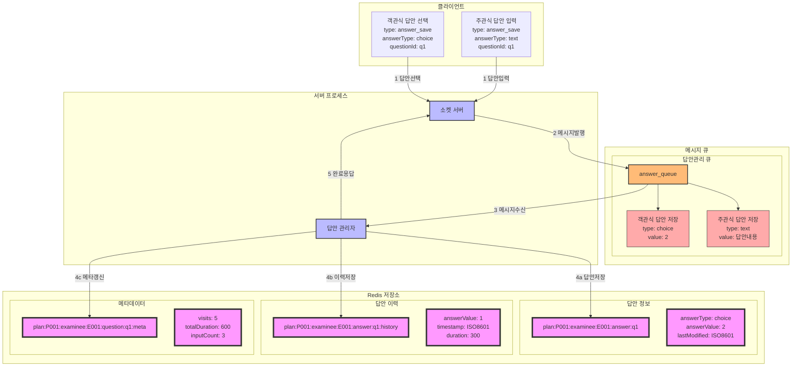

### **9. 수험자 답안 저장 시나리오**

#### **9.1 시나리오 개요**

-   목적: 수험자의 답안 저장 및 변경 이력 관리
-   처리 항목: 객관식/주관식 답안 저장, 변경 이력 관리, 메타데이터 관리
-   트리거: 수험자의 답안 선택/입력
-   결과: 답안 데이터 저장 및 이력 관리, 저장 완료 응답

#### **9.2 시퀀스 다이어그램**



#### **9.3 데이터 흐름**



#### **9.4 메시지 구조**

1. 객관식 답안 저장 메시지

```json
{
    "type": "answer_save",
    "data": {
        "planId": "P001",
        "groupId": "G001",
        "examineeId": "E001",
        "questionId": "q1",
        "answerType": "choice",
        "value": "2",
        "timestamp": "2024-01-01T09:10:00Z",
        "duration": 300
    }
}
```

2. 주관식 답안 저장 메시지

```json
{
    "type": "answer_save",
    "data": {
        "planId": "P001",
        "groupId": "G001",
        "examineeId": "E001",
        "questionId": "q1",
        "answerType": "text",
        "value": "답안내용",
        "timestamp": "2024-01-01T09:10:00Z",
        "inputType": "input",
        "duration": 300
    }
}
```

#### **9.5 처리 절차**

1. 답안 데이터 관리

```redis
# 답안 정보
plan:{planId}:examinee:{examineeId}:answer:{questionId}:detail
{
    "answerType": "choice",
    "answerValue": "2",
    "lastModified": "2024-01-01T09:10:00Z"
}

# 답안 변경 이력
plan:{planId}:examinee:{examineeId}:answer:{questionId}:history -> List
[{
    "answerValue": "1",
    "timestamp": "2024-01-01T09:05:00Z",
    "duration": 300
}]

# 문항 메타데이터
plan:{planId}:examinee:{examineeId}:question:{questionId}:meta
{
    "visits": 5,
    "totalDuration": 600,
    "effectiveDuration": 550,
    "clickCount": 10,
    "inputCount": 3
}
```

2. 에러 처리
    - 답안 형식 검증 실패
    - 저장 실패 복구
    - 이력 저장 실패
    - 메타데이터 갱신 실패
