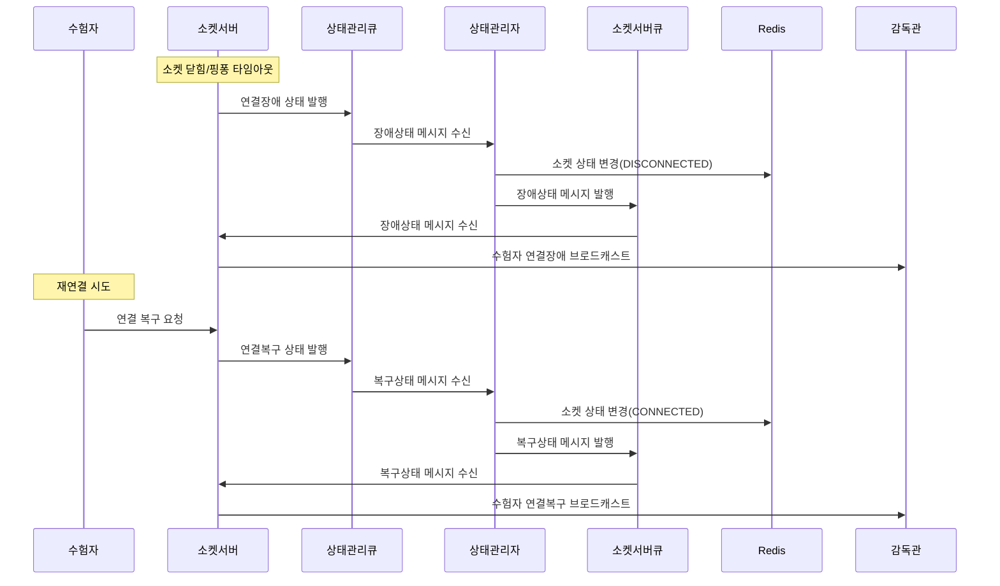
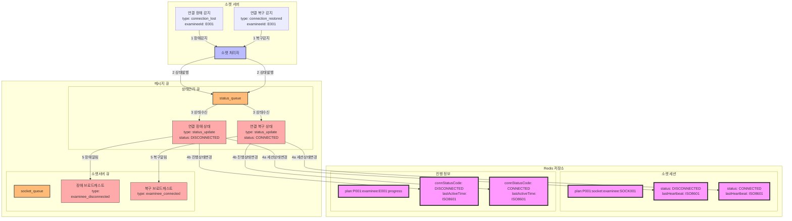

### **10. 수험자 소켓 연결장애/복구 시나리오**

#### **10.1 시나리오 개요**

-   목적: 수험자의 소켓 연결장애 감지 및 복구 처리
-   처리 항목: 연결장애 감지, 상태 변경, 관련자 통지, 연결 복구
-   트리거: 소켓 연결 끊김 또는 핑/퐁 타임아웃
-   결과: 연결 상태 관리 및 관련자 통지

#### **10.2 시퀀스 다이어그램**



#### **10.3 데이터 흐름**



#### **10.4 메시지 구조**

1. 연결 장애 상태 메시지

```json
{
    "type": "connection_status",
    "data": {
        "planId": "P001",
        "examineeId": "E001",
        "socketId": "SOCK001",
        "status": "DISCONNECTED",
        "timestamp": "2024-01-01T09:15:00Z",
        "reason": "SOCKET_CLOSED"
    }
}
```

2. 연결 복구 상태 메시지

```json
{
    "type": "connection_status",
    "data": {
        "planId": "P001",
        "examineeId": "E001",
        "socketId": "SOCK001",
        "status": "CONNECTED",
        "timestamp": "2024-01-01T09:17:00Z",
        "clientInfo": {
            "ipAddress": "192.168.1.100",
            "browserInfo": "Chrome 120.0"
        }
    }
}
```

#### **10.5 처리 절차**

1. 상태 정보 관리

```redis
# 소켓 세션 정보
plan:{planId}:socket:examinee:{socketId}
{
    "examineeId": "E001",
    "status": "DISCONNECTED/CONNECTED",
    "lastHeartbeat": "2024-01-01T09:15:00Z"
}

# 수험자 진행 정보
plan:{planId}:examinee:{examineeId}:progress
{
    "connStatusCode": "DISCONNECTED/CONNECTED",
    "lastActiveTime": "2024-01-01T09:15:00Z"
}
```

2. 에러 처리
    - 재연결 최대 시도 횟수 초과
    - 상태 변경 실패
    - 메시지 전파 실패
    - 복구 실패 시 대체 연결
