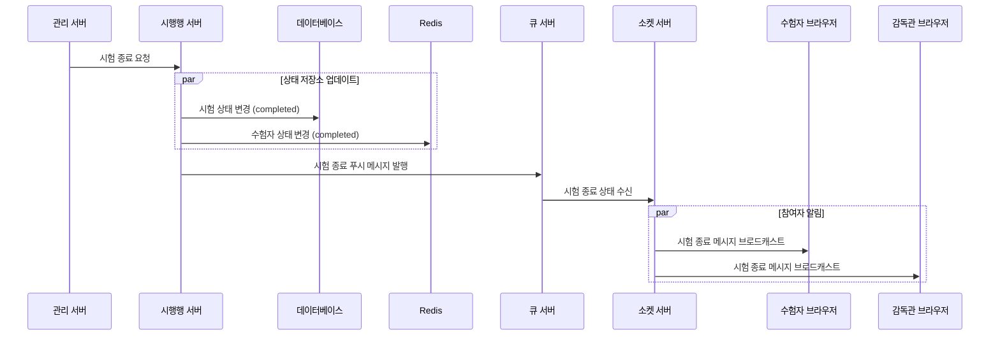
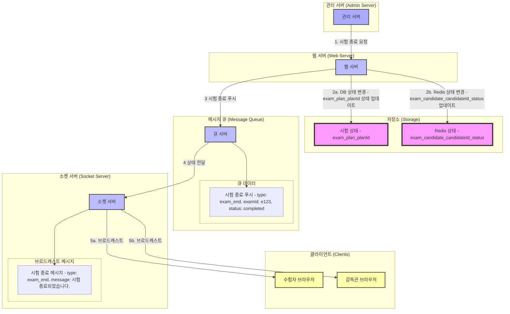

# 시험 완료 시나리오 상세 설계서

## 1. 시나리오 개요

### 1.1 목적

-   시험 완료 요청 처리 및 관련 데이터 업데이트
-   모든 참여자에게 시험 종료 알림 전송
-   시험 상태 및 결과 저장

### 1.2 범위

-   관리 서버의 시험 종료 요청부터 모든 참여자 알림 완료까지의 전체 프로세스
-   Redis 및 DB 상태 동기화
-   메시지 큐 및 소켓 서버를 통한 상태 전파

---

## 2. 시스템 구성도

### 2.1 시퀀스 다이어그램



---

### 2.2 데이터 흐름



---

## 3. 데이터 구조

### 3.1 Redis 데이터 구조

#### **시험 상태 (exam_plan:{plan_id})**

```plaintext
Key: exam_plan:{plan_id}
{
    "status": "completed",                    // 시험 상태: 완료
    "end_datetime": "2024-01-16T18:00:00Z"   // 시험 종료 시간
}
```

#### **수험자 상태 (exam_candidate:{candidate_id}:status)**

```plaintext
Key: exam_candidate:{candidate_id}:status
{
    "status": "completed",                    // 수험자 상태: 완료
    "last_active_time": "2024-01-16T18:00:00Z" // 최종 활동 시간
}
```

---

### 3.2 메시지 큐 데이터 구조

#### **큐 메시지**

```plaintext
Key: queue:exam_end
{
    "type": "exam_end",
    "examId": "e123",
    "status": "completed",
    "timestamp": "2024-01-16T18:00:00Z"
}
```

---

### 3.3 브로드캐스트 메시지

#### **소켓 메시지**

```plaintext
Key: socket:exam_end
{
    "type": "exam_end",
    "message": "시험이 종료되었습니다.",
    "timestamp": "2024-01-16T18:00:00Z"
}
```

---

## 4. 처리 절차

### 4.1 관리 서버 요청 처리

1. 관리 서버로부터 시험 종료 요청 수신
2. 요청 유효성 검증 (examId 및 상태 확인)
3. 상태 저장소 및 메시지 큐 업데이트

### 4.2 데이터 동기화

1. DB 및 Redis 상태 업데이트
2. 큐 서버 및 소켓 서버 상태 전파

### 4.3 참여자 알림

1. 소켓 서버를 통해 수험자와 감독관에게 시험 종료 메시지 브로드캐스트
2. Redis 및 DB 상태 최종 동기화

---
