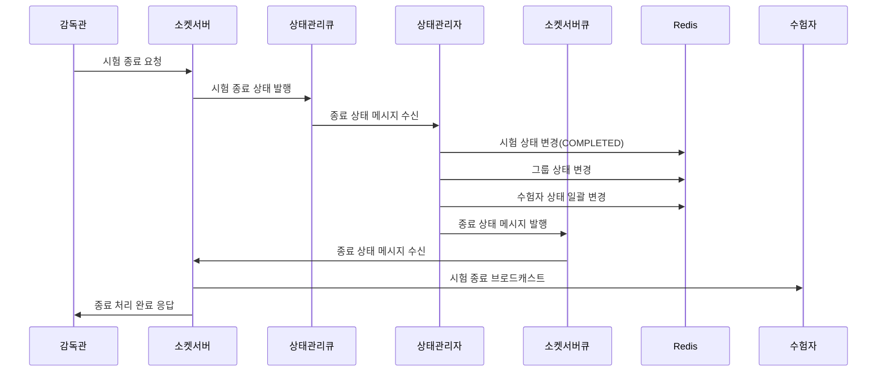
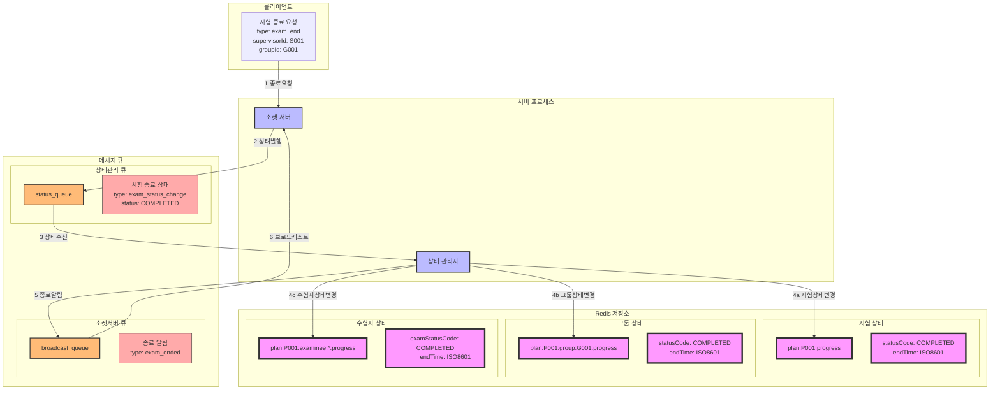

### **11. 감독관 시험종료 시나리오**

#### **11.1 시나리오 개요**

-   목적: 감독관의 시험 종료 처리 및 상태 전파
-   처리 항목: 시험 종료 요청, 상태 변경, 수험자 답안 제출, 종료 상태 전파
-   트리거: 감독관의 시험 종료 요청
-   결과: 시험 종료 및 관련자 통지

#### **11.2 시퀀스 다이어그램**



#### **11.3 데이터 흐름**



#### **11.4 메시지 구조**

1. 시험 종료 요청 메시지

```json
{
    "type": "exam_end",
    "data": {
        "supervisorId": "S001",
        "planId": "P001",
        "groupId": "G001",
        "timestamp": "2024-01-01T12:00:00Z",
        "reason": "SCHEDULED_END"
    }
}
```

2. 종료 상태 메시지

```json
{
    "type": "exam_status_change",
    "data": {
        "planId": "P001",
        "groupId": "G001",
        "status": "COMPLETED",
        "timestamp": "2024-01-01T12:00:00Z",
        "initiator": {
            "type": "supervisor",
            "id": "S001"
        }
    }
}
```

#### **11.5 처리 절차**

1. 상태 정보 갱신

```redis
# 시험 진행 상태
plan:{planId}:progress
{
    "statusCode": "COMPLETED",
    "endTime": "2024-01-01T12:00:00Z"
}

# 그룹 진행 상태
plan:{planId}:group:{groupId}:progress
{
    "statusCode": "COMPLETED",
    "endTime": "2024-01-01T12:00:00Z",
    "submittedExamineeCnt": 30
}

# 수험자 진행 상태
plan:{planId}:examinee:{examineeId}:progress
{
    "examStatusCode": "COMPLETED",
    "endTime": "2024-01-01T12:00:00Z"
}
```

2. 종료 처리

    - 미제출 답안 자동 제출
    - 수험자 접속 상태 정리
    - 통계 데이터 집계
    - 종료 이벤트 로깅

3. 에러 처리
    - 상태 변경 실패
    - 답안 제출 실패
    - 메시지 전파 실패
    - 종료 처리 롤백
