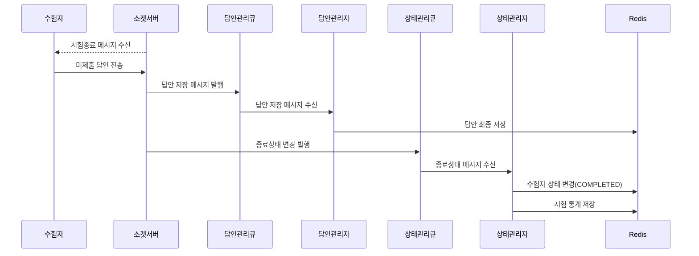
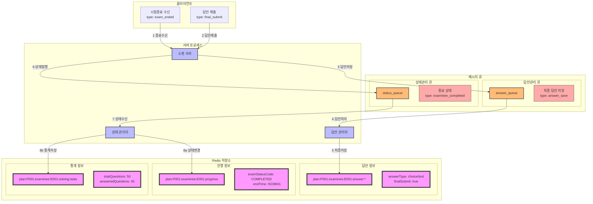

### **13. 수험자 시험종료 시나리오**

#### **13.1 시나리오 개요**

-   목적: 시험종료 메시지 수신 후 수험자의 시험 종료 처리
-   처리 항목: 미제출 답안 자동 제출, 상태 변경, 시험 종료 처리
-   트리거: 감독관의 시험종료 메시지 수신
-   결과: 답안 제출 완료 및 시험 종료 처리

#### **13.2 시퀀스 다이어그램**



#### **13.3 데이터 흐름**



#### **13.4 메시지 구조**

1. 시험종료 수신 메시지

```json
{
    "type": "exam_ended",
    "data": {
        "planId": "P001",
        "groupId": "G001",
        "endTime": "2024-01-01T12:00:00Z",
        "reason": "SUPERVISOR_END"
    }
}
```

2. 종료 상태 변경 메시지

```json
{
    "type": "examinee_completed",
    "data": {
        "planId": "P001",
        "examineeId": "E001",
        "endTime": "2024-01-01T12:00:00Z",
        "stats": {
            "totalQuestions": 50,
            "answeredQuestions": 45,
            "totalDuration": 10800
        }
    }
}
```

#### **13.5 처리 절차**

1. 답안 최종 저장

```redis
# 답안 정보 갱신
plan:{planId}:examinee:{examineeId}:answer:{questionId}:detail
{
    "answerType": "choice/text",
    "answerValue": "value",
    "lastModified": "2024-01-01T12:00:00Z",
    "finalSubmit": true
}

# 풀이 통계 갱신
plan:{planId}:examinee:{examineeId}:solving:stats
{
    "totalQuestions": 50,
    "answeredQuestions": 45,
    "totalDuration": 10800,
    "effectiveDuration": 10500,
    "focusLostCount": 3,
    "pageScrolls": 100,
    "totalClicks": 200
}

# 수험자 진행 상태
plan:{planId}:examinee:{examineeId}:progress
{
    "examStatusCode": "COMPLETED",
    "endTime": "2024-01-01T12:00:00Z"
}
```

2. 종료 처리

    - 미저장 답안 최종 저장
    - 풀이 통계 집계
    - 시험 상태 변경
    - 시험 환경 정리

3. 에러 처리
    - 답안 저장 실패
    - 통계 집계 실패
    - 상태 변경 실패
