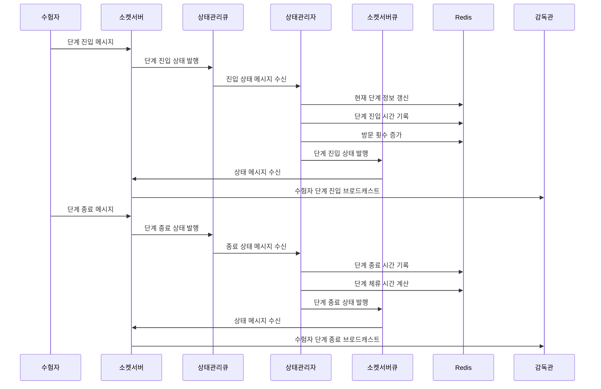
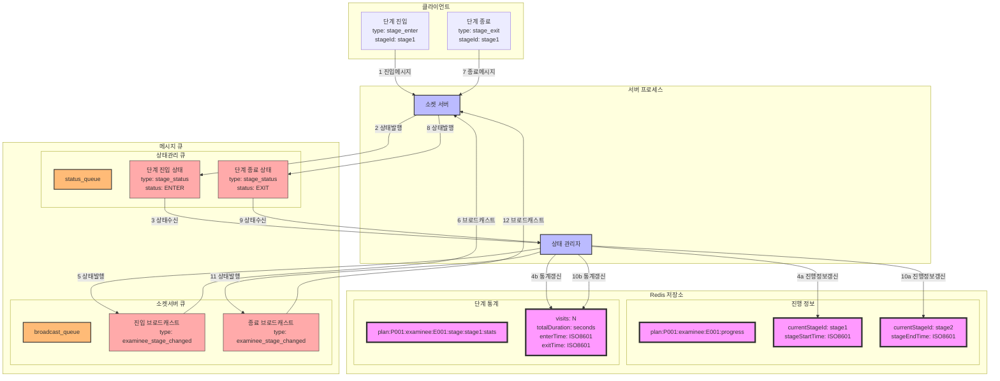

### **13. 수험자 단계진행 시나리오**

#### **13.1 시나리오 개요**

-   목적: 시험 단계별 진입/종료 처리 및 상태 관리
-   처리 항목: 단계 진입/종료 상태 관리, 단계별 시간 기록, 방문 횟수 관리
-   트리거: 수험자의 단계 진입/종료 발생
-   결과: 단계별 진행 상태 및 통계 정보 관리

#### **13.2 시퀀스 다이어그램**



#### **13.3 데이터 흐름**



#### **13.4 메시지 구조**

1. 단계 진입 메시지

```json
{
    "type": "stage_status",
    "data": {
        "planId": "P001",
        "examineeId": "E001",
        "stageId": "stage1",
        "status": "ENTER",
        "timestamp": "2024-01-01T09:00:00Z"
    }
}
```

2. 단계 종료 메시지

```json
{
    "type": "stage_status",
    "data": {
        "planId": "P001",
        "examineeId": "E001",
        "stageId": "stage1",
        "status": "EXIT",
        "timestamp": "2024-01-01T10:00:00Z",
        "duration": 3600
    }
}
```

3. 감독관 브로드캐스트 메시지

```json
{
    "type": "examinee_stage_changed",
    "data": {
        "planId": "P001",
        "groupId": "G001",
        "examineeId": "E001",
        "stageId": "stage1",
        "status": "ENTER/EXIT",
        "timestamp": "2024-01-01T09:00:00Z",
        "stageInfo": {
            "visits": 1,
            "totalDuration": 3600,
            "currentStage": "stage1"
        }
    }
}
```

#### **13.5 처리 절차**

1. 단계 정보 관리

```redis
# 수험자 진행 정보
plan:{planId}:examinee:{examineeId}:progress
{
    "currentStageId": "stage1",
    "stageStartTime": "2024-01-01T09:00:00Z",
    "stageEndTime": "2024-01-01T10:00:00Z"
}

# 단계별 통계 정보
plan:{planId}:examinee:{examineeId}:stage:{stageId}:stats
{
    "visits": 1,
    "totalDuration": 3600,
    "effectiveDuration": 3500,
    "firstVisit": "2024-01-01T09:00:00Z",
    "lastVisit": "2024-01-01T10:00:00Z",
    "enterTime": "2024-01-01T09:00:00Z",
    "exitTime": "2024-01-01T10:00:00Z"
}
```

2. 에러 처리
    - 단계 전환 검증 실패
    - 상태 변경 실패
    - 시간 기록 오류
    - 통계 갱신 실패
