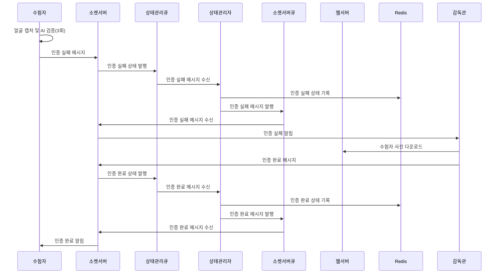
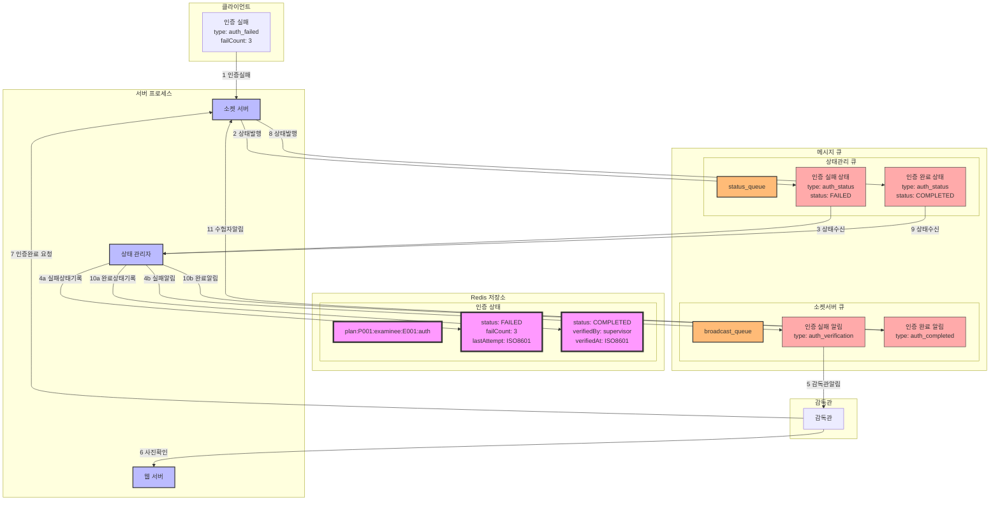

### **14. 수험자 본인인증 시나리오**

#### **14.1 시나리오 개요**

-   목적: 수험자의 생체 인증을 통한 본인 확인
-   처리 항목: 얼굴 인식, AI 모델 검증, 감독관 확인, 인증 상태 관리
-   트리거: 수험자의 본인인증 시도
-   결과: 본인인증 완료 및 시험 응시 자격 부여

#### **14.2 시퀀스 다이어그램**



#### **14.3 데이터 흐름**



#### **14.4 메시지 구조**

1. 인증 실패 메시지

```json
{
    "type": "auth_failed",
    "data": {
        "planId": "P001",
        "examineeId": "E001",
        "failCount": 3,
        "lastAttempt": "2024-01-01T08:55:00Z",
        "photoUrl": "/photos/E001_attempt3.jpg"
    }
}
```

2. 인증 완료 메시지

```json
{
    "type": "auth_completed",
    "data": {
        "planId": "P001",
        "examineeId": "E001",
        "verifiedBy": "S001",
        "verifiedAt": "2024-01-01T09:00:00Z",
        "authMethod": "supervisor"
    }
}
```

#### **14.5 처리 절차**

1. 인증 상태 관리

```redis
# 인증 상태 정보
plan:{planId}:examinee:{examineeId}:auth
{
    "status": "FAILED/COMPLETED",
    "failCount": 3,
    "lastAttempt": "2024-01-01T08:55:00Z",
    "verifiedBy": "S001",
    "verifiedAt": "2024-01-01T09:00:00Z",
    "photoUrl": "/photos/E001_attempt3.jpg"
}
```

2. 에러 처리
    - AI 인식 실패
    - 사진 저장 실패
    - 상태 변경 실패
    - 메시지 전파 실패
