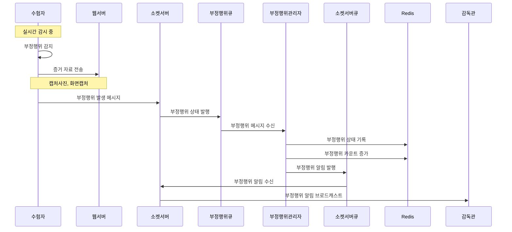
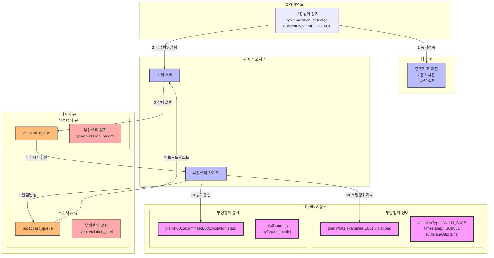

### **15. 시험중 부정행위 감시 시나리오**

#### **15.1 시나리오 개요**

-   목적: 시험 중 실시간 부정행위 감지 및 관리
-   처리 항목: 얼굴 인식, 부정행위 감지, 증거 저장, 상태 관리
-   트리거: 실시간 웹캠 모니터링 및 시스템 감지
-   결과: 부정행위 기록 및 감독관 통지

#### **15.2 시퀀스 다이어그램**



#### **15.3 데이터 흐름**



#### **15.4 메시지 구조**

1. 부정행위 감지 메시지

```json
{
    "type": "violation_detected",
    "data": {
        "planId": "P001",
        "examineeId": "E001",
        "violationType": "MULTI_FACE",
        "timestamp": "2024-01-01T09:30:00Z",
        "evidence": {
            "photoUrl": "/violations/E001/photo_123.jpg",
            "screenUrl": "/violations/E001/screen_123.jpg",
            "details": {
                "faceCount": 2,
                "confidence": 0.95
            }
        }
    }
}
```

2. 부정행위 알림 메시지

```json
{
    "type": "violation_alert",
    "data": {
        "planId": "P001",
        "groupId": "G001",
        "examineeId": "E001",
        "violationType": "MULTI_FACE",
        "timestamp": "2024-01-01T09:30:00Z",
        "stats": {
            "totalViolations": 3,
            "currentViolationType": {
                "count": 1,
                "severity": "HIGH"
            }
        },
        "evidenceUrls": {
            "photo": "/violations/E001/photo_123.jpg",
            "screen": "/violations/E001/screen_123.jpg"
        }
    }
}
```

#### **15.5 처리 절차**

1. 부정행위 정보 관리

```redis
# 부정행위 기록
plan:{planId}:examinee:{examineeId}:violations
[
    {
        "violationType": "MULTI_FACE",
        "timestamp": "2024-01-01T09:30:00Z",
        "evidenceUrls": {
            "photo": "/violations/E001/photo_123.jpg",
            "screen": "/violations/E001/screen_123.jpg"
        },
        "details": {
            "faceCount": 2,
            "confidence": 0.95
        }
    }
]

# 부정행위 통계
plan:{planId}:examinee:{examineeId}:violation:stats
{
    "totalCount": 3,
    "byType": {
        "MULTI_FACE": 1,
        "KEY_VIOLATION": 1,
        "GAZE_VIOLATION": 1
    },
    "lastViolation": "2024-01-01T09:30:00Z"
}
```

2. 부정행위 유형별 처리

    - 복수 인원 감지 (MULTI_FACE)
    - 키보드 조작 위반 (KEY_VIOLATION)
    - 불법 프로그램 실행 (ILLEGAL_PROGRAM)
    - 시선 이탈 (GAZE_VIOLATION)
    - 자리 이탈 (ABSENCE)
    - 대화 감지 (CONVERSATION)

3. 에러 처리
    - 이미지 저장 실패
    - 상태 변경 실패
    - 메시지 전파 실패
