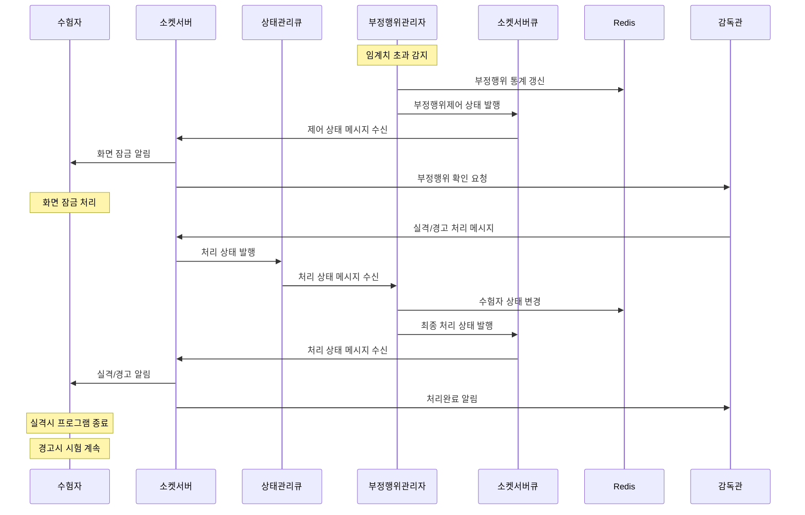
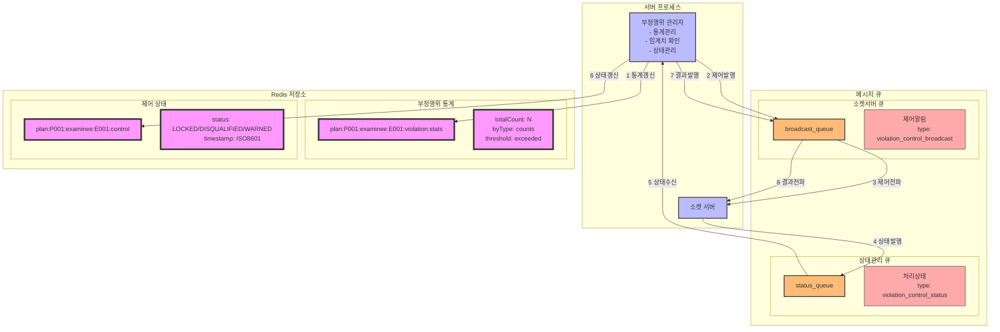

### **17. 부정행위 제어 시나리오**

#### **17.1 시나리오 개요**

-   목적: 부정행위 임계치 초과시 수험자 제어 및 처리
-   처리 항목: 부정행위 통계 관리, 화면 잠금, 실격/경고 처리
-   트리거: 부정행위 임계치 초과
-   결과: 수험자 실격 또는 경고 처리 완료

#### **17.2 시퀀스 다이어그램**



#### **17.3 데이터 흐름**



#### **17.4 메시지 구조**

1. 부정행위 제어 메시지

```json
{
    "type": "violation_control",
    "data": {
        "planId": "P001",
        "examineeId": "E001",
        "controlType": "LOCK",
        "violations": {
            "totalCount": 5,
            "thresholdExceeded": true,
            "timestamp": "2024-01-01T09:30:00Z"
        }
    }
}
```

2. 감독관 처리 메시지

```json
{
    "type": "violation_control_decision",
    "data": {
        "planId": "P001",
        "examineeId": "E001",
        "decision": "DISQUALIFIED/WARNING",
        "supervisorId": "S001",
        "timestamp": "2024-01-01T09:35:00Z"
    }
}
```

#### **17.5 처리 절차**

1. 부정행위 관리

```redis
# 부정행위 통계
plan:{planId}:examinee:{examineeId}:violation:stats
{
    "totalCount": 5,
    "byType": {
        "MULTI_FACE": 2,
        "GAZE_VIOLATION": 3
    },
    "lastViolation": "2024-01-01T09:30:00Z",
    "thresholdExceeded": true
}

# 제어 상태
plan:{planId}:examinee:{examineeId}:control
{
    "status": "LOCKED/DISQUALIFIED/WARNED",
    "timestamp": "2024-01-01T09:35:00Z",
    "supervisorId": "S001",
    "reason": "VIOLATION_THRESHOLD"
}
```

2. 임계치 판단 기준

    - 총 부정행위 횟수
    - 유형별 부정행위 횟수
    - 시간당 부정행위 빈도

3. 에러 처리
    - 통계 갱신 실패
    - 상태 변경 실패
    - 메시지 전파 실패
