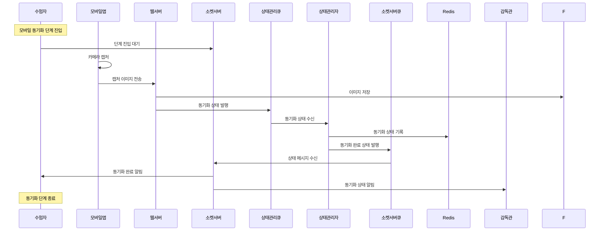
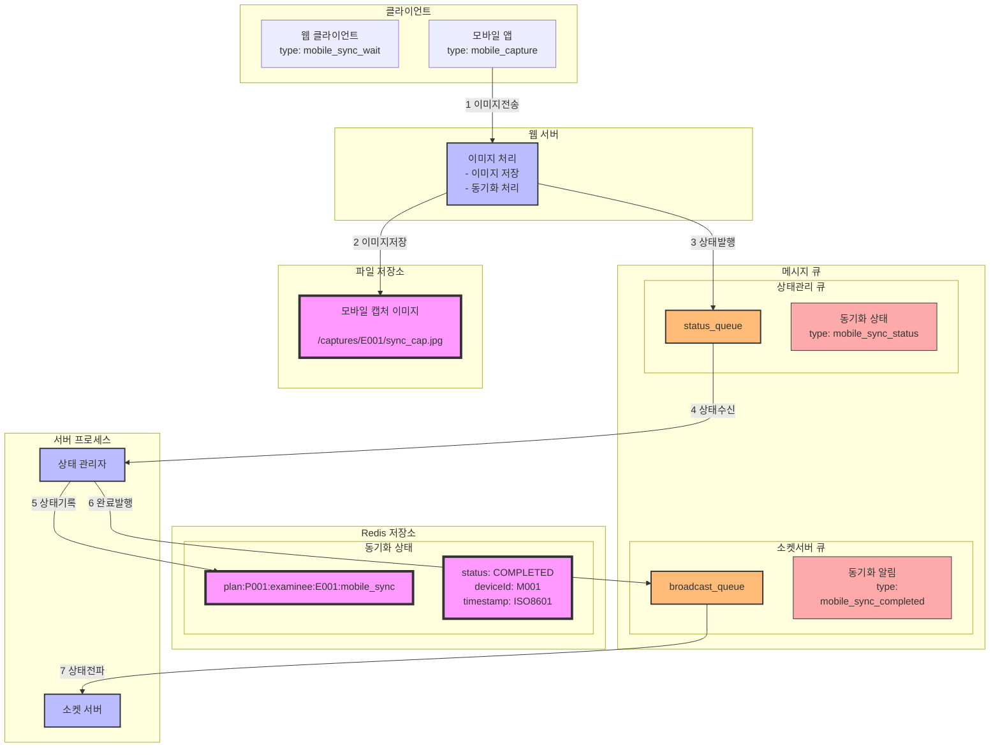

### **18. 모바일 동기화 시나리오**

#### **18.1 시나리오 개요**

-   목적: 부정행위 감지를 위한 모바일 카메라 동기화
-   처리 항목: 모바일 캡처 이미지 저장, 동기화 상태 관리
-   트리거: 모바일 동기화 단계 진입
-   결과: 모바일 카메라 동기화 완료 및 단계 종료

#### **18.2 시퀀스 다이어그램**



#### **18.3 데이터 흐름**



#### **18.4 메시지 구조**

1. 동기화 상태 메시지

```json
{
    "type": "mobile_sync_status",
    "data": {
        "planId": "P001",
        "examineeId": "E001",
        "deviceId": "M001",
        "status": "COMPLETED",
        "timestamp": "2024-01-01T09:00:00Z",
        "captureInfo": {
            "imageUrl": "/captures/E001/sync_cap.jpg",
            "deviceInfo": {
                "model": "iPhone 12",
                "osVersion": "iOS 15.0"
            }
        }
    }
}
```

2. 동기화 완료 알림 메시지

```json
{
    "type": "mobile_sync_completed",
    "data": {
        "planId": "P001",
        "examineeId": "E001",
        "deviceId": "M001",
        "status": "COMPLETED",
        "timestamp": "2024-01-01T09:00:00Z"
    }
}
```

#### **18.5 처리 절차**

1. 상태 정보 관리

```redis
# 모바일 동기화 상태
plan:{planId}:examinee:{examineeId}:mobile_sync
{
    "status": "COMPLETED",
    "deviceId": "M001",
    "timestamp": "2024-01-01T09:00:00Z",
    "imageUrl": "/captures/E001/sync_cap.jpg",
    "deviceInfo": {
        "model": "iPhone 12",
        "osVersion": "iOS 15.0"
    }
}
```

2. 에러 처리
    - 이미지 전송 실패
    - 이미지 저장 실패
    - 상태 변경 실패
    - 동기화 시간 초과
