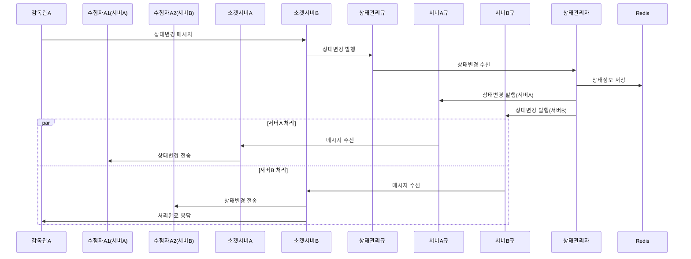
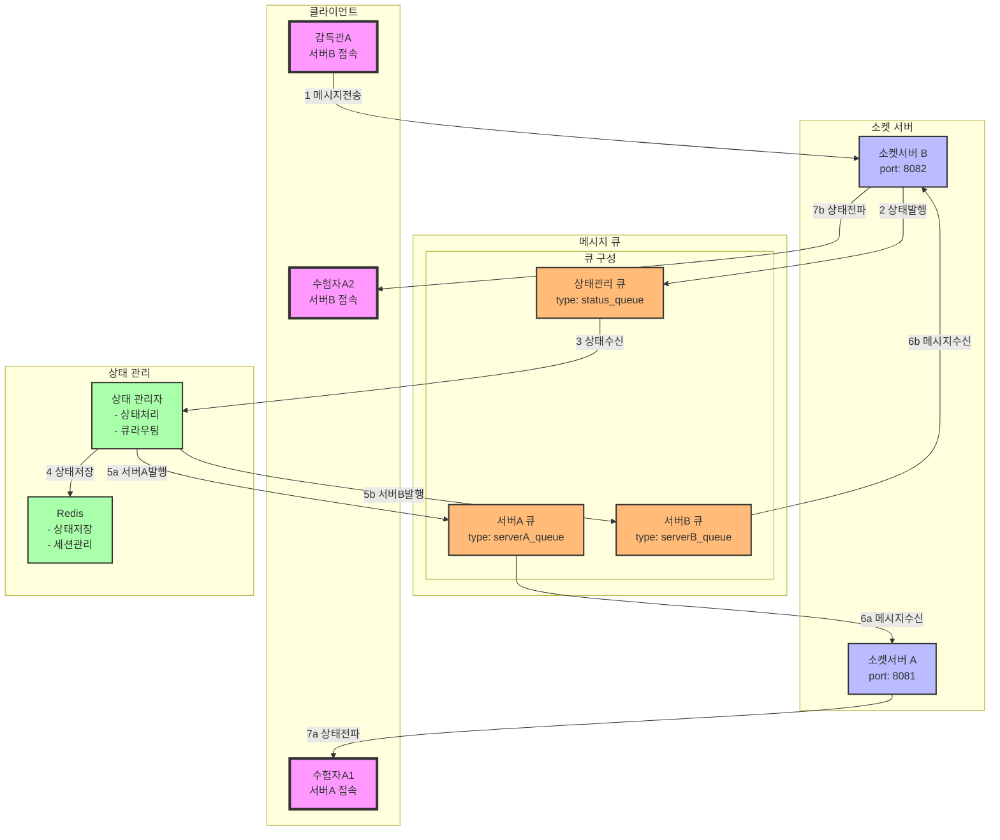

### **19. 분산 소켓서버 시나리오**

#### **19.1 시나리오 개요**

-   목적: 분산 환경에서의 소켓서버 간 메시지 처리 및 상태 동기화
-   처리 항목: 서버간 메시지 라우팅, 큐 처리, 상태 동기화
-   대상: 소켓서버 A/B, 각 서버별 큐, 상태관리 큐
-   결과: 분산 환경에서의 실시간 메시지 처리

#### **19.2 시퀀스 다이어그램**



#### **19.3 데이터 흐름**



#### **19.4 메시지 구조**

1. 서버 간 라우팅 메시지

```json
{
    "type": "route_message",
    "data": {
        "sourceServer": "serverB",
        "targetServer": "serverA",
        "messageType": "status_change",
        "payload": {
            "supervisorId": "S001",
            "targetExamineeId": "E001",
            "status": "STARTED",
            "timestamp": "2024-01-01T09:00:00Z"
        }
    }
}
```

2. 상태 동기화 메시지

```json
{
    "type": "sync_state",
    "data": {
        "servers": {
            "serverA": {
                "connections": ["E001"],
                "status": "ACTIVE"
            },
            "serverB": {
                "connections": ["E002", "S001"],
                "status": "ACTIVE"
            }
        },
        "timestamp": "2024-01-01T09:00:00Z"
    }
}
```

#### **19.5 처리 절차**

1. 서버 상태 관리

```redis
# 서버별 접속 정보
server:{serverId}:connections
{
    "clients": ["E001", "S001"],
    "lastSync": "2024-01-01T09:00:00Z",
    "status": "ACTIVE"
}

# 클라이언트 라우팅 정보
client:{clientId}:route
{
    "serverId": "serverA",
    "lastConnection": "2024-01-01T09:00:00Z"
}
```

2. 에러 처리
    - 서버 간 라우팅 실패
    - 큐 메시지 전달 실패
    - 상태 동기화 실패
    - 서버 장애 복구
