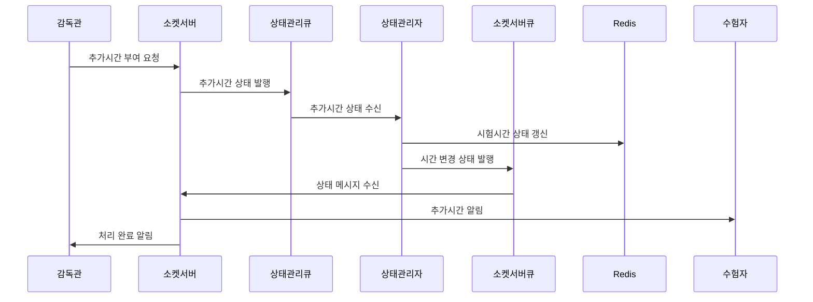
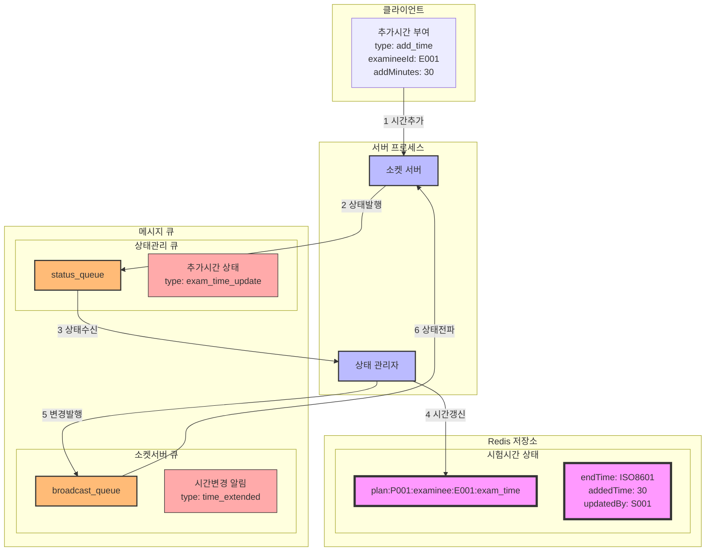

### **20. 시험 추가시간 부여 시나리오**

#### **20.1 시나리오 개요**

-   목적: 감독관의 수험자 추가시간 부여 처리
-   처리 항목: 추가시간 설정, 상태 변경, 시간 동기화
-   트리거: 감독관의 추가시간 부여 요청
-   결과: 수험자 시험시간 연장 및 상태 동기화

#### **20.2 시퀀스 다이어그램**



#### **20.3 데이터 흐름**



#### **20.4 메시지 구조**

1. 추가시간 부여 메시지

```json
{
    "type": "add_time",
    "data": {
        "planId": "P001",
        "groupId": "G001",
        "examineeId": "E001",
        "addMinutes": 30,
        "reason": "기술적 문제 보상",
        "supervisorId": "S001",
        "timestamp": "2024-01-01T10:30:00Z"
    }
}
```

2. 시간 변경 알림 메시지

```json
{
    "type": "time_extended",
    "data": {
        "planId": "P001",
        "examineeId": "E001",
        "originalEndTime": "2024-01-01T11:00:00Z",
        "newEndTime": "2024-01-01T11:30:00Z",
        "addedMinutes": 30,
        "updatedBy": "S001",
        "timestamp": "2024-01-01T10:30:00Z"
    }
}
```

#### **20.5 처리 절차**

1. 시험시간 상태 관리

```redis
# 시험시간 정보
plan:{planId}:examinee:{examineeId}:exam_time
{
    "originalEndTime": "2024-01-01T11:00:00Z",
    "currentEndTime": "2024-01-01T11:30:00Z",
    "totalAddedTime": 30,
    "lastUpdate": {
        "supervisorId": "S001",
        "reason": "기술적 문제 보상",
        "timestamp": "2024-01-01T10:30:00Z"
    }
}

# 시간 변경 이력
plan:{planId}:examinee:{examineeId}:time_history -> List
[{
    "addedMinutes": 30,
    "reason": "기술적 문제 보상",
    "supervisorId": "S001",
    "timestamp": "2024-01-01T10:30:00Z"
}]
```

2. 에러 처리
    - 상태 변경 실패
    - 메시지 전파 실패
    - 시간 동기화 오류
