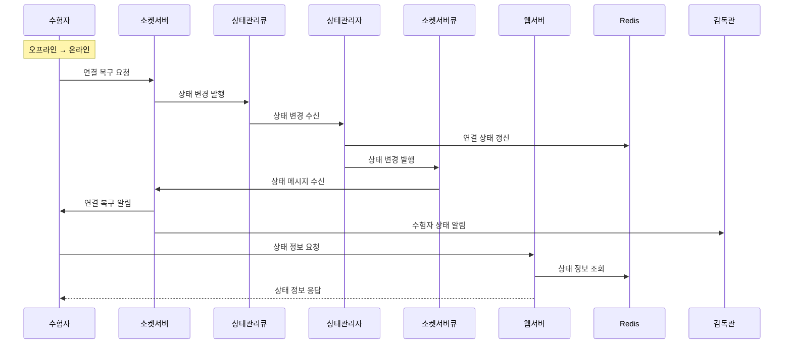
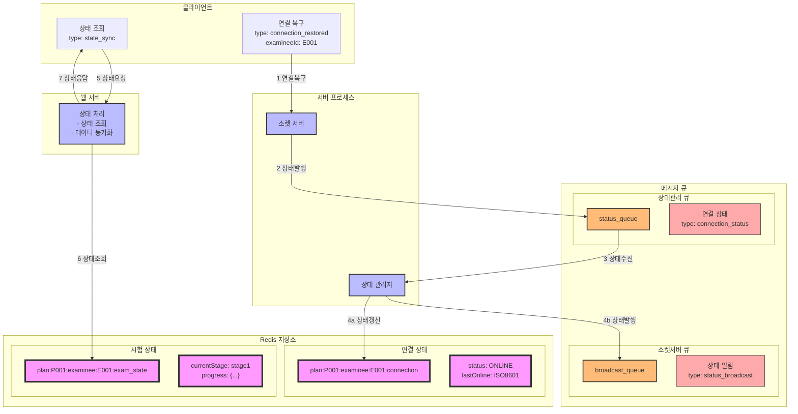

### **21. 오프라인-온라인 전환 시나리오**

#### **21.1 시나리오 개요**

-   목적: 수험자의 오프라인에서 온라인 상태 전환 처리
-   처리 항목: 연결 상태 변경, 오프라인 데이터 동기화, 시험 상태 복구
-   트리거: 수험자의 온라인 연결 복구
-   결과: 상태 동기화 및 시험 재개

#### **21.2 시퀀스 다이어그램**



#### **21.3 데이터 흐름**



#### **21.4 메시지 구조**

1. 연결 복구 메시지

```json
{
    "type": "connection_restored",
    "data": {
        "planId": "P001",
        "examineeId": "E001",
        "connectionInfo": {
            "clientId": "C123",
            "timestamp": "2024-01-01T10:15:00Z",
            "offlineDuration": 300
        },
        "offlineData": {
            "lastSyncTime": "2024-01-01T10:10:00Z",
            "pendingAnswers": [
                {
                    "questionId": "Q1",
                    "answer": "2",
                    "timestamp": "2024-01-01T10:12:00Z"
                }
            ]
        }
    }
}
```

2. 상태 동기화 응답

```json
{
    "type": "state_sync_response",
    "data": {
        "planId": "P001",
        "examineeId": "E001",
        "examState": {
            "currentStage": "stage1",
            "remainingTime": 1800,
            "lastAnswer": {
                "questionId": "Q1",
                "timestamp": "2024-01-01T10:12:00Z"
            }
        },
        "connectionState": {
            "status": "ONLINE",
            "lastOffline": "2024-01-01T10:10:00Z",
            "lastOnline": "2024-01-01T10:15:00Z"
        }
    }
}
```

#### **21.5 처리 절차**

1. 상태 정보 관리

```redis
# 연결 상태 정보
plan:{planId}:examinee:{examineeId}:connection
{
    "status": "ONLINE",
    "lastOffline": "2024-01-01T10:10:00Z",
    "lastOnline": "2024-01-01T10:15:00Z",
    "offlineDuration": 300,
    "totalOfflineTime": 600
}

# 오프라인 데이터
plan:{planId}:examinee:{examineeId}:offline_data
{
    "lastSyncTime": "2024-01-01T10:10:00Z",
    "pendingAnswers": [
        {
            "questionId": "Q1",
            "answer": "2",
            "timestamp": "2024-01-01T10:12:00Z"
        }
    ]
}
```

2. 에러 처리
    - 연결 복구 실패
    - 데이터 동기화 실패
    - 상태 불일치 처리
