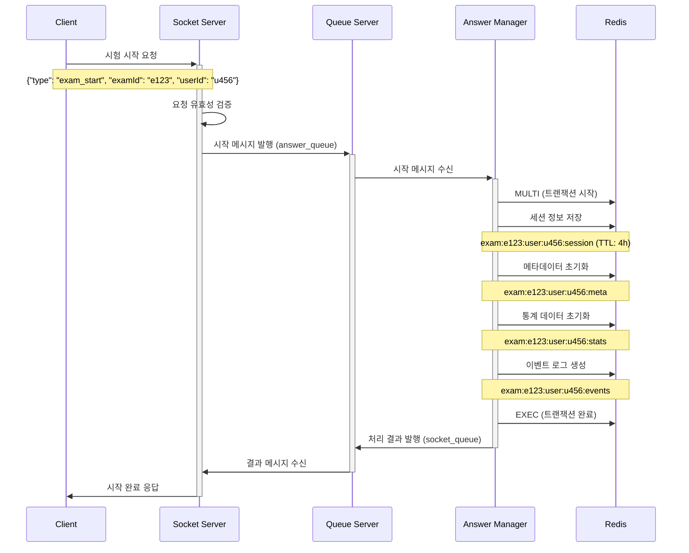
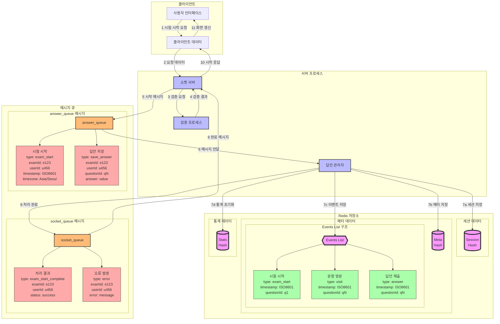

# 시험 시작 시나리오 상세 설계서

## 1. 시나리오 개요

### 1.1 목적

-   수험자의 시험 세션 생성 및 초기화
-   시험 관련 모든 데이터 구조의 일관된 초기화 보장
-   안정적인 시험 시작 환경 제공

### 1.2 범위

-   시험 시작 요청부터 첫 문항 표시까지의 전체 프로세스
-   관련 데이터 구조의 초기화 및 검증
-   예외 상황 처리 및 복구 절차

## 2. 시스템 구성도

### 2.1 시퀀스 다이어그램



### 2.2 데이터 흐름



## 3. 데이터 구조

### 3.1 클라이언트 요청 메시지

```json
{
    "type": "exam_start",
    "examId": "e123",
    "userId": "u456",
    "timestamp": "2024-01-01T00:00:00Z",
    "timezone": "Asia/Seoul",
    "clientInfo": {
        "browser": "Chrome",
        "version": "120.0",
        "platform": "Windows"
    }
}
```

### 3.2 Redis 저장 데이터

#### 3.2.1 세션 정보 (Hash, TTL: 4시간)

```json
exam:e123:user:u456:session = {
    "startTime": "2024-01-01T00:00:00Z",
    "status": "in_progress",
    "currentQuestion": "q1",
    "lastActiveTime": "2024-01-01T00:00:00Z",
    "timezone": "Asia/Seoul",
    "clientInfo": {
        "browser": "Chrome",
        "version": "120.0",
        "platform": "Windows"
    }
}
```

#### 3.2.2 메타데이터 (Hash)

```json
exam:e123:user:u456:meta = {
    "q1": {
        "visits": 1,
        "totalDuration": 0,
        "effectiveDuration": 0,
        "firstVisit": "2024-01-01T00:00:00Z",
        "lastVisit": "2024-01-01T00:00:00Z",
        "interactions": {
            "clicks": 0,
            "scrolls": 0,
            "inputs": 0
        }
    }
}
```

#### 3.2.3 통계 데이터 (Hash)

```json
exam:e123:user:u456:stats = {
    "totalQuestions": 10,
    "answeredQuestions": 0,
    "totalDuration": 0,
    "effectiveDuration": 0,
    "focusLostCount": 0,
    "pageScrolls": 0,
    "totalClicks": 0
}
```

#### 3.2.4 이벤트 로그 (List)

```json
exam:e123:user:u456:events = [
    {
        "type": "exam_start",
        "timestamp": "2024-01-01T00:00:00Z",
        "questionId": "q1"
    }
]
```

## 4. 처리 절차

### 4.1 클라이언트 측 처리

1. 시험 시작 요청 전송
2. 시작 응답 수신 및 유효성 검증
3. 첫 문항 렌더링
4. 시험 시간 타이머 시작
5. 실시간 소켓 연결 설정

### 4.2 서버 측 처리

1. 요청 유효성 검증
    - 필수 필드 존재 여부
    - examId, userId 유효성
    - 시험 시작 가능 상태 확인
2. Redis 트랜잭션 처리
    - MULTI 명령으로 트랜잭션 시작
    - 모든 데이터 구조 초기화
    - EXEC 명령으로 트랜잭션 완료
3. 세션 TTL 설정 (4시간)
4. 처리 결과 응답

## 5. 예외 처리

### 5.1 중복 시작 방지

1. 세션 키 존재 여부 확인
2. 중복 시 오류 응답
    - 오류 코드: DUPLICATE_SESSION
    - 기존 세션 정보 반환

### 5.2 네트워크 오류 처리

1. 재시도 메커니즘
    - 최대 3회 재시도
    - 지수 백오프 적용
2. 세션 복구 프로세스
    - 부분 생성된 세션 정리
    - 클라이언트 재연결 지원

### 5.3 Redis 장애 처리

1. 트랜잭션 실패 시
    - 생성된 키 삭제
    - 오류 로그 기록
2. 장애 복구 후
    - 세션 재검증
    - 필요시 세션 재생성
