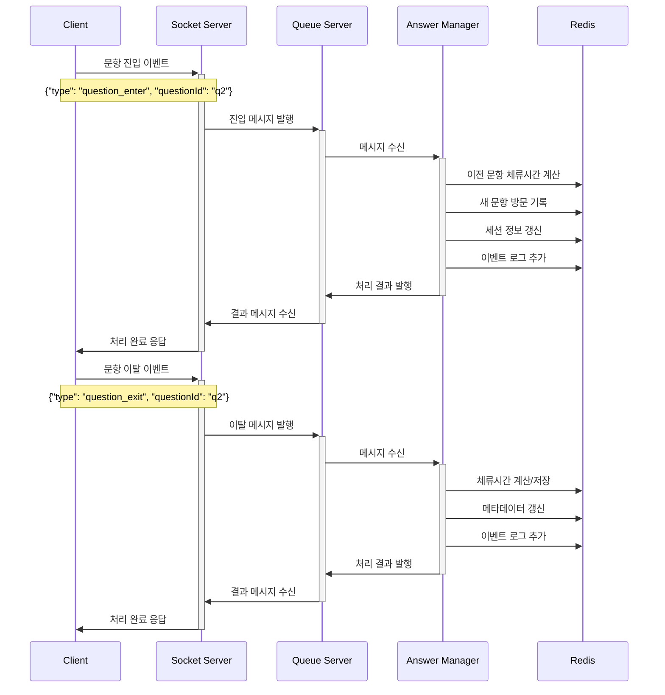
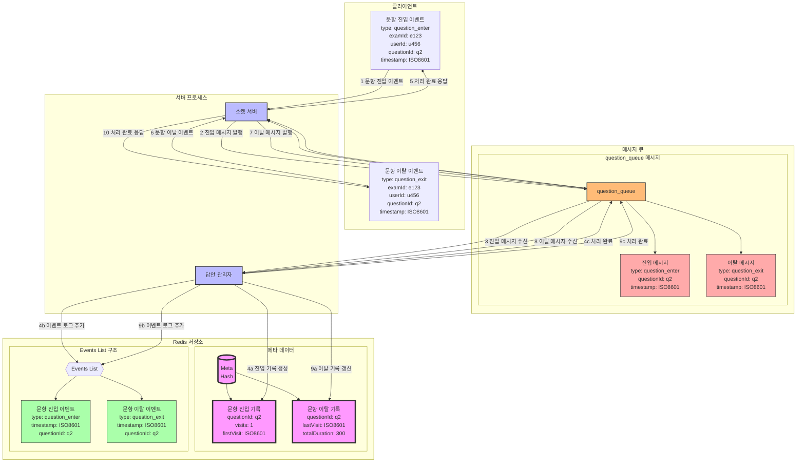

### **2. 문항 진입/이탈 시나리오**

#### **2.1 시나리오 개요**

-   목적: 수험자의 문항 간 이동 및 체류시간 추적
-   트리거:
    -   진입: 문항 이동 또는 처음 시험 시작
    -   이탈: 다른 문항으로 이동 또는 시험 종료
-   결과: 문항별 방문 기록 및 체류시간 저장

#### **2.2 시퀀스 다이어그램**



### 2.2 데이터 흐름



#### **2.3 메시지 구조**

1. 진입 메시지

```json
{
    "type": "question_enter",
    "examId": "e123",
    "userId": "u456",
    "questionId": "q2",
    "timestamp": "2024-01-01T00:10:00Z",
    "previousQuestionId": "q1", // 이전 문항 ID
    "entryType": "navigation" // navigation/initial/return
}
```

2. 이탈 메시지

```json
{
    "type": "question_exit",
    "examId": "e123",
    "userId": "u456",
    "questionId": "q2",
    "timestamp": "2024-01-01T00:15:00Z",
    "nextQuestionId": "q3", // 다음 문항 ID
    "exitType": "navigation" // navigation/timeout/exam_end
}
```

#### **2.4 Redis 데이터 갱신**

1. 메타데이터 업데이트

```json
// exam:e123:user:u456:meta
{
    "q2": {
        "visits": 1,
        "totalDuration": 300, // 초 단위
        "firstVisit": "2024-01-01T00:10:00Z",
        "lastVisit": "2024-01-01T00:15:00Z",
        "visitHistory": [
            {
                "enterTime": "2024-01-01T00:10:00Z",
                "exitTime": "2024-01-01T00:15:00Z",
                "duration": 300
            }
        ]
    }
}
```

2. 세션 정보 업데이트

```json
// exam:e123:user:u456:session
{
    "currentQuestion": "q2",
    "lastActiveTime": "2024-01-01T00:15:00Z",
    "navigationHistory": [
        { "from": "q1", "to": "q2", "timestamp": "2024-01-01T00:10:00Z" },
        { "from": "q2", "to": "q3", "timestamp": "2024-01-01T00:15:00Z" }
    ]
}
```

#### **2.5 처리 절차**

1. 문항 진입 처리

    - 이전 문항 체류시간 계산
    - 새 문항 방문 기록 생성
    - 세션 정보 갱신
    - 이벤트 로그 추가

2. 문항 이탈 처리
    - 현재 문항 체류시간 계산
    - 메타데이터 업데이트
    - 이동 이력 기록
    - 이벤트 로그 추가

#### **2.6 특수 상황 처리**

1. 그룹 문항(지문+여러 문항)

```json
// 그룹 진입/이탈 메시지
{
    "type": "group_enter",
    "examId": "e123",
    "userId": "u456",
    "groupId": "g1",
    "questionIds": ["q2", "q3", "q4"],
    "timestamp": "2024-01-01T00:10:00Z"
}
```

2. 비정상 이탈
    - 브라우저 종료
    - 네트워크 단절
    - 시험 강제 종료

#### **2.7 데이터 정합성 처리**

1. 체류시간 계산

    - 클라이언트 시간 검증
    - 서버 시간 기준 보정
    - 최대 허용 체류시간 제한

2. 동시성 제어

    - Redis 트랜잭션 사용
    - 순차적 이벤트 처리
    - 중복 이벤트 필터링

3. 데이터 백업
    - 주기적 영구 저장소 백업
    - 복구 지점 생성
    - 감사 로그 유지

이러한 상세 설계를 통해 수험자의 문항 이동과 체류시간을 정확하게 추적하고 관리할 수 있습니다.
