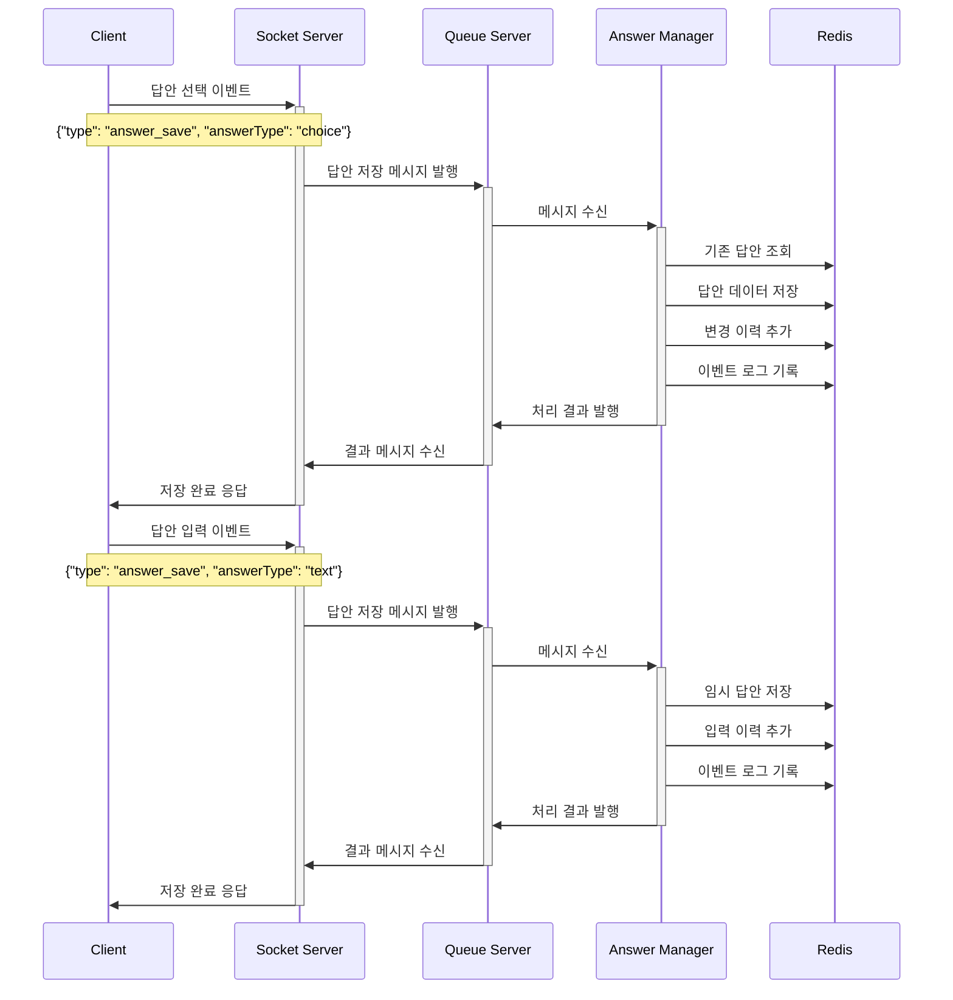
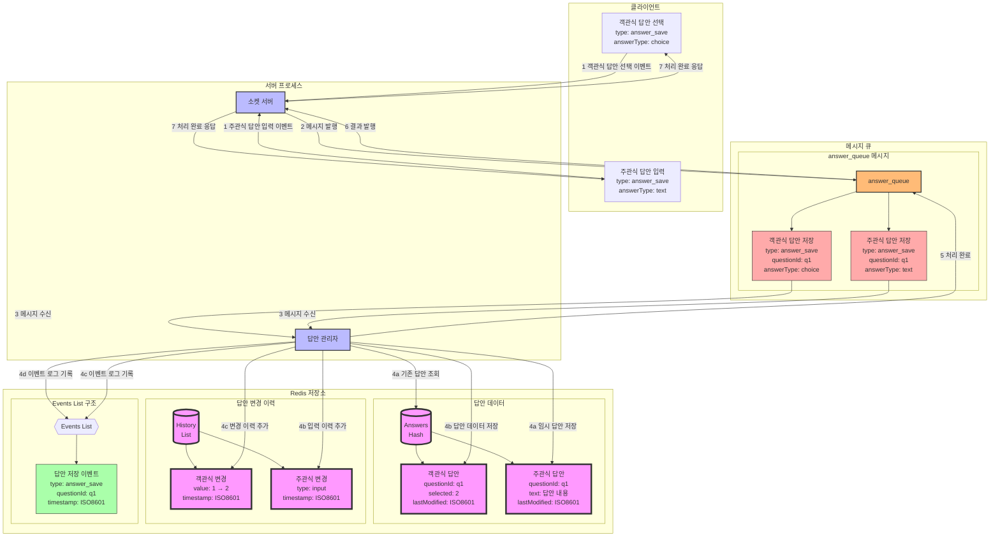

### **3. 답안 저장 시나리오**

#### **3.1 시나리오 개요**

-   목적: 수험자의 답안 저장 및 변경 이력 관리
-   유형: 객관식 선택, 주관식 입력, 복수 선택
-   트리거: 답안 선택/입력, 답안 수정
-   결과: 답안 데이터 저장 및 이력 관리

#### **3.2 시퀀스 다이어그램**



#### **3.3 데이터 흐름**



#### **3.4 메시지 구조**

1. 객관식 답안 메시지

```json
{
    "type": "answer_save",
    "examId": "e123",
    "userId": "u456",
    "questionId": "q1",
    "answerType": "choice",
    "data": {
        "selected": ["2"], // 선택한 답안 번호
        "timestamp": "2024-01-01T00:05:00Z",
        "changeCount": 1 // 변경 횟수
    }
}
```

2. 주관식 답안 메시지

```json
{
    "type": "answer_save",
    "examId": "e123",
    "userId": "u456",
    "questionId": "q1",
    "answerType": "text",
    "data": {
        "text": "답안 내용",
        "timestamp": "2024-01-01T00:05:00Z",
        "inputType": "input/paste/delete",
        "cursorPosition": 10
    }
}
```

#### **3.5 Redis 데이터 구조**

1. 답안 데이터

```json
// exam:e123:user:u456:answers
{
    "q1": {
        "current": {
            "type": "choice",
            "value": ["2"],
            "lastModified": "2024-01-01T00:05:00Z"
        },
        "history": [
            {
                "value": ["1"],
                "timestamp": "2024-01-01T00:03:00Z"
            },
            {
                "value": ["2"],
                "timestamp": "2024-01-01T00:05:00Z"
            }
        ]
    }
}
```

2. 답안 변경 이력

```json
// exam:e123:user:u456:answer:q1:changes
[
    {
        "type": "select",
        "value": "1",
        "timestamp": "2024-01-01T00:03:00Z"
    },
    {
        "type": "change",
        "value": "2",
        "timestamp": "2024-01-01T00:05:00Z"
    }
]
```

#### **3.6 처리 절차**

1. 객관식 답안 처리

    - 기존 답안 확인
    - 새 답안 저장
    - 변경 이력 추가
    - 메타데이터 갱신

2. 주관식 답안 처리
    - 임시 저장
    - 입력 이력 기록
    - 자동 저장 처리
    - 텍스트 변경 추적

#### **3.7 특수 상황 처리**

1. 복수 선택 문항

    - 선택 개수 제한 검증
    - 선택 순서 기록
    - 부분 점수 처리

2. 대용량 텍스트
    - chunk 단위 저장
    - 자동 저장 주기 설정
    - 버전 관리

#### **3.8 데이터 정합성**

1. 검증 규칙

    - 문항 유형 검증
    - 선택지 범위 검증
    - 입력값 형식 검증

2. 동시성 제어

    - 답안 저장 Lock
    - 버전 관리
    - 충돌 해결

3. 백업 처리
    - 주기적 영구 저장
    - 변경 이력 보존
    - 복구 포인트 생성

이러한 설계를 통해 다양한 유형의 답안을 안정적으로 저장하고 변경 이력을 추적할 수 있습니다.
