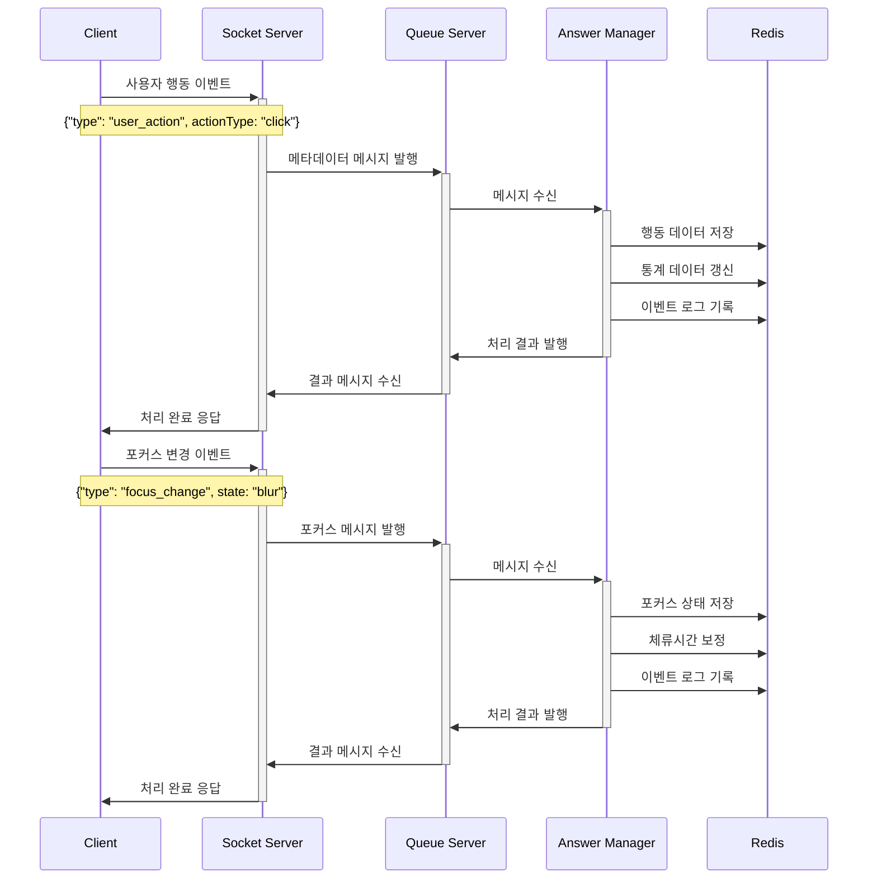
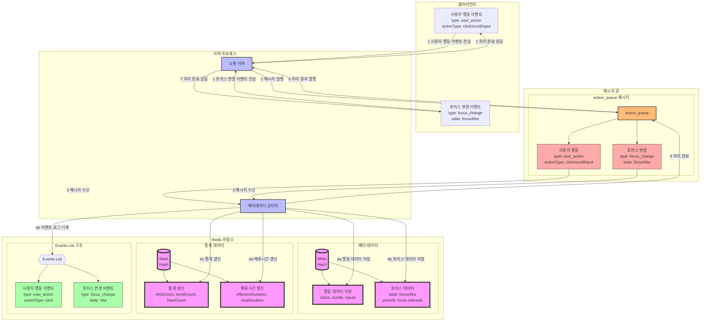

### **4. 메타데이터 수집 시나리오**

#### **4.1 시나리오 개요**

-   목적: 수험자의 문항 풀이 행동 데이터 수집
-   수집 항목: 클릭, 스크롤, 입력 행동, 페이지 포커스
-   트리거: 사용자 행동 발생
-   결과: 행동 패턴 데이터 저장

#### **4.2 시퀀스 다이어그램**



#### **4.4 데이터 흐름**



#### **4.4 메시지 구조**

1. 사용자 행동 메시지

```json
{
    "type": "user_action",
    "examId": "e123",
    "userId": "u456",
    "questionId": "q1",
    "actionType": "click/scroll/input",
    "data": {
        "timestamp": "2024-01-01T00:05:00Z",
        "target": "choice_2", // 클릭/입력 대상
        "position": {
            // 클릭 위치
            "x": 100,
            "y": 200
        },
        "scrollDepth": 0.75 // 스크롤 깊이
    }
}
```

2. 포커스 변경 메시지

```json
{
    "type": "focus_change",
    "examId": "e123",
    "userId": "u456",
    "questionId": "q1",
    "data": {
        "state": "focus/blur",
        "timestamp": "2024-01-01T00:05:00Z",
        "reason": "tab_change/window_minimize"
    }
}
```

#### **4.5 Redis 데이터 구조**

1. 행동 메타데이터

```json
// exam:e123:user:u456:meta:q1
{
    "interactions": {
        "clicks": [
            {
                "target": "choice_2",
                "timestamp": "2024-01-01T00:05:00Z",
                "position": { "x": 100, "y": 200 }
            }
        ],
        "scrolls": [
            {
                "depth": 0.75,
                "timestamp": "2024-01-01T00:05:30Z"
            }
        ],
        "inputs": [
            {
                "type": "text",
                "length": 10,
                "timestamp": "2024-01-01T00:06:00Z"
            }
        ]
    },
    "focus": {
        "totalTime": 300,
        "lostCount": 2,
        "periods": [
            {
                "start": "2024-01-01T00:05:00Z",
                "end": "2024-01-01T00:06:00Z",
                "state": "focus"
            }
        ]
    }
}
```

2. 통계 데이터

```json
// exam:e123:user:u456:stats:q1
{
    "clickCount": 5,
    "scrollCount": 3,
    "inputCount": 2,
    "focusLostCount": 2,
    "effectiveDuration": 280, // 실제 활성 시간
    "totalDuration": 300 // 전체 체류 시간
}
```

#### **4.6 처리 절차**

1. 행동 데이터 수집

    - 이벤트 데이터 검증
    - 행동 유형 분류
    - 시간 정보 기록
    - 통계 데이터 갱신

2. 포커스 관리
    - 포커스 상태 추적
    - 유효 시간 계산
    - 부정행위 감지

#### **4.7 특수 상황 처리**

1. 대량 이벤트 처리

    - 이벤트 버퍼링
    - 배치 처리
    - 데이터 압축

2. 네트워크 문제
    - 로컬 저장
    - 재전송 메커니즘
    - 순서 보장

#### **4.8 데이터 활용**

1. 실시간 모니터링

    - 부정행위 감지
    - 사용자 패턴 분석
    - 시스템 상태 확인

2. 통계 분석
    - 문항별 난이도 분석
    - 사용자 행동 패턴 분석
    - 시험 진행 상황 분석
