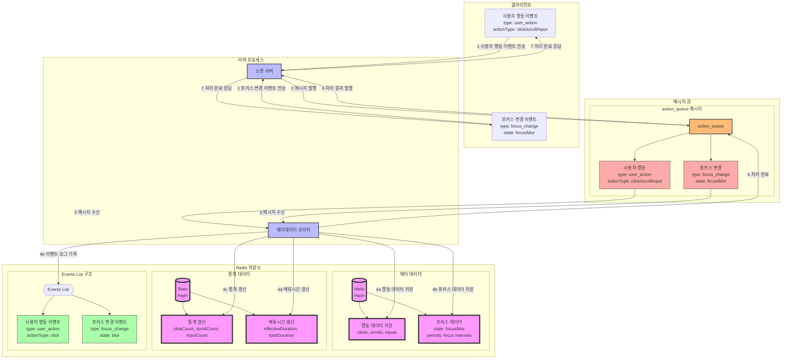

#### **4.2 데이터 흐름 다이어그램**

```mermaid
flowchart TB
    subgraph Client[클라이언트]
        UAC[사용자 행동 이벤트<br/>type: user_action<br/>actionType: click/scroll/input]
        FCE[포커스 변경 이벤트<br/>type: focus_change<br/>state: focus/blur]
    end

    subgraph MessageQueue[메시지 큐]
        subgraph ActionQueue[action_queue 메시지]
            AQ[action_queue]
            AQ1[사용자 행동<br/>type: user_action<br/>actionType: click/scroll/input]
            AQ2[포커스 변경<br/>type: focus_change<br/>state: focus/blur]
            AQ --> AQ1
            AQ --> AQ2
        end
    end

    subgraph Redis[Redis 저장소]
        direction TB
        subgraph MetaData[메타 데이터]
            RM[(Meta<br/>Hash)]
            RM1[행동 데이터 저장<br/>clicks, scrolls, inputs]
            RM2[포커스 데이터<br/>state: focus/blur<br/>periods: focus intervals]
            RM --> RM1
            RM --> RM2
        end
        subgraph StatsData[통계 데이터]
            RS[(Stats<br/>Hash)]
            RS1[통계 갱신<br/>clickCount, scrollCount, inputCount]
            RS2[체류시간 갱신<br/>effectiveDuration, totalDuration]
            RS --> RS1
            RS --> RS2
        end
        subgraph EventsList[Events List 구조]
            RE{{Events List}}
            EV1[사용자 행동 이벤트<br/>type: user_action<br/>actionType: click]
            EV2[포커스 변경 이벤트<br/>type: focus_change<br/>state: blur]
            RE --> EV1
            RE --> EV2
        end
    end

    subgraph Server[서버 프로세스]
        SP[소켓 서버]
        AP[메타데이터 관리자]
    end

    %% 데이터 흐름
    UAC -->|1 사용자 행동 이벤트 전송| SP
    FCE -->|1 포커스 변경 이벤트 전송| SP
    SP -->|2 메시지 발행| AQ
    AQ1 -->|3 메시지 수신| AP
    AQ2 -->|3 메시지 수신| AP

    AP -->|4a 행동 데이터 저장| RM1
    AP -->|4b 포커스 데이터 저장| RM2
    AP -->|4c 통계 갱신| RS1
    AP -->|4d 체류시간 갱신| RS2
    AP -->|4e 이벤트 로그 기록| RE

    AP -->|5 처리 완료| AQ
    AQ -->|6 처리 결과 발행| SP
    SP -->|7 처리 완료 응답| UAC
    SP -->|7 처리 완료 응답| FCE

    %% 스타일링
    classDef storage fill:#f9f,stroke:#333,stroke-width:4px
    classDef process fill:#bbf,stroke:#333,stroke-width:2px
    classDef queue fill:#fb7,stroke:#333,stroke-width:2px
    classDef event fill:#afa,stroke:#333,stroke-width:1px
    classDef message fill:#faa,stroke:#333,stroke-width:1px

    class RM1,RM2,RM,RS1,RS2,RS storage
    class SP,AP process
    class AQ queue
    class EV1,EV2 event
    class AQ1,AQ2 message
```
