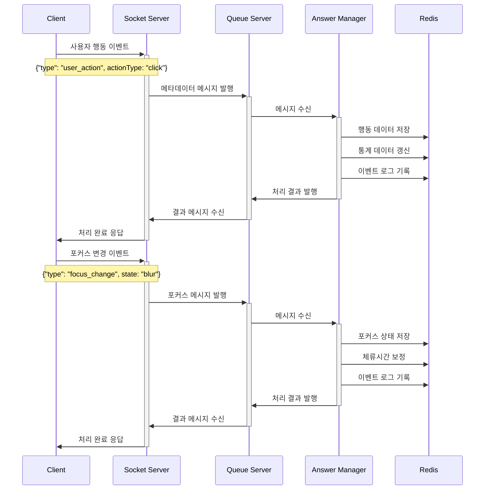

#### **4.2 시퀀스 다이어그램**

```mermaid
sequenceDiagram
    participant C as Client
    participant S as Socket Server
    participant Q as Queue Server
    participant A as Answer Manager
    participant R as Redis

    %% 일반 행동 이벤트
    C->>+S: 사용자 행동 이벤트
    Note over C,S: {"type": "user_action", actionType: "click"}

    S->>+Q: 메타데이터 메시지 발행
    Q->>+A: 메시지 수신

    A->>R: 행동 데이터 저장
    A->>R: 통계 데이터 갱신
    A->>R: 이벤트 로그 기록

    A->>-Q: 처리 결과 발행
    Q->>-S: 결과 메시지 수신
    S->>-C: 처리 완료 응답

    %% 페이지 포커스 이벤트
    C->>+S: 포커스 변경 이벤트
    Note over C,S: {"type": "focus_change", state: "blur"}

    S->>+Q: 포커스 메시지 발행
    Q->>+A: 메시지 수신

    A->>R: 포커스 상태 저장
    A->>R: 체류시간 보정
    A->>R: 이벤트 로그 기록

    A->>-Q: 처리 결과 발행
    Q->>-S: 결과 메시지 수신
    S->>-C: 처리 완료 응답
```
