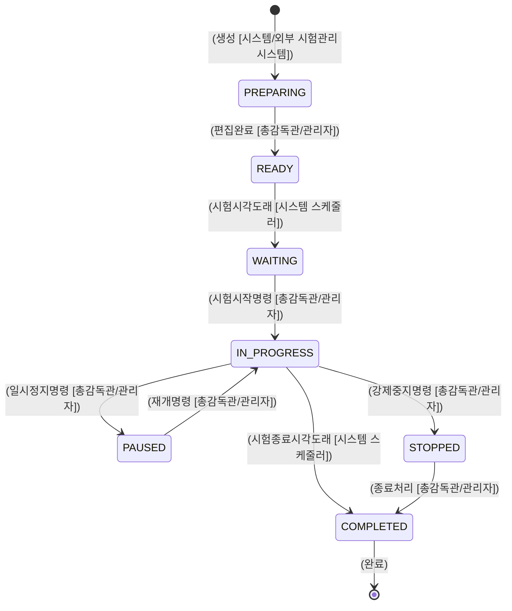
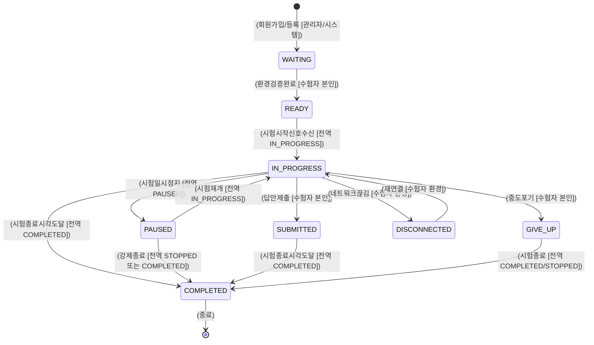
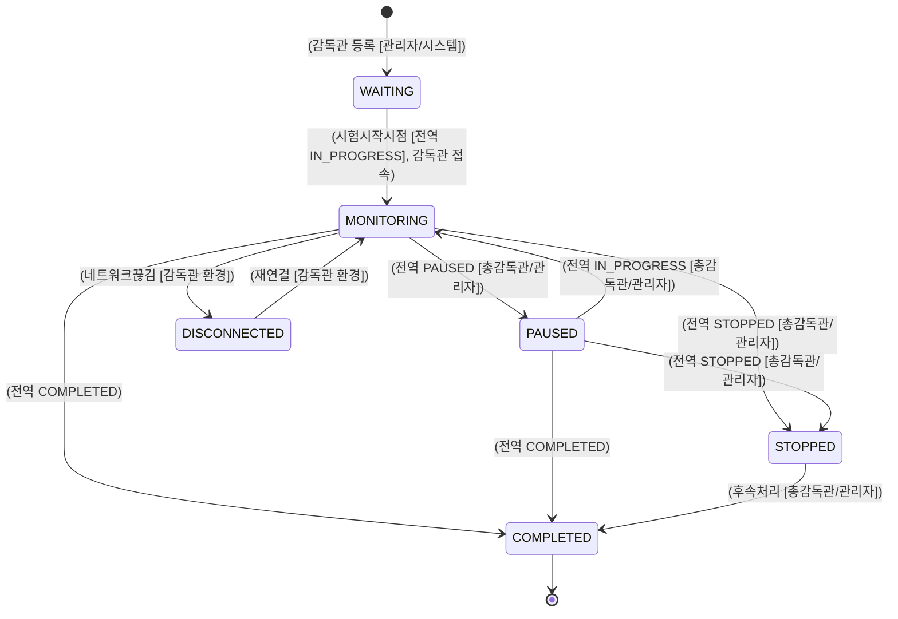
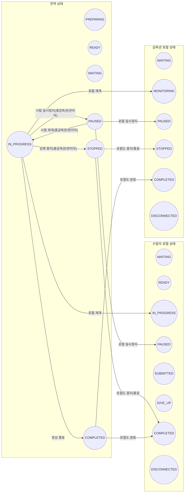

**[Online Exam System] 상태 명세서**  
**버전: 1.5.0** (최종 수정일: 2024-12-26)

---

## 변경 이력(Changelog)

| 버전  |    일자    | 변경 내용                                                                                                                 |  작성/수정자  |
| :---: | :--------: | :------------------------------------------------------------------------------------------------------------------------ | :-----------: |
| 1.0.0 |     -      | 최초 문서 작성                                                                                                            |       -       |
| 1.1.0 | 2024-12-26 | 1) Mermaid 기반 다이어그램 작성  2) 전역/로컬 상태 정의 보강  3) 이벤트 및 주체 일부 표기                           | AI 어시스턴트 |
| 1.2.0 | 2024-12-26 | 1) 상태 변경 주체/이벤트 명시 다이어그램 보강  2) 글로벌 ↔ 로컬 상태 변화 영향 관계 다이어그램 및 설명 추가            | AI 어시스턴트 |
| 1.3.0 | 2024-12-26 | 1) **준비중(PREPARING) 단계**가 “외부 시험관리시스템에서 시험계획 정보가 등록되는 단계”임을 명시                          | AI 어시스턴트 |
| 1.4.0 | 2024-12-26 | 1) **감독관 상태가 관리 중인 시험 그룹 및 하위 수험자 상태에 영향을 줄 수 있음**을 명시                                   | AI 어시스턴트 |
| 1.5.0 | 2024-12-26 | 1) **감독관은 전역상태(상위 단계)에 직접 영향을 주지 않는다**  2) 시험의 전역상태 변경은 총감독관/관리자/시스템만 가능 | AI 어시스턴트 |

---

## 1. 문서 개요

본 문서는 **온라인 시험 시스템**에서 정의되는 **전역(글로벌) 상태**와 **로컬(개별) 상태**의 종류 및 전이(Transition) 관계를 다룹니다.

-   **전역 상태**: 시험 전체 라이프사이클(시험계획 등록, 준비완료, 시험진행 등)
-   **로컬 상태**: 시험에 참여하거나 감독하는 개별 엔티티(수험자, 감독관 등)의 상태
-   **상태 변경 주체/이벤트**: 어떤 사용자(총감독관/관리자/수험자/시스템 등)가 어떤 행위를 했을 때 상태가 어떻게 전이되는지
-   **중요**: **감독관(Supervisor)은 전역상태(상위 단계)에 직접 영향을 주지 않습니다.** 전역상태 변경(일시정지/재개/중지 등)은 **총감독관, 관리자, 또는 시스템**만 수행할 수 있습니다.

> \[배경\] 기존에는 “감독관이 시험 일시정지/재개 명령을 직접 실행”이라고 서술된 부분이 있었으나, 이번 버전(1.5.0)에서 “감독관은 전역 상태에 직접 영향 불가”로 변경되어, **감독관**은 하위 그룹/수험자 상태(로컬)만 제어 가능하다는 점을 명시합니다.

---

## 2. 전역(Global) 상태

### 2.1 전역 상태 정의

|     상태     |    코드     | 설명                                                                                                                 |
| :----------: | :---------: | :------------------------------------------------------------------------------------------------------------------- |
|  **준비중**  |  PREPARING  | 외부 시험관리시스템에서 **온라인 시험 시스템**으로 시험계획(계획명, 일정, 시험지 정보 등) 관련 정보를 등록 중인 단계 |
| **준비완료** |    READY    | 시험 운영 시작 전, 모든 준비가 끝난 단계                                                                             |
| **시험대기** |   WAITING   | 시험 오픈 직전, 수험자·감독관이 접속해 대기 가능한 단계                                                              |
| **시험진행** | IN_PROGRESS | 시험이 실제로 진행 중인 상태                                                                                         |
| **시험멈춤** |   PAUSED    | 일시정지 상태. 재개 시 IN_PROGRESS로 돌아감                                                                          |
| **시험중지** |   STOPPED   | 시험이 도중에 강제로 종료된 상태. 재개 불가                                                                          |
| **시험완료** |  COMPLETED  | 시험이 정상 종료된 상태. 후속 통계 처리, 결과 산출 등으로 전환 가능                                                  |

### 2.2 전역 상태 전이: 이벤트 & 주체

> 감독관이 아닌, **총감독관/관리자/시스템**만이 시험 전체(전역) 상태를 바꿀 수 있습니다.  
> 예) 시험을 일시정지 하려면 총감독관/관리자가 해당 명령을 내려야 하며, 단순 감독관은 전역 상태를 변경할 수 없습니다.

---

## 3. 로컬(Local) 상태

### 3.1 수험자(Examinee) 로컬 상태

#### 3.1.1 상태 정의

|       상태       |     코드     | 설명                                                                 |
| :--------------: | :----------: | :------------------------------------------------------------------- |
| **대기**(미응시) |   WAITING    | 시험 시작 전, 아직 응시 준비가 되지 않은 상태                        |
|   **시험준비**   |    READY     | 환경 검증/로그인 완료, 시험 시작만 기다리는 상태                     |
|   **시험응시**   | IN_PROGRESS  | 실제 문제 풀이 중                                                    |
|   **일시정지**   |    PAUSED    | 전역이 멈춤이면 수험자도 자동 일시정지 (총감독관/관리자 명령)        |
|   **답안제출**   |  SUBMITTED   | 모든 답안을 제출 완료 (추가 수정 불가능)                             |
|   **중도포기**   |   GIVE_UP    | 수험자가 스스로 시험을 포기 (전역 상태에는 영향 없음)                |
|   **시험완료**   |  COMPLETED   | 시험 정상 종료 or 시간 도달 시 더 이상 풀이 불가                     |
|   **연결끊김**   | DISCONNECTED | 네트워크 장애 등으로 시스템과 단절됨 (재연결 시 직전 상태 복귀 가능) |

#### 3.1.2 수험자 상태 전이: 이벤트 & 주체

---

### 3.2 감독관(Supervisor) 로컬 상태

감독관은 시험 그룹과 그 하위 수험자를 실시간 모니터링하고, 부정행위를 감지·제재할 수 있습니다.  
하지만 **감독관은 전역 상태를 직접 바꿀 수 없으며**, 필요한 경우 총감독관이나 관리자를 통해 전역 명령을 요청해야 합니다.

#### 3.2.1 상태 정의

|       상태       |     코드     | 설명                                                                                                            |
| :--------------: | :----------: | :-------------------------------------------------------------------------------------------------------------- |
|    **대기중**    |   WAITING    | 시험 모니터링 전, 그룹 배정된 후 접속 대기 상태                                                                 |
|  **모니터링중**  |  MONITORING  | 시험 진행 시점에서 수험자 모니터링/부정행위 감시 단, 전역 상태 변경(시험 일시정지/재개/강제종료 등)은 불가능 |
|   **일시정지**   |    PAUSED    | 전역이 멈춤일 경우, 감독관 화면도 중단                                                                          |
| **시험관리완료** |  COMPLETED   | 시험이 정상 종료되어 더 이상 모니터링할 사항 없음                                                               |
|   **중도중지**   |   STOPPED    | 시험이 강제 중지되어, 이 감독관도 시험 관리 불가                                                                |
|   **연결끊김**   | DISCONNECTED | 감독관 클라이언트와 서버 간 연결이 끊긴 상태 (재연결 시 MONITORING 복귀 가능)                                   |

#### 3.2.2 상태 전이: 이벤트 & 주체

> -   **감독관**은 시험을 “일시정지/재개”하거나 “강제종료”하도록 **직접** 전역 상태를 바꿀 수 없습니다.
> -   감독관이 필요 시에는 **총감독관/관리자에게 요청**하여 전역 상태 변경 명령이 실행됩니다.

---

## 4. 글로벌 ↔ 로컬 상태 변화 관계

다음 다이어그램은 전역 상태가 로컬 상태에 영향을 주는 기본적인 흐름을 나타냅니다.

-   **총감독관/관리자**가 시험을 일시정지(전역 → PAUSED)하면, 수험자 · 감독관 로컬 상태도 PAUSED로 전이됨.
-   감독관이 이를 “직접” 명령할 수는 없으며, **요청** 후 총감독관/관리자의 승인·실행이 필요합니다.

---

## 5. 감독관이 하위 수험자 상태에 주는 영향 (로컬 ↔ 로컬)

-   **감독관**은 전역 상태를 바꾸진 못하지만, **소속 시험 그룹 내 수험자**에게 로컬 수준의 조치를 취할 수 있습니다.  
    예: 특정 수험자가 부정행위를 감지하면, **감독관**이 그 수험자를 “강제 퇴장(중도종료에 준하는 처리)” 시킬 수 있음.
-   이 경우 **해당 수험자 로컬 상태**가 변경될 뿐, 시험 전체(전역) 상태에는 영향이 없습니다.

예시)

1. 수험자 A가 부정행위를 했다고 판단됨
2. 감독관은 “A 수험자 강제 퇴장” 기능을 수행 (로컬 액션)
3. 수험자 A 상태: `IN_PROGRESS` → `STOPPED`(혹은 `COMPLETED` 유사 처리)
4. 시험 전체 전역 상태: 여전히 `IN_PROGRESS` (다른 수험자들은 정상 진행)

---

## 6. 문서 활용 및 주의사항

1. **전역 상태 변경 권한**
    - 시험대기, 시험진행, 일시정지, 중지, 종료 등은 **총감독관/관리자/시스템**만 실행 가능
    - 단순 감독관은 전역 상태 변경이 불가
2. **감독관 로컬 제어**
    - 감독관은 자신이 담당하는 시험 그룹·수험자에 한해서만 부정행위 감시, 강제 퇴장, 메시지 발송 등의 로컬 조치 가능
    - 전역 상태에 영향을 미치지 않음
3. **DB/코드 설계**
    - 전역 상태: `TEST_PLAN.PLAN_STATUS_CODE`
    - 수험자/감독관 상태: `EXAMINEE_PROGRESS`, `SUPERVISOR_PROGRESS`
    - “감독관 → 수험자 로컬 액션”을 어떻게 기록할지(부정행위 로그 등) 추가 설계 필요
4. **이벤트 기반 처리**
    - 시험 멈춤, 시험 종료 등은 반드시 총감독관/관리자 권한으로 발생
    - 감독관은 요청만 가능(또는 별도 승인 프로세스), 실제 전역 상태는 승인된 후 변경
5. **버전 관리**
    - 본 문서(버전 1.5.0)는 이전 버전(1.4.0)에 비해 “감독관은 전역 상태에 영향을 주지 않는다”라는 요구사항을 반영하였습니다.

---

## 7. 결론

-   **감독관**은 **시험 그룹/수험자 상태(로컬)**에만 조치를 취할 수 있고, **전역 상태(시험 전체)**는 **총감독관/관리자/시스템**이 제어합니다.
-   따라서, 시험을 일시정지/재개/강제중지하려면 **감독관**이 **총감독관/관리자**에게 요청하여 시스템에 반영해야 합니다.
-   이 구조를 통해 권한 분리가 명확해지고, 감독관과 총감독관(또는 관리자)이 역할을 분담하게 됩니다.

(버전: 1.5.0)
