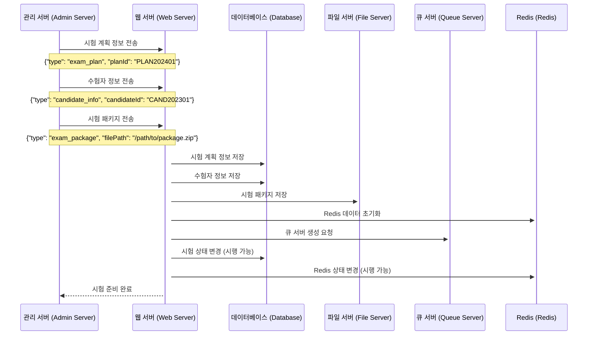

# **시험 준비 시나리오**

---

## **1. 시나리오 개요**

### **1.1 목적**

-   시험 데이터 및 환경 초기화
-   시험 진행 준비 상태로 시스템 전환
-   관련 데이터 구조 동기화 및 저장

### **1.2 범위**

-   시험 데이터 전송 및 저장
-   시험 환경 초기화
-   큐 서버 및 Redis 상태 설정
-   시험 상태 변경

---

## **2. 시스템 구성도**

### **2.1 시퀀스 다이어그램**



---

### **2.2 데이터 흐름**

```mermaid
flowchart TB
    subgraph AdminServer["관리 서버 (Admin Server)"]
        AS[관리 서버]
    end

    subgraph WebServer["웹 서버 (Web Server)"]
        WS[웹 서버]
    end

    subgraph Storage["저장소 (Storage)"]
        DB[(데이터베이스<br/>exam_plan:{plan_id})]
        FS[(파일 서버<br/>/path/to/package.zip)]
    end

    subgraph MessageQueue["메시지 큐 (Message Queue)"]
        QS[(큐 서버<br/>exam_queue:{plan_id})]
    end

    subgraph Cache["캐시 (Cache)"]
        RD[(Redis<br/>exam_plan:{plan_id}:status)]
    end

    %% 데이터 전송
    AS -->|시험 계획 정보<br/>{"type":"exam_plan","planId":"PLAN202401"}| WS
    AS -->|수험자 정보 전송<br/>{"type":"candidate_info","candidateId":"CAND202301"}| WS
    AS -->|시험 패키지 전송<br/>{"type":"exam_package","filePath":"/path/to/package.zip"}| WS

    %% 데이터 저장
    WS -->|시험 계획 저장<br/>exam_plan:{plan_id}| DB
    WS -->|수험자 정보 저장<br/>exam_candidate:{candidate_id}:status| DB
    WS -->|시험 패키지 저장<br/>/path/to/package.zip| FS

    %% 환경 초기화
    WS -->|Redis 데이터 초기화<br/>exam_plan:{plan_id}:status| RD
    WS -->|큐 서버 생성 요청<br/>exam_queue:{plan_id}| QS

    %% 상태 변경
    WS -->|DB 상태 변경<br/>exam_plan:{plan_id}:status| DB
    WS -->|Redis 상태 변경<br/>exam_plan:{plan_id}:status| RD
```

---

## **3. 데이터 구조**

### **3.1 Redis 저장 구조**

#### **3.1.1 시험 계획 정보**

```plaintext
Key: exam_plan:{plan_id}
{
    "exam_name": "한국어능력시험",
    "start_datetime": "2024-01-15T09:00:00Z",
    "end_datetime": "2024-01-16T18:00:00Z",
    "status": "ready"
}
```

#### **3.1.2 수험자 상태**

```plaintext
Key: exam_candidate:{candidate_id}:status
{
    "status": "ready",
    "current_stage": null
}
```

#### **3.1.3 큐 상태**

```plaintext
Key: exam_queue:{plan_id}
{
    "queue_status": "initialized"
}
```

---

## **4. 처리 절차**

1. **시험 데이터 전송 및 저장**

    - 관리 서버에서 시험 계획, 수험자 정보, 시험 패키지 데이터를 웹 서버로 전송.
    - 웹 서버는 해당 데이터를 데이터베이스(DB)와 파일 서버(FS)에 저장.

2. **시험 환경 초기화**

    - Redis 초기화를 통해 시험 관련 데이터 구조를 생성.
    - 큐 서버를 초기화하여 메시지 큐를 준비.

3. **상태 변경**

    - 시험 상태를 `ready`로 변경하여 시험 준비 완료 상태로 전환.
    - 데이터베이스(DB)와 Redis의 상태를 동기화.

4. **시험 준비 완료 응답**

    - 관리 서버로 시험 준비 완료 상태를 응답으로 전송.

---
